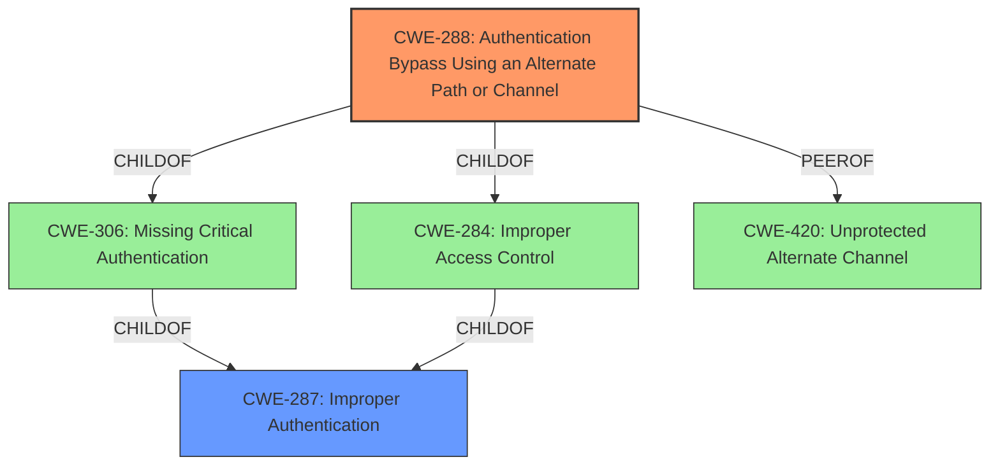

# Enhanced Analysis for CVE-2022-0342

# Summary
| CWE ID  | CWE Name                                                                                        | Confidence | CWE Abstraction Level | CWE Vulnerability Mapping Label | CWE-Vulnerability Mapping Notes |
| :-------- | :------------------------------------------------------------------------------------------------ | :---------- | :---------------------- | :------------------------------ | :------------------------------ |
| CWE-288   | Authentication Bypass Using an Alternate Path or Channel                                       | 0.9         | Base                    | Primary                         | Allowed                       |
| CWE-287   | Improper Authentication                                                                         | 0.6         | Class                   | Secondary                       | Discouraged                    |

## Evidence and Confidence

*   **Confidence Score:** 0.9
*   **Evidence Strength:** HIGH

## Relationship Analysis
The primary CWE, CWE-288, is a base-level weakness describing an authentication bypass via an alternate path or channel. It is a child of CWE-284 (Improper Access Control) and CWE-306 (Missing Critical Authentication). CWE-288 is also a peer of CWE-420 (Unprotected Alternate Channel), suggesting similar types of vulnerabilities. While CWE-287 (Improper Authentication) is a parent of CWE-288, the vulnerability description clearly indicates the existence of an alternate path, making CWE-288 a more specific and appropriate fit.



## Vulnerability Chain
The vulnerability chain starts with an **authentication bypass** in the CGI program, leading to the impact of obtaining administrative access to the device.
- Root Cause: **Authentication Bypass** (CWE-288)
- Impact: Obtain Administrative Access

## Summary of Analysis
The initial assessment focused on the **authentication bypass** **weakness** and its potential root causes. The retriever results suggested several CWEs, including CWE-676, CWE-250, CWE-1390, CWE-287, CWE-912, CWE-288, CWE-613, CWE-88, CWE-78 and CWE-798.

CWE-288 (Authentication Bypass Using an Alternate Path or Channel) was selected as the primary CWE due to the vulnerability description explicitly mentioning an **authentication bypass**. The description states that the vulnerability "could allow an attacker to bypass the web authentication and obtain administrative access of the device." This directly aligns with the definition of CWE-288, which describes a scenario where a product requires authentication but has an alternate path or channel that does not.

CWE-287 (Improper Authentication) was considered as a possible candidate, but it is a more general class of weakness. While it's technically correct, CWE-288 provides a more specific description of the vulnerability, as it explicitly involves bypassing authentication through an alternate path. The MITRE mapping guidance discourages using CWE-287 when lower-level CWE entries are applicable.

The selection of CWE-288 is further supported by its base-level abstraction, which is preferred for mapping root causes. The evidence provided in the vulnerability description strongly supports this classification.

Other CWEs were considered but deemed less appropriate:

*   CWE-676 (Use of Potentially Dangerous Function), CWE-250 (Execution with Unnecessary Privileges), CWE-1390 (Weak Authentication), CWE-912 (Hidden Functionality), CWE-613 (Insufficient Session Expiration), CWE-88 (Improper Neutralization of Argument Delimiters in a Command ('Argument Injection')), CWE-78 (Improper Neutralization of Special Elements used in an OS Command ('OS Command Injection')), and CWE-798 (Use of Hard-coded Credentials) do not directly address the **authentication bypass** mechanism described in the vulnerability.

The final decision is based on the specific evidence of an **authentication bypass** **weakness** combined with the mapping guidance to select the most specific and appropriate CWE.


## CWE Relationship Analysis

Current CWEs represent these abstraction levels: .


### Vulnerability Chain Analysis

**Chain starting from CWE-1390:**
- 1390 (Weak Authentication) - ROOT


**Chain starting from CWE-250:**
- 250 (Execution with Unnecessary Privileges) - ROOT


### CWE Relationship Diagram

```mermaid
graph TD
    classDef primary fill:#f96,stroke:#333,stroke-width:2px
    classDef secondary fill:#69f,stroke:#333
    classDef tertiary fill:#9e9,stroke:#333
```