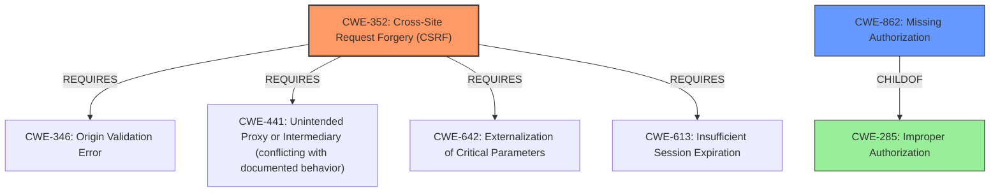

# Analysis Report for CVE-2022-0345

# Vulnerability Analysis Report: CVE-2022-0345

## Description


## Analysis (with Relationship Data)

# Summary
| CWE ID | CWE Name | Confidence | CWE Abstraction Level | CWE Vulnerability Mapping Label | CWE-Vulnerability Mapping Notes |
|---|---|---|---|---|---|
| CWE-352 | Cross-Site Request Forgery (CSRF) | 0.9 | Compound | Allowed | Primary CWE |
| CWE-862 | Missing Authorization | 0.9 | Class | Allowed-with-Review | Secondary Candidate |

## Evidence and Confidence

*   **Confidence Score:** 0.9
*   **Evidence Strength:** HIGH

## Relationship Analysis
The vulnerability description clearly indicates both missing authorization and CSRF protection.
- CWE-352 (Cross-Site Request Forgery) is a Compound weakness, indicating multiple contributing factors.
  - CWE-352 Requires CWE-346, CWE-441, CWE-642, and CWE-613.
- CWE-862 (Missing Authorization) is a Class weakness, suggesting more specific base-level CWEs might exist.
  - CWE-862 is a child of CWE-285 (Improper Authorization).

The Mermaid diagram visualizes these relationships:



## Vulnerability Chain
The vulnerability chain involves the following:
  1. **Root Cause:** **Missing authorization and CSRF checks** in the `bnfw_search_users` AJAX action.
  2. **Weakness:** Any authenticated user can call the AJAX action without proper validation.
  3. **Impact:** Email address disclosure of users by querying the endpoint with incremental character prefixes.

## Summary of Analysis
Based on the evidence, the primary weakness is the **missing authorisation and CSRF check** in the AJAX action.
- The vulnerability description states: "The Customize WordPress Emails and Alerts WordPress plugin before 1.8.7 does not have authorisation and CSRF check in its bnfw_search_users AJAX action, allowing any authenticated users to call it and query for user e-mail prefixes (finding the first letter, then the second one, then the third one etc.)."
- The CVE Reference Links Content Summary confirms this: "Root cause of vulnerability: The plugin's `bnfw_search_users` AJAX action lacks authorization and CSRF checks."

CWE-352 (Cross-Site Request Forgery) is a Compound weakness that accurately captures the CSRF aspect of the vulnerability. The "Usage: Allowed" mapping guidance supports this choice. The vulnerability description explicitly mentions the **missing CSRF check**, making this a suitable primary CWE.

CWE-862 (Missing Authorization) addresses the missing authorization check. The "Usage: Allowed-with-Review" mapping guidance suggests examining its children for a better fit. However, no child CWE provides a more specific description of the authorization failure in this context.

CWE-285 (Improper Authorization) was considered but not chosen as it is discouraged by MITRE. CWE-862 is a child of CWE-285 and is more specific.

CWE-359 (Exposure of Private Personal Information to an Unauthorized Actor) was considered because the impact is email address disclosure. However, the root cause is the **missing authorisation and CSRF check**, not the exposure itself, making it a less appropriate choice than CWE-352 and CWE-862.

CWE-639 (Authorization Bypass Through User-Controlled Key) was considered as an alternative authorization weakness. However, the description doesn't quite match the vulnerability, as it is more about directly modifying a key to access other user's data. In this case, it is more about calling an AJAX action that should not be accessible without proper authorization.

The selected CWEs, CWE-352 and CWE-862, are at the optimal level of specificity, addressing both the CSRF and authorization aspects of the vulnerability.

Relevant CWE Information:
- CWE-352: Cross-Site Request Forgery (CSRF)
- CWE-862: Missing Authorization


## CWE Relationship Analysis

Current CWEs represent these abstraction levels: .


### Vulnerability Chain Analysis

**Chain starting from CWE-862:**
- 862 (Missing Authorization) - ROOT


**Chain starting from CWE-352:**
- 352 (Cross-Site Request Forgery (CSRF)) - ROOT


### CWE Relationship Diagram

```mermaid
graph TD
    classDef primary fill:#f96,stroke:#333,stroke-width:2px
    classDef secondary fill:#69f,stroke:#333
    classDef tertiary fill:#9e9,stroke:#333
```


*Report generated on 2025-03-30 23:28:08*
