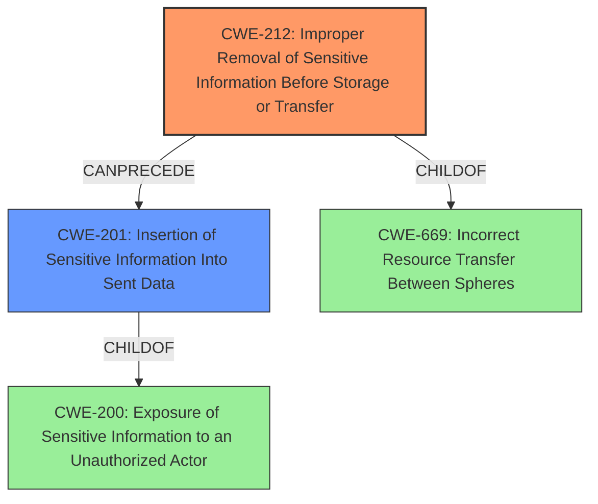

# Analysis Report for CVE-2022-0355

# Vulnerability Analysis Report: CVE-2022-0355

## Description


## Analysis (with Relationship Data)

# Summary
| CWE ID | CWE Name | Confidence | CWE Abstraction Level | CWE Vulnerability Mapping Label | CWE-Vulnerability Mapping Notes |
|---|---|---|---|---|---|
| CWE-212 | Improper Removal of Sensitive Information Before Storage or Transfer | 1.0 | Base | Primary | Allowed |
| CWE-201 | Insertion of Sensitive Information Into Sent Data | 0.7 | Base | Secondary | Allowed |

## Evidence and Confidence

*   **Confidence Score:** 0.9
*   **Evidence Strength:** HIGH

## Relationship Analysis
The primary CWE, CWE-212, is a base-level weakness focusing on the improper removal of sensitive data before a transfer or storage operation. This aligns directly with the vulnerability description. CWE-201, a parent of CWE-212, represents a more general case of inserting sensitive information into sent data, offering a broader classification of the issue. The relationship `CanPrecede` between CWE-212 and CWE-201 suggests that the improper removal could lead to the sensitive information being sent. The base abstraction level of CWE-212 is preferred as it directly addresses the root cause.



## Vulnerability Chain
The vulnerability chain begins with the **improper removal of sensitive information** (CWE-212), specifically the "Cookie" and "Authorization" headers. This leads to the **insertion of sensitive information into sent data** (CWE-201) during the redirect. The final impact is the potential exposure of this sensitive information to unauthorized actors due to the server redirect, which is covered by CWE-200.

## Summary of Analysis
The initial assessment strongly points to CWE-212 ("Improper Removal of Sensitive Information Before Storage or Transfer") as the primary weakness. This is based on the vulnerability description explicitly mentioning "**Improper Removal of Sensitive Information Before Storage or Transfer**" and the CVE Reference Links Content Summary, which states that the library "does not properly discard sensitive headers like 'Cookie' and 'Authorization' before making the redirect request."

CWE-201 ("Insertion of Sensitive Information Into Sent Data") is considered a secondary candidate as it represents the immediate consequence of the **improper removal**: the inclusion of sensitive headers in the redirected request. The relationship analysis and vulnerability chain further support this classification. The evidence directly supports CWE-212 as the most specific and accurate representation of the root cause.

The retriever results listed many CWEs to consider, but these are the reasons why they were not selected:
*   CWE-120 ("Buffer Copy without Checking Size of Input ('Classic Buffer Overflow')") - Not relevant as there is no buffer copy operation mentioned.
*   CWE-532 ("Insertion of Sensitive Information into Log File") - Not relevant since it doesn't involve logging.
*   CWE-613 ("Insufficient Session Expiration") - Not relevant since the issue is not about session expiration.
*   CWE-256 ("Plaintext Storage of a Password") - Not relevant as there is no password stored in plaintext.
*   CWE-922 ("Insecure Storage of Sensitive Information") - Too generic, CWE-212 is more specific.
*   CWE-138 ("Improper Neutralization of Special Elements") - Not specific enough.
*   CWE-269 ("Improper Privilege Management") - Irrelevant to the reported vulnerability.
*   CWE-316 ("Cleartext Storage of Sensitive Information in Memory") - Not applicable since sensitive information is not stored in memory but sent.

Relevant CWE Information:

# Enhanced Context (25 CWEs)
The following CWEs were identified as potentially relevant to this vulnerability:

## CWE-312: Cleartext Storage of Sensitive Information
**Abstraction Level**: Base
**Similarity Score**: 0.79
**Source**: dense

**Description**:
The product stores sensitive information in cleartext within a resource that might be accessible to another control sphere.

**Mapping Guidance**:
- Usage: Allowed
- Rationale: This CWE entry is at the Base level of abstraction, which is a preferred level of abstraction for mapping to the root causes of vulnerabilities.


## CWE-212: Improper Removal of Sensitive Information Before Storage or Transfer
**Abstraction Level**: Base
**Similarity Score**: 0.79
**Source**: dense

**Description**:
The product stores, transfers, or shares a resource that contains sensitive information, but it does not properly remove that information before the product makes the resource available to unauthorized actors.

**Mapping Guidance**:
- Usage: Allowed
- Rationale: This CWE entry is at the Base level of abstraction, which is a preferred level of abstraction for mapping to the root causes of vulnerabilities.


## CWE-316: Cleartext Storage of Sensitive Information in Memory
**Abstraction Level**: Variant
**Similarity Score**: 0.78
**Source**: dense

**Description**:
The product stores sensitive information in cleartext in memory.

**Mapping Guidance**:
- Usage: Allowed
- Rationale: This CWE entry is at the Variant level of abstraction, which is a preferred level of abstraction for mapping to the root causes of vulnerabilities.


## CWE-226: Sensitive Information in Resource Not Removed Before Reuse
**Abstraction Level**: Base
**Similarity Score**: 0.78
**Source**: dense

**Description**:
The product releases a resource such as memory or a file so that it can be made available for reuse, but it does not clear or "zeroize" the information contained in the resource before the product performs a critical state transition or makes the resource available for reuse by other entities.

**Mapping Guidance**:
- Usage: Allowed
- Rationale: This CWE entry is at the Base level of abstraction, which is a preferred level of abstraction for mapping to the root causes of vulnerabilities.


## CWE-538: Insertion of Sensitive Information into Externally-Accessible File or Directory
**Abstraction Level**: Base
**Similarity Score**: 0.77
**Source**: dense

**Description**:
The product places sensitive information into files or directories that are accessible to actors who are allowed to have access to the files, but not to the sensitive information.

**Mapping Guidance**:
- Usage: Allowed
- Rationale: This CWE entry is at the Base level of abstraction, which is a preferred level of abstraction for mapping to the root causes of vulnerabilities.


## CWE-922: Insecure Storage of Sensitive Information
**Abstraction Level**: Class
**Similarity Score**: 0.76
**Source**: dense

**Description**:
The product stores sensitive information without properly limiting read or write access by unauthorized actors.

**Mapping Guidance**:
- Usage: Allowed-with-Review
- Rationale: This CWE entry is a Class and might have Base-level children that would be more appropriate


## CWE-319: Cleartext Transmission of Sensitive Information
**Abstraction Level**: Base
**Similarity Score**: 0.75
**Source**: dense

**Description**:
The product transmits sensitive or security-critical data in cleartext in a communication channel that can be sniffed by unauthorized actors.

**Mapping Guidance**:
- Usage: Allowed
- Rationale: This CWE entry is at the Base level of abstraction, which is a preferred level of abstraction for mapping to the root causes of vulnerabilities.


## CWE-311: Missing Encryption of Sensitive Data
**Abstraction Level**: Class
**Similarity Score**: 0.75
**Source**: dense

**Description**:
The product does not encrypt sensitive or critical information before storage or transmission.

**Mapping Guidance**:
- Usage: Discouraged
- Rationale: CWE-311 is high-level with more precise children available. It is a level-1 Class (i.e., a child of a Pillar).


## CWE-313: Cleartext Storage in a File or on Disk
**Abstraction Level**: Variant
**Similarity Score**: 0.74
**Source**: dense

**Description**:
The product stores sensitive information in cleartext in a file, or on disk.

**Mapping Guidance**:
- Usage: Allowed
- Rationale: This CWE entry is at the Variant level of abstraction, which is a preferred level of abstraction for mapping to the root causes of vulnerabilities.


## CWE-497: Exposure of Sensitive System Information to an Unauthorized Control Sphere
**Abstraction Level**: Base
**Similarity Score**: 0.73
**Source**: dense

**Description**:
The product does not properly prevent sensitive


## CWE Relationship Analysis

Current CWEs represent these abstraction levels: .


### Vulnerability Chain Analysis

**Chain starting from CWE-138:**
- 138 (Improper Neutralization of Special Elements) - ROOT


**Chain starting from CWE-313:**
- 313 (Cleartext Storage in a File or on Disk) - ROOT


### CWE Relationship Diagram

```mermaid
graph TD
    classDef primary fill:#f96,stroke:#333,stroke-width:2px
    classDef secondary fill:#69f,stroke:#333
    classDef tertiary fill:#9e9,stroke:#333
```


*Report generated on 2025-03-30 21:01:13*
