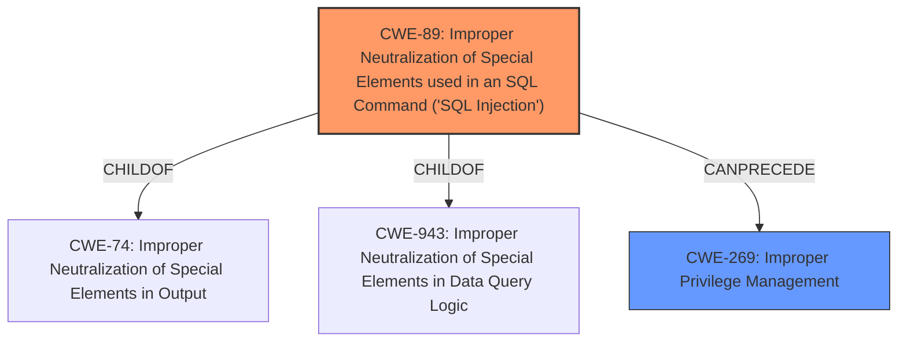

# Analysis for CVE-2022-0366

# Summary
| CWE ID | CWE Name | Confidence | CWE Abstraction Level | CWE Vulnerability Mapping Label | CWE-Vulnerability Mapping Notes |
|---|---|---|---|---|---|
| CWE-89 | Improper Neutralization of Special Elements used in an SQL Command ('SQL Injection') | 1.0 | Base | Allowed | Primary CWE |
| CWE-269 | Improper Privilege Management | 0.5 | Class | Discouraged | Secondary Candidate |

## Evidence and Confidence

*   **Confidence Score:** 0.9
*   **Evidence Strength:** HIGH

## Relationship Analysis
The primary relationship is that CWE-89 [CWE-89: Improper Neutralization of Special Elements used in an SQL Command ('SQL Injection')] is a child of CWE-74 [CWE-74: Improper Neutralization of Special Elements in Output] and CWE-943 [CWE-943: Improper Neutralization of Special Elements in Data Query Logic]. It can also lead to privilege escalation, which is related to CWE-269 [CWE-269: Improper Privilege Management], although CWE-269 is more of an impact than a root cause in this case. The abstraction level influenced the selection, as CWE-89 is a Base level CWE, which is preferred over the Class level CWE-269.

## Vulnerability Chain
The vulnerability chain starts with the **SQL injection** (CWE-89) vulnerability, which allows an authenticated user to inject malicious SQL queries. Successful exploitation leads to privilege escalation, allowing the attacker to gain administrative access.
  - The root cause is CWE-89
  - The impact is Privilege Escalation.

## Summary of Analysis
The initial analysis identified CWE-89 [CWE-89: Improper Neutralization of Special Elements used in an SQL Command ('SQL Injection')] as the primary root cause due to the presence of an **SQL injection** vulnerability. The provided evidence, including the **Vulnerability Description Key Phrases** and **CVE Reference Links Content Summary**, explicitly mentions the **SQL injection** as the root cause.

The analysis considered CWE-269 [CWE-269: Improper Privilege Management] as a secondary candidate, acknowledging that the **SQL injection** leads to privilege escalation. However, CWE-269 is a Class level CWE and is discouraged as it represents the impact rather than the root cause. CWE-89 is a Base level CWE and accurately represents the underlying weakness.

The selection of CWE-89 is further supported by its high score in the Retriever Results and the MITRE mapping guidance, which recommends using Base level CWEs when available.

The final decision is based on the evidence that the root cause is an **SQL injection** vulnerability (CWE-89), which enables privilege escalation. CWE-89 is at the optimal level of specificity, as it directly addresses the **improper neutralization of special elements in an SQL command.**

Relevant CWE Information:

## CWE-89: Improper Neutralization of Special Elements used in an SQL Command ('SQL Injection')
**Abstraction:** Base
**Status:** Stable

### Description
The product constructs all or part of an SQL command using externally-influenced input from an upstream component, but it does not neutralize or incorrectly neutralizes special elements that could modify the intended SQL command when it is sent to a downstream component. Without sufficient removal or quoting of SQL syntax in user-controllable inputs, the generated SQL query can cause those inputs to be interpreted as SQL instead of ordinary user data.

### Extended Description
Not provided

### Alternative Terms
SQL injection: a common attack-oriented phrase
SQLi: a common abbreviation for "SQL injection"

### Relationships
ChildOf -> CWE-943
ChildOf -> CWE-74

### Mapping Guidance
**Usage:** Allowed
**Rationale:** This CWE entry is at the Base level of abstraction, which is a preferred level of abstraction for mapping to the root causes of vulnerabilities.
**Comments:** Carefully read both the name and description to ensure that this mapping is an appropriate fit. Do not try to 'force' a mapping to a lower-level Base/Variant simply to comply with this preferred level of abstraction.
**Reasons:**
- Acceptable-Use

### Additional Notes
**[Relationship]** SQL injection can be resultant from special character mismanagement, MAID, or denylist/allowlist problems. It can be primary to authentication errors.

### Observed Examples
- **CVE-2023-32530:** SQL injection in security product dashboard using crafted certificate fields
- **CVE-2021-42258:** SQL injection in time and billing software, as exploited in the wild per CISA KEV.
- **CVE-2021-27101:** SQL injection in file-transfer system via a crafted Host header, as exploited in the wild per CISA KEV.

## CWE-269: Improper Privilege Management
**Abstraction:** Class
**Status:** Draft

### Description
The product does not properly assign, modify, track, or check privileges for an actor, creating an unintended sphere of control for that actor.

### Extended Description
Not provided

### Alternative Terms
None

### Relationships
ChildOf -> CWE-284

### Mapping Guidance
**Usage:** Discouraged
**Rationale:** CWE-269 is commonly misused. It can be conflated with "privilege escalation," which is a technical impact that is listed in many low-information vulnerability reports [REF-1287]. It is not useful for trend analysis.
**Comments:** If an error or mistake allows privilege escalation, then use the CWE ID for that mistake. Avoid using CWE-269 when only phrases such as "privilege escalation" or "gain privileges" are available, as these indicate technical impact of the vulnerability - not the root cause weakness. If the root cause seems to be directly related to privileges, then examine the children of CWE-269 for additional hints, such as Execution with Unnecessary Privileges (CWE-250) or Incorrect Privilege Assignment (CWE-266).
**Reasons:**
- Frequent Misuse

### Additional Notes
**[Maintenance]** The relationships between privileges, permissions, and actors (e.g. users and groups) need further refinement within the Research view. One complication is that these concepts apply to two different pillars, related to control of resources (CWE-664) and protection mechanism failures (CWE-693).

### Observed Examples
- **CVE-2001-1555:** Terminal privileges are not reset when a user logs out.
- **CVE-2001-1514:** Does not properly pass security context to child processes in certain cases, allows privilege escalation.
- **CVE-2001-0128:** Does not properly compute roles.