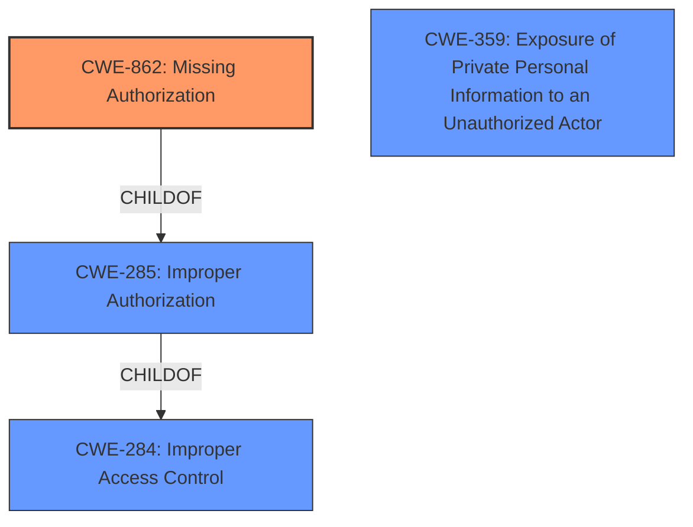

# Raw Analyzer Response for CVE-2022-0373

# Summary
| CWE ID | CWE Name | Confidence | CWE Abstraction Level | CWE Vulnerability Mapping Label | CWE-Vulnerability Mapping Notes |
|---|---|---|---|---|---|
| **CWE-862** | **Missing Authorization** | 0.9 | Base | Primary | Allowed |
| CWE-359 | Exposure of Private Personal Information to an Unauthorized Actor | 0.7 | Base | Secondary | Allowed |
| CWE-285 | Improper Authorization | 0.6 | Class | Secondary | Discouraged |
| CWE-284 | Improper Access Control | 0.4 | Pillar | Secondary | Discouraged |

## Evidence and Confidence

*   **Confidence Score:** 0.8
*   **Evidence Strength:** HIGH

## Relationship Analysis
The primary CWE is CWE-862 (**Missing Authorization**), as the vulnerability stems from a lack of authorization checks. CWE-862 is a child of CWE-285 (**Improper Authorization**) and CWE-284 (**Improper Access Control**), representing increasing levels of abstraction. CWE-359 (**Exposure of Private Personal Information to an Unauthorized Actor**) is related because the missing authorization leads to the exposure of the service desk email, which can be considered private information. Choosing CWE-862 provides the most specific and accurate representation of the root cause.

## Vulnerability Chain
The chain of events is as follows:
1.  **Missing Authorization** (CWE-862): The GraphQL API lacks proper authorization checks for accessing the service desk email address.
2.  Information Disclosure: As a result of the missing authorization, project non-members can retrieve the service desk email address.
3.  **Exposure of Private Personal Information to an Unauthorized Actor** (CWE-359): The email address, considered private information, is exposed to unauthorized individuals.

## Summary of Analysis
The initial assessment based on the vulnerability description and key phrases pointed to **Improper access control** as the root cause. The CVE Reference Links Content Summary confirmed that the GraphQL API was not properly configured to enforce access control, leading to the leakage of the service desk email address.

The Retriever Results suggested several CWEs, including CWE-285 (**Improper Authorization**), CWE-639 (**Authorization Bypass Through User-Controlled Key**), and CWE-863 (**Incorrect Authorization**). However, after reviewing the complete CWE specifications, CWE-862 (**Missing Authorization**) emerged as the most appropriate choice because the core issue is that there *was no* authorization check performed in the first place. The GraphQL API simply lacked the necessary checks to prevent non-members from accessing the `serviceDeskAddress` field. This makes it more specific than CWE-285 and CWE-863.

CWE-359 (**Exposure of Private Personal Information to an Unauthorized Actor**) is a relevant secondary concern, as the disclosed email address can be considered private information.

The decision to prioritize CWE-862 is based on the principle of selecting the most specific CWE that accurately represents the root cause. While CWE-284 and CWE-285 are related, they are more general and less descriptive of the specific vulnerability.

The selected CWEs are at the optimal level of specificity because they directly address the underlying coding error (missing authorization) and the resulting impact (information disclosure).

Relevant CWE Information:

# Enhanced Context (25 CWEs)
The following CWEs were identified as potentially relevant to this vulnerability:

## CWE-405: Asymmetric Resource Consumption (Amplification)
**Abstraction Level**: Class
**Similarity Score**: 0.78
**Source**: dense

**Description**:
The product does not properly control situations in which an adversary can cause the product to consume or produce excessive resources without requiring the adversary to invest equivalent work or otherwise prove authorization, i.e., the adversary's influence is "asymmetric."

**Mapping Guidance**:
- Usage: Allowed-with-Review
- Rationale: This CWE entry is a Class and might have Base-level children that would be more appropriate

## CWE-404: Improper Resource Shutdown or Release
**Abstraction Level**: Class
**Similarity Score**: 0.77
**Source**: dense

**Description**:
The product does not release or incorrectly releases a resource before it is made available for re-use.

**Mapping Guidance**:
- Usage: Allowed-with-Review
- Rationale: This CWE entry is a Class and might have Base-level children that would be more appropriate

## CWE-664: Improper Control of a Resource Through its Lifetime
**Abstraction Level**: Pillar
**Similarity Score**: 0.77
**Source**: dense

**Description**:
The product does not maintain or incorrectly maintains control over a resource throughout its lifetime of creation, use, and release.

**Mapping Guidance**:
- Usage: Discouraged
- Rationale: This CWE entry is high-level when lower-level children are available.

## CWE-668: Exposure of Resource to Wrong Sphere
**Abstraction Level**: Class
**Similarity Score**: 0.77
**Source**: dense

**Description**:
The product exposes a resource to the wrong control sphere, providing unintended actors with inappropriate access to the resource.

**Mapping Guidance**:
- Usage: Discouraged
- Rationale: CWE-668 is high-level and is often misused as a catch-all when lower-level CWE IDs might be applicable. It is sometimes used for low-information vulnerability reports [REF-1287]. It is a level-1 Class (i.e., a child of a Pillar). It is not useful for trend analysis.

## CWE-799: Improper Control of Interaction Frequency
**Abstraction Level**: Class
**Similarity Score**: 0.76
**Source**: dense

**Description**:
The product does not properly limit the number or frequency of interactions that it has with an actor, such as the number of incoming requests.

**Mapping Guidance**:
- Usage: Allowed-with-Review
- Rationale: This CWE entry is a Class and might have Base-level children that would be more appropriate

## CWE-226: Sensitive Information in Resource Not Removed Before Reuse
**Abstraction Level**: Base
**Similarity Score**: 0.76
**Source**: dense

**Description**:
The product releases a resource such as memory or a file so that it can be made available for re-use, but it does not clear or "zeroize" the information contained in the resource before the product performs a critical state transition or makes the resource available for reuse by other entities.

**Mapping Guidance**:
- Usage: Allowed
- Rationale: This CWE entry is at the Base level of abstraction, which is a preferred level of abstraction for mapping to the root causes of vulnerabilities.

## CWE-639: Authorization Bypass Through User-Controlled Key
**Abstraction Level**: Base
**Similarity Score**: 0.76
**Source**: dense

**Description**:
The system's authorization functionality does not prevent one user from gaining access to another user's data or record by modifying the key value identifying the data.

**Mapping Guidance**:
- Usage: Allowed
- Rationale: This CWE entry is at the Base level of abstraction, which is a preferred level of abstraction for mapping to the root causes of vulnerabilities.

## CWE-1220: Insufficient Granularity of Access Control
**Abstraction Level**: Base
**Similarity Score**: 0.75
**Source**: dense

**Description**:
The product implements access controls via a policy or other feature with the intention to disable or restrict accesses (reads and/or writes) to assets in a system from untrusted agents. However, implemented access controls lack required granularity, which renders the control policy too broad because it allows accesses from unauthorized agents to the security-sensitive assets.

**Mapping Guidance**:
- Usage: Allowed
- Rationale: This CWE entry is at the Base level of abstraction, which is a preferred level of abstraction for mapping to the root causes of vulnerabilities.

## CWE-610: Externally Controlled Reference to a Resource in Another Sphere
**Abstraction Level**: Class
**Similarity Score**: 0.75
**Source**: dense

**Description**:
The product uses an externally controlled name or reference that resolves to a resource that is outside of the intended control sphere.

**Mapping Guidance**:
- Usage: Discouraged
- Rationale: This CWE entry is a level-1 Class (i.e., a child of a Pillar). It might have lower-level children that