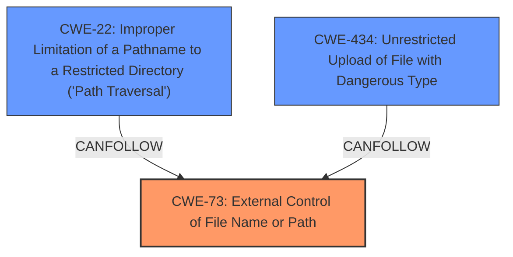

# Analysis for CVE-2022-0377

# Summary
| CWE ID | CWE Name | Confidence | CWE Abstraction Level | CWE Vulnerability Mapping Label | CWE-Vulnerability Mapping Notes |
|---|---|---|---|---|---|
| CWE-73 | External Control of File Name or Path | 0.9 | Base | Allowed | Primary CWE |
| CWE-22 | Improper Limitation of a Pathname to a Restricted Directory ('Path Traversal') | 0.7 | Base | Allowed | Secondary Candidate |
| CWE-434 | Unrestricted Upload of File with Dangerous Type | 0.6 | Base | Allowed | Secondary Candidate |

## Evidence and Confidence

*   **Confidence Score:** 0.8
*   **Evidence Strength:** HIGH

## Relationship Analysis
The primary CWE is CWE-73, as it directly addresses the root cause of the vulnerability: the external control of file names or paths. CWE-22 and CWE-434 are related CWEs. CWE-22 can be a consequence of CWE-73 if proper path sanitization is not implemented. CWE-434 is related since the vulnerability requires an upload to occur.

## Vulnerability Chain
The vulnerability chain starts with the **External Control of File Name or Path (CWE-73)**. If an attacker can manipulate the file path, they might be able to perform a **Path Traversal (CWE-22)** to access or modify files outside the intended directory. Additionally, **Unrestricted Upload of File with Dangerous Type (CWE-434)** is a component since it requires an upload to occur for the vulnerability to function.

## Summary of Analysis
The primary weakness is the **External Control of File Name or Path (CWE-73)**, as highlighted in the "CVE Reference Links Content Summary": "The plugin does not properly sanitize or validate the 'name' parameter within the `lp-user-avatar-crop` POST request. An attacker can provide an arbitrary file path to the `name` parameter." This directly allows an attacker to control the file path used by the application. This is further supported by the "Vulnerability Description Key Phrases": "impact: rename arbitrary image file".

CWE-22 is a secondary weakness because the vulnerability description also mentions the potential for "Path Traversal" attacks, which can be used to target files outside of the intended upload directory. The "CVE Reference Links Content Summary" also mentions "Path Traversal: The vulnerability can be exploited using path traversal techniques (e.g. `../`), allowing the attacker to target files outside of the intended upload directory."

CWE-434 is a secondary weakness because the application allows for file uploads of dangerous file types that are automatically processed within its environment.

The selected CWEs are at the optimal level of specificity because they directly reflect the root cause and potential consequences of the vulnerability.

Relevant CWE Information:

# Enhanced Context (25 CWEs)
The following CWEs were identified as potentially relevant to this vulnerability:

## CWE-668: Exposure of Resource to Wrong Sphere
**Abstraction Level**: Class
**Similarity Score**: 0.77
**Source**: dense

**Description**:
The product exposes a resource to the wrong control sphere, providing unintended actors with inappropriate access to the resource.

**Mapping Guidance**:
- Usage: Discouraged
- Rationale: CWE-668 is high-level and is often misused as a catch-all when lower-level CWE IDs might be applicable. It is sometimes used for low-information vulnerability reports [REF-1287]. It is a level-1 Class (i.e., a child of a Pillar). It is not useful for trend analysis.
- I did not select this CWE because it is too high level and there are more specific CWEs that match the vulnerability description.

## CWE-610: Externally Controlled Reference to a Resource in Another Sphere
**Abstraction Level**: Class
**Similarity Score**: 0.76
**Source**: dense

**Description**:
The product uses an externally controlled name or reference that resolves to a resource that is outside of the intended control sphere.

**Mapping Guidance**:
- Usage: Discouraged
- Rationale: This CWE entry is a level-1 Class (i.e., a child of a Pillar). It might have lower-level children that would be more appropriate
- I did not select this CWE because it is too high level and there are more specific CWEs that match the vulnerability description.

## CWE-552: Files or Directories Accessible to External Parties
**Abstraction Level**: Base
**Similarity Score**: 0.75
**Source**: dense

**Description**:
The product makes files or directories accessible to unauthorized actors, even though they should not be.

**Mapping Guidance**:
- Usage: Allowed
- Rationale: This CWE entry is at the Base level of abstraction, which is a preferred level of abstraction for mapping to the root causes of vulnerabilities.
- I did not select this CWE because it is more related to permissions issues, not directly the file path manipulation that is the root cause.

## CWE-73: External Control of File Name or Path
**Abstraction Level**: Base
**Similarity Score**: 0.75
**Source**: dense

**Description**:
The product allows user input to control or influence paths or file names that are used in filesystem operations.

**Mapping Guidance**:
- Usage: Allowed
- Rationale: This CWE entry is at the Base level of abstraction, which is a preferred level of abstraction for mapping to the root causes of vulnerabilities.
- I selected this CWE as the primary, because the **root cause** is that the product allows user input to control the file name or path.

## CWE-664: Improper Control of a Resource Through its Lifetime
**Abstraction Level**: Pillar
**Similarity Score**: 0.75
**Source**: dense

**Description**:
The product does not maintain or incorrectly maintains control over a resource throughout its lifetime of creation, use, and release.

**Mapping Guidance**:
- Usage: Discouraged
- Rationale: This CWE entry is high-level when lower-level children are available.
- I did not select this CWE because it is too high level and there are more specific CWEs that match the vulnerability description.

## CWE-41: Improper Resolution of Path Equivalence
**Abstraction Level**: Base
**Similarity Score**: 0.75
**Source**: dense

**Description**:
The product is vulnerable to file system contents disclosure through path equivalence. Path equivalence involves the use of special characters in file and directory names. The associated manipulations are intended to generate multiple names for the same object.

**Mapping Guidance**:
- Usage: Allowed
- Rationale: This CWE entry is at the Base level of abstraction, which is a preferred level of abstraction for mapping to the root causes of vulnerabilities.
- I did not select this CWE because it is more focused on path equivalence, not the direct control of the file path.

## CWE-669: Incorrect Resource Transfer Between Spheres
**Abstraction Level**: Class
**Similarity Score**: 0.74
**Source**: dense

**Description**:
The product does not properly transfer a resource/behavior to another sphere, or improperly imports a resource/behavior from another sphere, in a manner that provides unintended control over that resource.

**Mapping Guidance**:
- Usage: Allowed-with-Review
- Rationale: This CWE entry is a Class and might have Base-level children that would be more appropriate
- I did not select this CWE because it is too high level and there are more specific CWEs that match the vulnerability description.

## CWE-807: Reliance on Untrusted Inputs in a Security Decision
**Abstraction Level**: Base
**Similarity Score**: 0.74
**Source**: dense

**Description**:
The product uses a protection mechanism that relies on the existence or values of an input, but the input can be modified by an untrusted actor in a way that bypasses the protection mechanism.

**Mapping Guidance**:
- Usage: Allowed
- Rationale: This CWE entry is at the Base level of abstraction, which is a preferred level of abstraction for mapping to the root causes of vulnerabilities.
- I did not select this CWE because the **root cause** is not directly related to a security decision relying on untrusted input, but rather the lack of proper input validation for file paths.

## CWE-653: Improper Isolation or Compartmentalization
**Abstraction Level**: Class
**Similarity Score**: 0.74
**Source**: dense

**Description**:
The product does not properly compartmentalize or isolate functionality, processes, or resources that require different privilege levels, rights, or permissions.

**Mapping