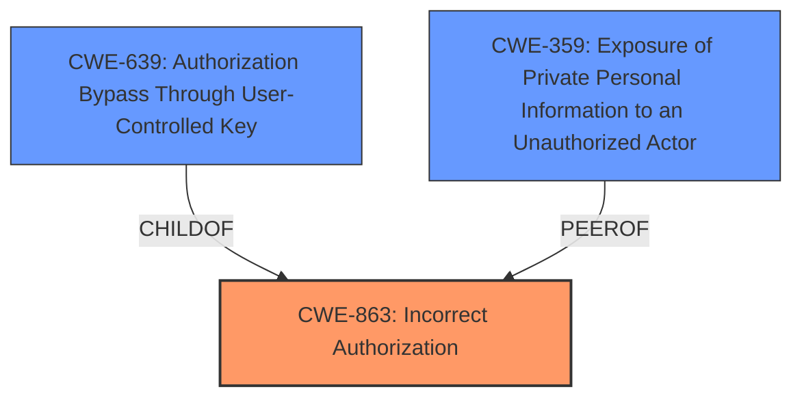

# Analysis for CVE-2022-0390

# Summary
| CWE ID | CWE Name | Confidence | CWE Abstraction Level | CWE Vulnerability Mapping Label | CWE-Vulnerability Mapping Notes |
|---|---|---|---|---|---|
| CWE-863 | Incorrect Authorization | 0.9 | Class | Primary | Allowed-with-Review |
| CWE-639 | Authorization Bypass Through User-Controlled Key | 0.7 | Base | Secondary | Allowed |
| CWE-359 | Exposure of Private Personal Information to an Unauthorized Actor | 0.6 | Base | Secondary | Allowed |

## Evidence and Confidence

*   **Confidence Score:** 0.8
*   **Evidence Strength:** HIGH

## Relationship Analysis
The primary CWE selected is CWE-863, Incorrect Authorization, which is a Class-level CWE. CWE-639, Authorization Bypass Through User-Controlled Key, is a child of CWE-863, making it a more specific candidate, however the vulnerability description does not provide sufficient evidence to suggest that a user-controlled key is being directly manipulated to bypass authorization. CWE-359, Exposure of Private Personal Information to an Unauthorized Actor is a peer that focuses on data leakage, and given the vulnerability's focus on issue details being revealed to unauthorized users it is worth considering.

## Vulnerability Chain
The chain of events is as follows:
1.  **Improper Access Control (CWE-863)**: The root cause is the **improper access control** mechanism in GitLab CE/EE.
2.  **Information Disclosure (CWE-359)**: This leads to the retrieval of issue details by unauthorized users.

## Summary of Analysis
The initial assessment identified **improper access control** as the root cause, leading to the disclosure of issue details to project non-members.

The vulnerability description explicitly mentions "**improper access control**" as the root cause and "retrieve issue details" as the impact, aligning with CWE-863. The "CVE Reference Links Content Summary" also supports this by stating "Information disclosure due to lack of access control during issue link deletion." This confirms that the vulnerability stems from an authorization flaw, specifically when issue links are deleted. The retriever results also prioritize CWE-863, CWE-639, and CWE-285, all related to authorization issues.

Given the available evidence, CWE-863 is the most appropriate primary mapping, as it directly reflects the **incorrect authorization** check performed when retrieving issue details. While CWE-639 is a more specific child, there is insufficient evidence that a user-controlled key is being manipulated. CWE-359 is applicable as a secondary mapping due to the **information disclosure** aspect.

The selected CWEs are at the optimal level of specificity, with CWE-863 representing the general class of authorization flaws and CWE-359 highlighting the resulting data exposure.

Relevant CWE Information:

# Enhanced Context (25 CWEs)
The following CWEs were identified as potentially relevant to this vulnerability:

## CWE-639: Authorization Bypass Through User-Controlled Key
**Abstraction Level**: Base
**Similarity Score**: 0.77
**Source**: dense

**Description**:
The system's authorization functionality does not prevent one user from gaining access to another user's data or record by modifying the key value identifying the data.

**Mapping Guidance**:
- Usage: Allowed
- Rationale: This CWE entry is at the Base level of abstraction, which is a preferred level of abstraction for mapping to the root causes of vulnerabilities.

**Technical Explanation:** While this CWE is related to authorization bypass, it is more specific than the general **improper access control** described in the vulnerability. It involves manipulating a key value to access another user's data, which is not explicitly mentioned in the description.
**Justification:** While related, the description does not provide enough evidence to suggest that a key is being manipulated.
**Decision:** Considered, but not selected as primary. Selected as secondary candidate.

## CWE-863: Incorrect Authorization
**Abstraction Level**: Class
**Similarity Score**: 0.76
**Source**: dense

**Description**:
The product performs an authorization check when an actor attempts to access a resource or perform an action, but it does not correctly perform the check.

**Mapping Guidance**:
- Usage: Allowed-with-Review
- Rationale: This CWE entry is a Class and might have Base-level children that would be more appropriate

**Technical Explanation:** This CWE accurately describes the **improper access control** issue, where the authorization check is not correctly implemented, allowing project non-members to retrieve issue details.
**Justification:** The description explicitly mentions **improper access control**, aligning with the core concept of this CWE.
**Decision:** Selected as primary.

## CWE-359: Exposure of Private Personal Information to an Unauthorized Actor
**Abstraction Level**: Base
**Similarity Score**: 0.76
**Source**: dense

**Description**:
The product does not properly prevent a person's private, personal information from being accessed by actors who either (1) are not explicitly authorized to access the information or (2) do not have the implicit consent of the person about whom the information is collected.

**Mapping Guidance**:
- Usage: Allowed
- Rationale: This CWE entry is at the Base level of abstraction, which is a preferred level of abstraction for mapping to the root causes of vulnerabilities.

**Technical Explanation:** The vulnerability allows project non-members to retrieve issue details, which constitutes an exposure of private information to unauthorized actors.
**Justification:** The impact of the vulnerability directly relates to the exposure of sensitive issue information.
**Decision:** Selected as secondary candidate.

## CWE-285: Improper Authorization
**Abstraction Level**: Class
**Similarity Score**: 0.75
**Source**: dense

**Description**:
The product does not perform or incorrectly performs an authorization check when an actor attempts to access a resource or perform an action.

**Mapping Guidance**:
- Usage: Discouraged
- Rationale: CWE-285 is high-level and lower-level CWEs can frequently be used instead. It is a level-1 Class (i.e., a child of a Pillar).

**Technical Explanation:** This CWE is similar to CWE-863 but is more generic.
**Justification:** CWE-863 provides a more specific description of the vulnerability.
**Decision:** Considered, but not selected.

## CWE-425: Direct Request ('Forced Browsing')
**Abstraction Level**: Base
**Similarity Score**: 0.75
**Source**: dense

**Description**:
The web application does not adequately enforce appropriate authorization on all restricted URLs, scripts, or files.

**Mapping Guidance**:
- Usage: Allowed
- Rationale: This CWE entry is at the Base level of abstraction, which is a preferred level of abstraction for mapping to the root causes of vulnerabilities.

**Technical Explanation:** This CWE relates to bypassing authorization by directly accessing restricted resources.
**Justification:** While the vulnerability involves unauthorized access, it's not explicitly about direct request or forced browsing.
**Decision:** Considered, but not selected.