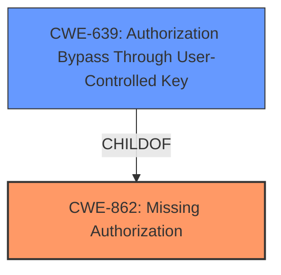

# Analysis for CVE-2022-0404

# Summary
| CWE ID | CWE Name | Confidence | CWE Abstraction Level | CWE Vulnerability Mapping Label | CWE-Vulnerability Mapping Notes |
|---|---|---|---|---|---|
| CWE-862 | Missing Authorization | 1.0 | Class | Allowed-with-Review | Primary CWE |
| CWE-639 | Authorization Bypass Through User-Controlled Key | 0.7 | Base | Allowed | Secondary Candidate |

## Evidence and Confidence

*   **Confidence Score:** 0.9
*   **Evidence Strength:** HIGH

## Relationship Analysis
The primary relationship is that CWE-862 [Missing Authorization] is a Class-level CWE. CWE-639 [Authorization Bypass Through User-Controlled Key] is a Base-level CWE and a more specific type of authorization issue. CWE-862 is a parent of CWE-639.

## Vulnerability Chain
The chain of events starts with the **missing authorization check** (CWE-862), allowing an attacker to set arbitrary options to true, potentially leading to Denial of Service.

## Summary of Analysis
The initial assessment identified CWE-862 as the primary weakness due to the **missing authorization check**. Further analysis considered CWE-639 due to the ability to set arbitrary options, suggesting a bypass. The final decision favors CWE-862 as the primary weakness because the root cause is the **lack of authorization** and this is a Class level CWE. CWE-639 is included as a secondary weakness because it reflects the user controlled key aspect.

Evidence from the vulnerability description:
*   "**rootcause:** **missing authorization check**"
*   "allowing any logged in user (with roles as low as Subscriber) to set arbitrary options to true"
*   "The vulnerability stems from a lack of authorization checks in the `cf7md_dismiss_notice` action"

The selection is based on the direct evidence of a **missing authorization check**, aligning with CWE-862.

Relevant CWE Information:

# Enhanced Context (25 CWEs)
The following CWEs were identified as potentially relevant to this vulnerability:

## CWE-472: External Control of Assumed-Immutable Web Parameter
**Abstraction Level**: Base

## CWE-807: Reliance on Untrusted Inputs in a Security Decision
**Abstraction Level**: Base

## CWE-538: Insertion of Sensitive Information into Externally-Accessible File or Directory
**Abstraction Level**: Base

## CWE-552: Files or Directories Accessible to External Parties
**Abstraction Level**: Base

## CWE-639: Authorization Bypass Through User-Controlled Key
**Abstraction Level**: Base

## CWE-212: Improper Removal of Sensitive Information Before Storage or Transfer
**Abstraction Level**: Base

## CWE-668: Exposure of Resource to Wrong Sphere
**Abstraction Level**: Class

## CWE-425: Direct Request ('Forced Browsing')
**Abstraction Level**: Base

## CWE-41: Improper Resolution of Path Equivalence
**Abstraction Level**: Base

## CWE-74: Improper Neutralization of Special Elements in Output Used by a Downstream Component ('Injection')
**Abstraction Level**: Class

## CWE-863: Incorrect Authorization
**Abstraction Level**: Class

## CWE-472: External Control of Assumed-Immutable Web Parameter
**Abstraction Level**: Base

## CWE-285: Improper Authorization
**Abstraction Level**: Class

## CWE-639: Authorization Bypass Through User-Controlled Key
**Abstraction Level**: Base

## CWE-306: Missing Authentication for Critical Function
**Abstraction Level**: Base

## CWE-183: Permissive List of Allowed Inputs
**Abstraction Level**: base

## CWE-178: Improper Handling of Case Sensitivity
**Abstraction Level**: base

## CWE-430: Deployment of Wrong Handler
**Abstraction Level**: base

## CWE-613: Insufficient Session Expiration
**Abstraction Level**: base

## CWE-471: Modification of Assumed-Immutable Data (MAID)
**Abstraction Level**: base

## CWE-202: Exposure of Sensitive Information Through Data Queries
**Abstraction Level**: base

## CWE-351: Insufficient Type Distinction
**Abstraction Level**: base

## CWE-1289: Improper Validation of Unsafe Equivalence in Input
**Abstraction Level**: base

## CWE-209: Generation of Error Message Containing Sensitive Information
**Abstraction Level**: base

## CWE-434: Unrestricted Upload of File with Dangerous Type
**Abstraction Level**: Base

### Technical Explanation for CWE-862
*   **How it matches:** The vulnerability description explicitly states a **missing authorization check** in the `cf7md_dismiss_notice` action. This aligns directly with CWE-862 [Missing Authorization], which describes a scenario where the product does not perform an authorization check when an actor attempts to access a resource or perform an action.
*   **Security Implications:** The absence of authorization allows unauthorized users (even those with minimal privileges) to execute actions they should not be permitted to perform. In this case, it enables them to modify arbitrary plugin options.
*   **Impact:** This can lead to significant consequences, including Denial of Service (DoS) by corrupting the site's configuration.
*   **Relationship:** CWE-862 [Missing Authorization] is a child of CWE-285 [Improper Authorization] and CWE-284 [Improper Access Control], but CWE-862 is more specific to the **missing authorization check** issue.
*   **Mapping Guidance:** The MITRE mapping guidance allows for CWE-862 [Missing Authorization] with review, as it is a Class-level CWE and may have Base-level children that would be more appropriate. However, in this case, no more specific child CWE perfectly fits the description.

### Technical Explanation for CWE-639
*   **How it matches:** The vulnerability allows any logged-in user to set arbitrary options to true. This implies that the user is controlling a key (the `notice` parameter) that is used in the authorization process, leading to a bypass.
*   **Security Implications:** Attackers can modify system settings by manipulating user-controlled keys.
*   **Impact:** This can lead to Denial of Service (DoS) by setting options that break the site.
*   **Relationship:** CWE-639 [Authorization Bypass Through User-Controlled Key] is related to CWE-862 [Missing Authorization] as a more specific case where the authorization is bypassed due to a user-controlled key.
*   **Mapping Guidance:** The MITRE mapping guidance allows for CWE-639 [Authorization Bypass Through User-Controlled Key].

### Alternative CWEs Considered and Rejected:
*   CWE-284 [Improper Access Control]: Rejected because it's too high-level (Pillar) and the description focuses on the **missing authorization check**, making CWE-862 [Missing Authorization] more appropriate. The Mapping Guidance discourages using CWE-284.
*   CWE-285 [Improper Authorization]: Rejected because while related, CWE-862 [Missing Authorization] is more precise and addresses the specific issue of a **missing authorization check**. The Mapping Guidance discourages using CWE-285.
*   CWE-472 [External Control of Assumed-Immutable Web Parameter]: While the vulnerability involves setting arbitrary options, the root cause is the **missing authorization check**, not the external control of parameters. Thus, CWE-862 [Missing Authorization] is more appropriate.
*   CWE-306 [Missing Authentication for Critical Function]: Rejected because the vulnerability occurs after authentication, focusing on authorization.
*   CWE-352 [Cross-Site Request Forgery (CSRF)]: Rejected because the vulnerability does not involve tricking a user into making an unintentional request. It's related to authorization.