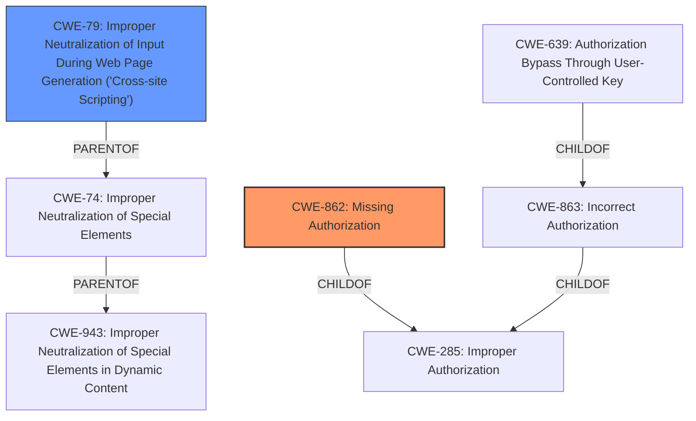

# Analysis Report for CVE-2022-0421

# Vulnerability Analysis Report: CVE-2022-0421

## Description


## Analysis (with Relationship Data)

# Summary
| CWE ID | CWE Name | Confidence | CWE Abstraction Level | CWE Vulnerability Mapping Label | CWE-Vulnerability Mapping Notes |
|---|---|---|---|---|---|
| CWE-862 | Missing Authorization | 1.0 | Class | Allowed-with-Review | Primary CWE |
| CWE-79 | Improper Neutralization of Input During Web Page Generation ('Cross-site Scripting') | 1.0 | Base | Allowed | Secondary CWE |

## Evidence and Confidence

*   **Confidence Score:** 1.0
*   **Evidence Strength:** HIGH

## Relationship Analysis
The primary weakness is **CWE-862 (Missing Authorization)**, a Class-level CWE. The vulnerability description clearly states a **lack of authorization** when changing payment statuses. Since CWE-862 is a class, reviewing its children could provide a more specific CWE. **CWE-639 (Authorization Bypass Through User-Controlled Key)** is a child of **CWE-863 (Incorrect Authorization)**, which is a child of **CWE-285 (Improper Authorization)**, and **CWE-862 (Missing Authorization)** is also a child of **CWE-285 (Improper Authorization)**. However, the vulnerability is more accurately described as a **missing** authorization check rather than an incorrect one. Therefore, **CWE-862 (Missing Authorization)** is the most appropriate.

The secondary weakness is **CWE-79 (Improper Neutralization of Input During Web Page Generation ('Cross-site Scripting'))**, a Base-level CWE. The vulnerability description mentions a **lack of sanitisation and escaping**, allowing Cross-Site Scripting (XSS) attacks.



## Vulnerability Chain
The vulnerability chain starts with the **lack of authorization (CWE-862)**, allowing unauthenticated users to change the payment status of arbitrary bookings. The **lack of sanitisation and escaping** leads to Cross-Site Scripting (XSS) attacks (**CWE-79**) against logged-in admins viewing the failed payments.

## Summary of Analysis
The analysis is based on the provided evidence, specifically the vulnerability description and CVE reference links content summary. The key phrases "lack of authorisation" and "lack of sanitisation and escaping" directly support the selection of **CWE-862 (Missing Authorization)** and **CWE-79 (Improper Neutralization of Input During Web Page Generation ('Cross-site Scripting'))**, respectively. The relationship analysis confirms that **CWE-862 (Missing Authorization)** is the most appropriate Class-level CWE for the missing authorization issue. The description for **CWE-79 (Improper Neutralization of Input During Web Page Generation ('Cross-site Scripting'))** accurately describes the XSS vulnerability resulting from the **lack of sanitisation**. Both CWEs are at the optimal level of specificity, representing the root causes of the identified vulnerabilities.

**CWE-352 (Cross-Site Request Forgery (CSRF))** was considered but deemed less relevant than **CWE-862 (Missing Authorization)** because the primary issue is that no authorization is required, not that a forged request is being used. **CWE-116 (Improper Encoding or Escaping of Output)** was also considered, but the vulnerability description explicitly refers to XSS which matches the description of **CWE-79 (Improper Neutralization of Input During Web Page Generation ('Cross-site Scripting'))**.


## CWE Relationship Analysis

Current CWEs represent these abstraction levels: .


### Vulnerability Chain Analysis

**Chain starting from CWE-862:**
- 862 (Missing Authorization) - ROOT


**Chain starting from CWE-116:**
- 116 (Improper Encoding or Escaping of Output) - ROOT


### CWE Relationship Diagram

```mermaid
graph TD
    classDef primary fill:#f96,stroke:#333,stroke-width:2px
    classDef secondary fill:#69f,stroke:#333
    classDef tertiary fill:#9e9,stroke:#333
```


*Report generated on 2025-03-30 18:56:39*
