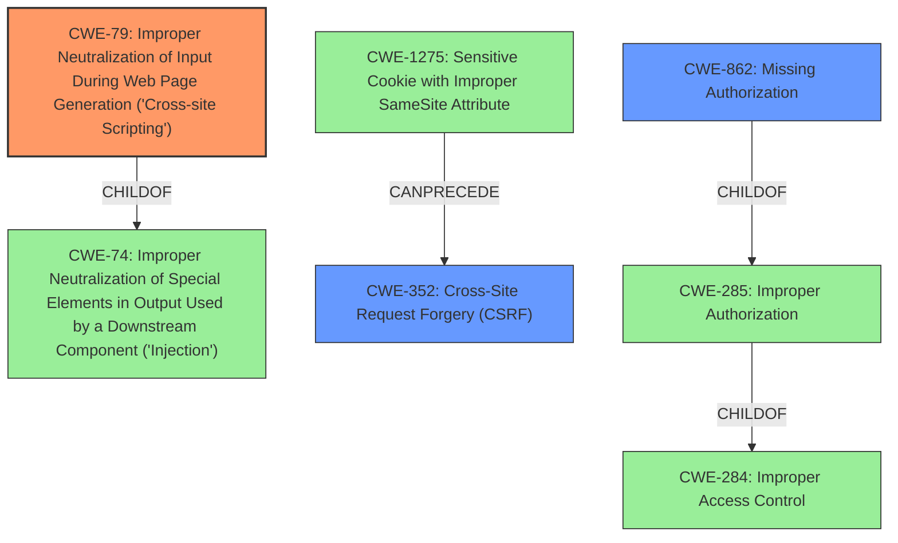

# Analysis Report for CVE-2022-0423

# Vulnerability Analysis Report: CVE-2022-0423

## Description


## Analysis (with Relationship Data)

# Summary
| CWE ID | CWE Name | Confidence | CWE Abstraction Level | CWE Vulnerability Mapping Label | CWE-Vulnerability Mapping Notes |
|---|---|---|---|---|---|
| CWE-79 | Improper Neutralization of Input During Web Page Generation ('Cross-site Scripting') | 1.0 | Base | Allowed | Primary CWE |
| CWE-352 | Cross-Site Request Forgery (CSRF) | 0.9 | Compound | Allowed | Secondary Candidate |
| CWE-862 | Missing Authorization | 0.8 | Class | Allowed-with-Review | Secondary Candidate |

## Evidence and Confidence

*   **Confidence Score:** 0.9
*   **Evidence Strength:** HIGH

## Relationship Analysis
The primary weakness is **CWE-79** [Improper Neutralization of Input During Web Page Generation ('Cross-site Scripting')], which is caused by **lack of authorization and CSRF checks**. **CWE-79** [Improper Neutralization of Input During Web Page Generation ('Cross-site Scripting')] is a child of **CWE-74** [Improper Neutralization of Special Elements in Output Used by a Downstream Component ('Injection')]. **CWE-352** [Cross-Site Request Forgery (CSRF)] can follow **CWE-1275** [Sensitive Cookie with Improper SameSite Attribute]. **CWE-862** [Missing Authorization] is a child of **CWE-285** [Improper Authorization], which in turn is a child of **CWE-284** [Improper Access Control]. The abstraction levels guided the selection, with a preference for Base (CWE-79) and Compound (CWE-352) over Class (CWE-862) and Pillar (CWE-284).



## Vulnerability Chain
The vulnerability chain starts with **lack of authorization and CSRF checks** in the plugin settings update functionality, which allows an authenticated user to inject a Cross-Site Scripting (XSS) payload.

Missing Authorization (CWE-862) -> Cross-Site Request Forgery (CWE-352) -> Improper Neutralization of Input During Web Page Generation ('Cross-site Scripting') (CWE-79)

## Summary of Analysis
The initial analysis considered **CWE-79** [Improper Neutralization of Input During Web Page Generation ('Cross-site Scripting')] due to the **cross-site scripting** weakness mentioned in the description and the CVE Reference Links Content Summary. The "Retriever Results" also gave **CWE-79** [Improper Neutralization of Input During Web Page Generation ('Cross-site Scripting')] a high score. Further analysis revealed that **lack of authorization and CSRF checks** are contributing factors. **CWE-352** [Cross-Site Request Forgery (CSRF)] is included because the vulnerability description mentions the **lack of CSRF checks** when updating settings. **CWE-862** [Missing Authorization] is included due to the **lack of authorization**.

The final selection is based on the provided evidence, particularly the **Vulnerability Description Key Phrases** and the "CVE Reference Links Content Summary" section. The relationships between CWEs support the selection of **CWE-79** [Improper Neutralization of Input During Web Page Generation ('Cross-site Scripting')] as the primary cause with contributing factors of **CWE-352** [Cross-Site Request Forgery (CSRF)] and **CWE-862** [Missing Authorization]. The selected CWEs are at the optimal level of specificity, with **CWE-79** [Improper Neutralization of Input During Web Page Generation ('Cross-site Scripting')] being a Base level CWE and **CWE-352** [Cross-Site Request Forgery (CSRF)] being a Compound level CWE.

Relevant CWE Information:

# Enhanced Context (25 CWEs)

## CWE-79: Improper Neutralization of Input During Web Page Generation ('Cross-site Scripting')
**CWE-79** [Improper Neutralization of Input During Web Page Generation ('Cross-site Scripting')] is the primary CWE because the vulnerability ultimately manifests as a **cross-site scripting** issue. The vulnerability description states that authenticated users can inject Cross-Site Scripting payloads. The "CVE Reference Links Content Summary" also confirms the presence of Stored Cross-Site Scripting (XSS). This matches the description of **CWE-79** [Improper Neutralization of Input During Web Page Generation ('Cross-site Scripting')], where user-controllable input is not neutralized before being placed in a web page.
The security implication is that an attacker can execute arbitrary JavaScript in the victim's browser, potentially stealing cookies, redirecting the user, or defacing the website.

## CWE-352: Cross-Site Request Forgery (CSRF)
**CWE-352** [Cross-Site Request Forgery (CSRF)] is a secondary CWE because the vulnerability description mentions a **lack of CSRF checks** when updating settings. This means an attacker could potentially forge requests on behalf of an authenticated user.
The security implication is that an attacker can trick a user into performing actions they did not intend, such as changing settings or making purchases.

## CWE-862: Missing Authorization
**CWE-862** [Missing Authorization] is a secondary CWE because the vulnerability description mentions a **lack of authorization**. This allows any authenticated user, including subscribers, to modify the plugin settings.
The security implication is that users can perform actions they are not authorized to perform, leading to potential data breaches or system compromise.

CWEs considered but not used:

- **CWE-284** [Improper Access Control]: While the **lack of authorization and CSRF checks** can be seen as a form of improper access control, **CWE-284** [Improper Access Control] is too high-level (Pillar). The more specific **CWE-862** [Missing Authorization] is a better fit. Also, the MITRE Mapping Guidance discourages using **CWE-284** [Improper Access Control].
- **CWE-116** [Improper Encoding or Escaping of Output]: While the vulnerability description mentions **lack of sanitization/escaping**, the ultimate issue is that this **lack of sanitization/escaping** leads to Cross-Site Scripting. Therefore, **CWE-79** [Improper Neutralization of Input During Web Page Generation ('Cross-site Scripting')] is a more accurate representation of the vulnerability.
- **CWE-434** [Unrestricted Upload of File with Dangerous Type]: This CWE is not applicable as the vulnerability does not involve file uploads.


## CWE Relationship Analysis

Current CWEs represent these abstraction levels: .


### Vulnerability Chain Analysis

**Chain starting from CWE-862:**
- 862 (Missing Authorization) - ROOT


**Chain starting from CWE-1275:**
- 1275 (Sensitive Cookie with Improper SameSite Attribute) - ROOT


### CWE Relationship Diagram

```mermaid
graph TD
    classDef primary fill:#f96,stroke:#333,stroke-width:2px
    classDef secondary fill:#69f,stroke:#333
    classDef tertiary fill:#9e9,stroke:#333
```


*Report generated on 2025-03-31 13:01:41*
