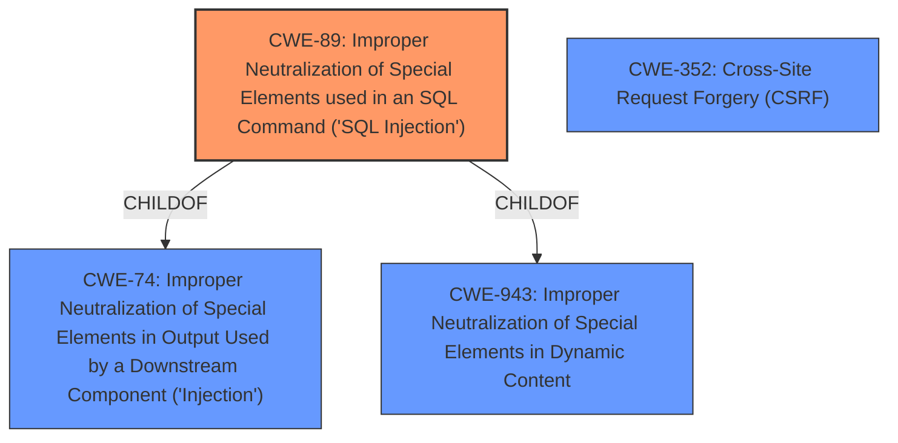

# Analysis for CVE-2022-0439

# Summary
| CWE ID | CWE Name | Confidence | CWE Abstraction Level | CWE Vulnerability Mapping Label | CWE-Vulnerability Mapping Notes |
|---|---|---|---|---|---|
| CWE-89 | Improper Neutralization of Special Elements used in an SQL Command ('SQL Injection') | 1.0 | Base | Allowed | Primary CWE |
| CWE-352 | Cross-Site Request Forgery (CSRF) | 1.0 | Compound | Allowed | Secondary Candidate |

## Evidence and Confidence

*   **Confidence Score:** 1.0
*   **Evidence Strength:** HIGH

## Relationship Analysis
The primary weakness is **SQL injection** (CWE-89), which is a Base level CWE. CWE-89 is a child of CWE-74 (Improper Neutralization of Special Elements in Output Used by a Downstream Component ('Injection')) and CWE-943 (Improper Neutralization of Special Elements in Dynamic Content). A secondary weakness is Cross-Site Request Forgery (CSRF) (CWE-352) which is a Compound level CWE. CWE-352 requires CWE-346, CWE-441, CWE-642 and CWE-613.

## Vulnerability Chain
The vulnerability chain starts with **improper escaping of parameters**, which leads to **SQL injection**. The lack of CSRF protection then allows an attacker to exploit the **SQL injection** vulnerability by tricking a user into performing an action.
- **Root Cause:** Improper escaping of parameters
- **Weakness 1:** SQL Injection (CWE-89)
- **Weakness 2:** Cross-Site Request Forgery (CWE-352)

## Summary of Analysis
The vulnerability description clearly states that the Email Subscribers & Newsletters WordPress plugin before 5.3.2 does not correctly escape the `order` and `orderby` parameters to the `ajax_fetch_report_list` action, making it vulnerable to blind **SQL injection** attacks. The CVE Reference Links Content Summary confirms that the root cause of the vulnerability is the plugin does not correctly escape the `order` and `orderby` parameters in the `ajax_fetch_report_list` action, and that the weakness is a blind SQL injection vulnerability.
Additionally, the vulnerability description mentions that there is no CSRF protection in place for the action, allowing an attacker to trick any logged-in user to perform the action by clicking a link. The CVE Reference Links Content Summary also confirms this lack of CSRF protection.

Based on this evidence, CWE-89 (Improper Neutralization of Special Elements used in an SQL Command ('SQL Injection')) is the primary CWE because the root cause is **improper escaping of parameters**, which leads directly to **SQL injection**. CWE-352 (Cross-Site Request Forgery (CSRF)) is a secondary CWE because the lack of CSRF protection allows an attacker to more easily exploit the **SQL injection** vulnerability. Both CWEs are at the appropriate level of specificity, with CWE-89 being at the Base level and CWE-352 being a Compound.

I considered CWE-116 (Improper Encoding or Escaping of Output) but did not use it because the specific type of injection is SQL injection, which is better represented by CWE-89. I also considered CWE-862 (Missing Authorization) and CWE-863 (Incorrect Authorization) but did not use them because the primary issue is not a missing or incorrect authorization check, but rather the **improper escaping of parameters** that leads to **SQL injection** and lack of CSRF protection.