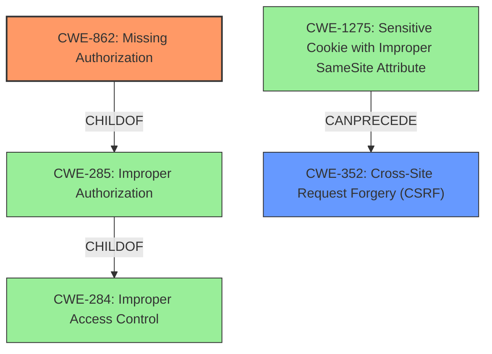

# Enhanced Analysis for CVE-2022-0444

# Summary
| CWE ID | CWE Name | Confidence | CWE Abstraction Level | CWE Vulnerability Mapping Label | CWE-Vulnerability Mapping Notes |
|---|---|---|---|---|---|
| CWE-862 | Missing Authorization | 1.0 | Class | Primary | Allowed-with-Review |
| CWE-352 | Cross-Site Request Forgery (CSRF) | 1.0 | Compound | Secondary | Allowed |

## Evidence and Confidence

*   **Confidence Score:** 1.0
*   **Evidence Strength:** HIGH

## Relationship Analysis
The primary CWE is CWE-862, Missing Authorization, which is a class-level CWE. It is related to CWE-285 (Improper Authorization) and CWE-284 (Improper Access Control) through parent-child relationships. CWE-352, Cross-Site Request Forgery (CSRF), is a compound CWE that requires other weaknesses to be present. There is a CANPRECEDE relationship from CWE-1275 (Sensitive Cookie with Improper SameSite Attribute) to CWE-352.



## Vulnerability Chain
The vulnerability chain starts with the **lack of authorization and CSRF checks**. The **missing authorization** allows unauthenticated attackers to reset settings and generate a new backup encryption key. The **missing CSRF protection** allows attackers to trick a logged-in administrator into unintentionally resetting the settings.

## Summary of Analysis
The analysis is based on the provided evidence, which explicitly states the **root cause** as the **lack of authorization and CSRF checks** in the XCloner plugin before version 4.3.6.

The **Vulnerability Description Key Phrases** state:
- **rootcause:** **lack of authorization and CSRF checks**
- **impact:** reset settings and generate new backup encryption key
- **attacker:** unauthenticated attackers

The **CVE Reference Links Content Summary** section supports this with:
- **Root cause of vulnerability:** The XCloner plugin versions prior to 4.3.6 **lack proper authorization and CSRF checks** when resetting its settings.

Based on the **lack of authorization**, CWE-862 (Missing Authorization) is selected as the primary CWE. CWE-862 is a class-level CWE, and the mapping guidance suggests examining children of this entry to see if there is a better fit. However, none of the children provide a more specific fit than the general **lack of authorization**.

Based on the **lack of CSRF checks**, CWE-352 (Cross-Site Request Forgery (CSRF)) is also selected as a secondary CWE. This is a compound CWE, which means that multiple weaknesses must occur simultaneously.

Other CWEs Considered:

*   CWE-284 (Improper Access Control): This is a Pillar-level CWE and is too general. It is also discouraged to be used for vulnerability mapping.
*   CWE-425 (Direct Request ('Forced Browsing')): While related to authorization issues, it doesn't fully capture the **lack of authorization** as the root cause.
*   CWE-306 (Missing Authentication for Critical Function): Authentication is not the primary issue, authorization is.
*   CWE-863 (Incorrect Authorization): While related, "missing" authorization is more accurate than "incorrect" authorization, given the description.
* CWE-285 (Improper Authorization): This is a Class CWE and is discouraged from being used since it is high-level and lower-level CWEs can be used instead.

The selected CWEs are at the optimal level of specificity, with CWE-862 capturing the core authorization issue and CWE-352 capturing the CSRF aspect of the vulnerability.


## CWE Relationship Analysis

Current CWEs represent these abstraction levels: .


### Vulnerability Chain Analysis

**Chain starting from CWE-862:**
- 862 (Missing Authorization) - ROOT


**Chain starting from CWE-1275:**
- 1275 (Sensitive Cookie with Improper SameSite Attribute) - ROOT


### CWE Relationship Diagram

```mermaid
graph TD
    classDef primary fill:#f96,stroke:#333,stroke-width:2px
    classDef secondary fill:#69f,stroke:#333
    classDef tertiary fill:#9e9,stroke:#333
```