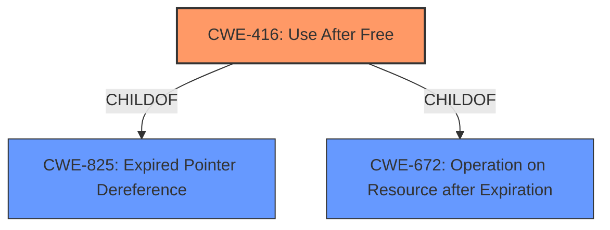

# Raw Analyzer Response for CVE-2022-0453

# Summary
| CWE ID | CWE Name | Confidence | CWE Abstraction Level | CWE Vulnerability Mapping Label | CWE-Vulnerability Mapping Notes |
|---|---|---|---|---|---|
| CWE-416 | Use After Free | 1.0 | Variant | Allowed | Primary CWE |

## Evidence and Confidence

*   **Confidence Score:** 1.0
*   **Evidence Strength:** HIGH

## Relationship Analysis
The primary identified CWE is CWE-416 (Use After Free), a variant-level CWE. This is a child of CWE-825 (Expired Pointer Dereference) and CWE-672 (Operation on Resource after Expiration). The vulnerability description clearly states "**use after free**" as the **rootcause**, making CWE-416 the most specific and appropriate choice.

## Vulnerability Chain
The chain of events is straightforward: the **rootcause** is a **use after free** condition (CWE-416), which leads to heap corruption, potentially allowing arbitrary code execution or denial of service.

## Summary of Analysis
The vulnerability description explicitly mentions "**use after free**" as the **rootcause**. The CVE reference links content summary confirms this: "Root cause of vulnerability: Use after free" and "Weaknesses/vulnerabilities present: Use after free in Reader Mode." The primary CWE match from similar CVE descriptions is CWE-416. The Retriever Results also list CWE-416 as the top combined result.

The analysis is based heavily on the provided evidence, specifically the vulnerability description and the CVE reference links content summary. The relationship graph reinforces the specificity of CWE-416 as a variant of more general weaknesses related to resource expiration.

The selected CWE is at the optimal level of specificity because it directly reflects the **rootcause** described in the vulnerability.

Relevant CWE Information:

# Enhanced Context (25 CWEs)
The following CWEs were identified as potentially relevant to this vulnerability:

## CWE-366: Race Condition within a Thread
**Abstraction Level**: Base
**Similarity Score**: 0.80
**Source**: dense

**Description**:
If two threads of execution use a resource simultaneously, there exists the possibility that resources may be used while invalid, in turn making the state of execution undefined.

**Mapping Guidance**:
- Usage: Allowed
- Rationale: This CWE entry is at the Base level of abstraction, which is a preferred level of abstraction for mapping to the root causes of vulnerabilities.

*Reasoning for not selecting*: While a race condition could potentially lead to a use-after-free, there is no explicit mention of concurrency or threading in the vulnerability description. Therefore, CWE-366 is not selected.

## CWE-1021: Improper Restriction of Rendered UI Layers or Frames
**Abstraction Level**: Base
**Similarity Score**: 0.79
**Source**: dense

**Description**:
The web application does not restrict or incorrectly restricts frame objects or UI layers that belong to another application or domain, which can lead to user confusion about which interface the user is interacting with.

**Mapping Guidance**:
- Usage: Allowed
- Rationale: This CWE entry is at the Base level of abstraction, which is a preferred level of abstraction for mapping to the root causes of vulnerabilities.

*Reasoning for not selecting*: This CWE is related to UI misrepresentation, which is not directly relevant to the use-after-free condition described. Therefore, CWE-1021 is not selected.

## CWE-367: Time-of-check Time-of-use (TOCTOU) Race Condition
**Abstraction Level**: Base
**Similarity Score**: 0.78
**Source**: dense

**Description**:
The product checks the state of a resource before using that resource, but the resource's state can change between the check and the use in a way that invalidates the results of the check. This can cause the product to perform invalid actions when the resource is in an unexpected state.

**Mapping Guidance**:
- Usage: Allowed
- Rationale: This CWE entry is at the Base level of abstraction, which is a preferred level of abstraction for mapping to the root causes of vulnerabilities.

*Reasoning for not selecting*: Similar to CWE-366, a TOCTOU race condition is a possible cause of a use-after-free, but there's no evidence to support the presence of a race condition. Therefore, CWE-367 is not selected.

## CWE-451: User Interface (UI) Misrepresentation of Critical Information
**Abstraction Level**: Class
**Similarity Score**: 0.78
**Source**: dense

**Description**:
The user interface (UI) does not properly represent critical information to the user, allowing the information - or its source - to be obscured or spoofed. This is often a component in phishing attacks.

**Mapping Guidance**:
- Usage: Allowed-with-Review
- Rationale: This CWE entry is a Class and might have Base-level children that would be more appropriate

*Reasoning for not selecting*: This CWE is related to UI misrepresentation, which is not directly relevant to the **use after free** condition described. Therefore, CWE-451 is not selected.

## CWE-362: Concurrent Execution using Shared Resource with Improper Synchronization ('Race Condition')
**Abstraction Level**: Class
**Similarity Score**: 0.78
**Source**: dense

**Description**:
The product contains a concurrent code sequence that requires temporary, exclusive access to a shared resource, but a timing window exists in which the shared resource can be modified by another code sequence operating concurrently.

**Mapping Guidance**:
- Usage: Allowed-with-Review
- Rationale: This CWE entry is a Class and might have Base-level children that would be more appropriate

*Reasoning for not selecting*: While a race condition could potentially lead to a **use-after-free**, there is no explicit mention of concurrency or threading in the vulnerability description. Therefore, CWE-362 is not selected.

## CWE-667: Improper Locking
**Abstraction Level**: Class
**Similarity Score**: 0.77
**Source**: dense

**Description**:
The product does not properly acquire or release a lock on a resource, leading to unexpected resource state changes and behaviors.

**Mapping Guidance**:
- Usage: Allowed-with-Review
- Rationale: This CWE entry is a Class and might have Base-level children that would be more appropriate

*Reasoning for not selecting*: Improper locking could be a cause of a **use-after-free**, but there is no evidence to support the presence of improper locking. Therefore, CWE-667 is not selected.

## CWE-843: Access of Resource Using Incompatible Type ('Type Confusion')
**Abstraction Level**: Base
**Similarity Score**: 0.77
**Source**: dense

**Description**:
The product allocates or initializes a resource such as a pointer, object, or variable using one type, but it later accesses that resource using a type that is incompatible with the original type.

**Mapping Guidance**:
- Usage: Allowed
- Rationale: This CWE entry is at the Base level of abstraction, which is a preferred level of abstraction for mapping to the root causes of vulnerabilities.

*Reasoning for not selecting*: Type confusion is not the direct **rootcause** of the vulnerability. The core issue is the reuse of freed memory, not the type of access. Therefore, CWE-843 is not selected.

## CWE-404: Improper Resource Shutdown or Release
**Abstraction Level**: Class
**Similarity Score**: 0.77
**Source**: dense

**Description**:
The product does not release or incorrectly releases a resource before it is made available for re-use.

**Mapping Guidance**:
- Usage: Allowed-with-Review
- Rationale: This CWE entry is a Class and might have Base-level children that would be more appropriate

*Reasoning for not selecting*: While improper resource shutdown or release can contribute to a **use-after-free**, the description focuses on the reuse of already freed memory. Therefore, CWE-404 is not selected.

## CWE-226: Sensitive Information in Resource Not Removed Before Reuse
**Abstraction Level**: Base
**Similarity Score**: 0.76
**Source**: dense

**Description**:
The product releases a resource such as memory or a file so that it can be made available for reuse, but it does not clear or "zeroize" the information contained in the resource before the product performs a critical state transition or makes the resource available for reuse by other entities.

**Mapping Guidance**:
- Usage: Allowed
- Rationale: This CWE entry is at the Base level of abstraction, which is a preferred level of abstraction for mapping to the root