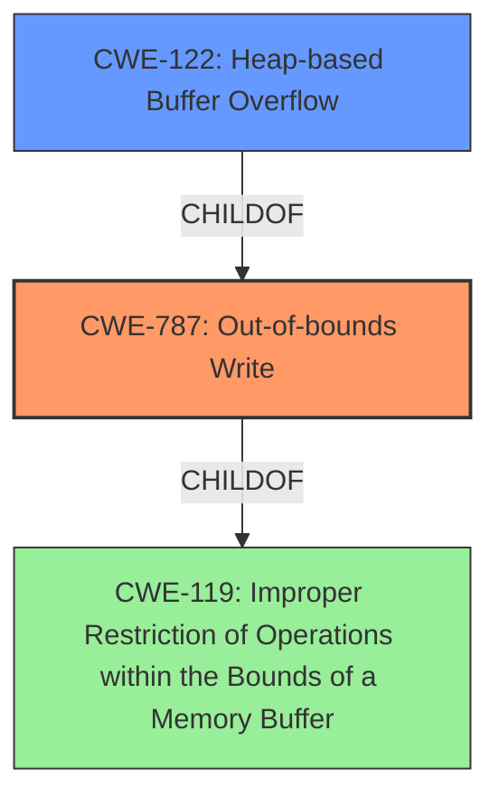

# Analysis for CVE-2022-0454

# Summary
| CWE ID  | CWE Name   | Confidence | CWE Abstraction Level | CWE Vulnerability Mapping Label | CWE-Vulnerability Mapping Notes |
|------------------|-------------------------------------------------------------------|-------------------|---------------------------|-----------------------------------|------------------------------------|
| CWE-787 | Out-of-bounds Write | 1.0 | Base | Primary | Allowed |
| CWE-122 | Heap-based Buffer Overflow | 0.7 | Variant | Secondary | Allowed |
| CWE-119 | Improper Restriction of Operations within the Bounds of a Memory Buffer | 0.4 | Class | Secondary | Discouraged |

## Evidence and Confidence

*   **Confidence Score:** 0.9
*   **Evidence Strength:** HIGH

## Relationship Analysis
The primary weakness is CWE-787 **Out-of-bounds Write** which is a **Base** level CWE. The vulnerability description clearly states that there is a **buffer overflow** on the heap. Thus **CWE-122** **Heap-based Buffer Overflow** which is a **Variant** of **CWE-787** should also be considered. **CWE-787** is a child of **CWE-119** **Improper Restriction of Operations within the Bounds of a Memory Buffer**, which is a more general **Class** level CWE. The relationship is hierarchical with **CWE-119** being the parent and **CWE-787** the child, and **CWE-122** being a more specific child of **CWE-787**.

## Vulnerability Chain
The vulnerability chain starts with a **buffer overflow** in ANGLE, which leads to heap corruption. This allows a remote attacker to potentially execute arbitrary code via a crafted HTML page.

## Summary of Analysis
The initial analysis identified **CWE-787** as the primary candidate based on the vulnerability description mentioning a **"heap buffer overflow"**. The **CWE for similar CVE Descriptions** also indicates **CWE-787** as the primary match. The retriever results list **CWE-119**, **CWE-190**, **CWE-120**, **CWE-416**, **CWE-122** as possible candidates.

The description states: "Heap **buffer overflow** in ANGLE in Google Chrome prior to 98.0.4758.80 allowed a remote attacker to potentially exploit heap corruption via a crafted HTML page." The CVE Reference Links Content Summary confirms the **root_cause** as "Heap **buffer overflow** in ANGLE" and one of the **weaknesses** as "Heap **buffer overflow**".

**CWE-787** **Out-of-bounds Write** is the most accurate **Base** level CWE. **CWE-122** **Heap-based Buffer Overflow** which is a **Variant** of **CWE-787** is also a good fit since the **buffer overflow** occurs on the heap. **CWE-119** **Improper Restriction of Operations within the Bounds of a Memory Buffer** is a more general **Class** level CWE and is discouraged.

The final selection includes **CWE-787** as the primary CWE, with **CWE-122** as a secondary candidate because it specifies the location of the **buffer overflow**. **CWE-119** was considered but not selected as primary due to its higher level of abstraction.

Relevant CWE Information:

# Enhanced Context (25 CWEs)

## CWE-124: Buffer Underwrite ('Buffer Underflow')
**Abstraction Level**: Base
**Similarity Score**: 0.79
**Source**: dense
**Description**:
The product writes to a buffer using an index or pointer that references a memory location prior to the beginning of the buffer.
**Mapping Guidance**:
- Usage: Allowed
- Rationale: This CWE entry is at the Base level of abstraction, which is a preferred level of abstraction for mapping to the root causes of vulnerabilities.
*Not selected* because the vulnerability is a **buffer overflow** not a **buffer underflow**.

## CWE-191: Integer Underflow (Wrap or Wraparound)
**Abstraction Level**: Base
**Similarity Score**: 0.78
**Source**: dense
**Description**:
The product subtracts one value from another, such that the result is less than the minimum allowable integer value, which produces a value that is not equal to the correct result.
**Mapping Guidance**:
- Usage: Allowed
- Rationale: This CWE entry is at the Base level of abstraction, which is a preferred level of abstraction for mapping to the root causes of vulnerabilities.
*Not selected* because there is no evidence of an integer underflow.

## CWE-131: Incorrect Calculation of Buffer Size
**Abstraction Level**: Base
**Similarity Score**: 0.78
**Source**: dense
**Description**:
The product does not correctly calculate the size to be used when allocating a buffer, which could lead to a buffer overflow.
**Mapping Guidance**:
- Usage: Allowed
- Rationale: This CWE entry is at the Base level of abstraction, which is a preferred level of abstraction for mapping to the root causes of vulnerabilities.
*Not selected* because the vulnerability description does not provide enough information to determine if the root cause is an incorrect calculation of **buffer** size.

## CWE-193: Off-by-one Error
**Abstraction Level**: Base
**Similarity Score**: 0.77
**Source**: dense
**Description**:
A product calculates or uses an incorrect maximum or minimum value that is 1 more, or 1 less, than the correct value.
**Mapping Guidance**:
- Usage: Allowed
- Rationale: This CWE entry is at the Base level of abstraction, which is a preferred level of abstraction for mapping to the root causes of vulnerabilities.
*Not selected* because the vulnerability description does not provide enough information to determine if the root cause is an off-by-one error.

## CWE-805: Buffer Access with Incorrect Length Value
**Abstraction Level**: Base
**Similarity Score**: 0.77
**Source**: dense
**Description**:
The product uses a sequential operation to read or write a buffer, but it uses an incorrect length value that causes it to access memory that is outside of the bounds of the buffer.
**Mapping Guidance**:
- Usage: Allowed
- Rationale: This CWE entry is at the Base level of abstraction, which is a preferred level of abstraction for mapping to the root causes of vulnerabilities.
*Not selected* because the vulnerability description does not provide enough information to determine if the root cause is **buffer** access with an incorrect length value.

## CWE-786: Access of Memory Location Before Start of Buffer
**Abstraction Level**: Base
**Similarity Score**: 0.76
**Source**: dense
**Description**:
The product reads or writes to a buffer using an index or pointer that references a memory location prior to the beginning of the buffer.
**Mapping Guidance**:
- Usage: Discouraged
- Rationale: The CWE entry might be misused when lower-level CWE entries might be available. It also overlaps existing CWE entries and might be deprecated in the future.
*Not selected* because the vulnerability is a **buffer overflow**, not an access before the start of the **buffer**.

## CWE-127: Buffer Under-read
**Abstraction Level**: Variant
**Similarity Score**: 0.76
**Source**: dense
**Description**:
The product reads from a buffer using buffer access mechanisms such as indexes or pointers that reference memory locations prior to the targeted buffer.
**Mapping Guidance**:
- Usage: Allowed
- Rationale: This CWE entry is at the Variant level of abstraction, which is a preferred level of abstraction for mapping to the root causes of vulnerabilities.
*Not selected* because the vulnerability is a **buffer overflow**, not a **buffer under-read**.

## CWE-197: Numeric Truncation Error
**Abstraction Level**: Base
**Similarity Score**: 0.75
**Source**: dense
**Description**:
Truncation errors occur when a primitive is cast to a primitive of a smaller size and data is lost in the conversion.
**Mapping Guidance**:
- Usage: Allowed
- Rationale: This CWE entry is at the Base level of abstraction, which is a preferred level of abstraction for mapping to the root causes of vulnerabilities.
*Not selected* because there is no evidence of a numeric truncation error.

## CWE-36