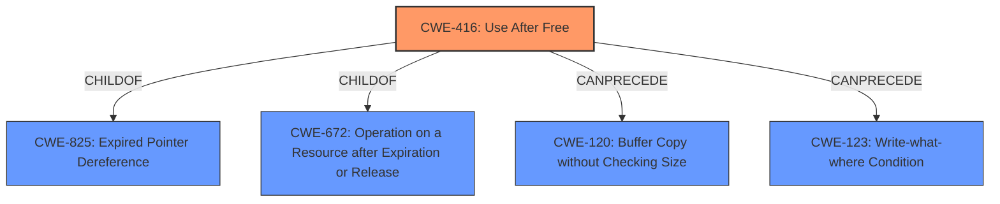

# Analysis Report for CVE-2022-0458

# Vulnerability Analysis Report: CVE-2022-0458

## Description


## Analysis (with Relationship Data)

# Summary
| CWE ID | CWE Name | Confidence | CWE Abstraction Level | CWE Vulnerability Mapping Label | CWE-Vulnerability Mapping Notes |
|---|---|---|---|---|---|
| CWE-416 | Use After Free | 1.0 | Variant | Allowed | Primary CWE |

## Evidence and Confidence

*   **Confidence Score:** 1.0
*   **Evidence Strength:** HIGH

## Relationship Analysis
The primary relationship that influenced the decision was the direct match of the **weakness** described in the vulnerability "use after free" to CWE-416. The retriever results listed CWE-416 first.



## Vulnerability Chain
The vulnerability chain starts with the **use after free** condition, leading to potential heap corruption.
  - **Root Cause:** Use After Free (CWE-416)
  - **Impact:** Heap corruption

## Summary of Analysis
The initial analysis strongly pointed to CWE-416 due to the explicit mention of "**use after free**" in both the vulnerability description and the CVE reference summary. The retriever results also listed CWE-416 as the top combined result.

The evidence from the vulnerability description and CVE reference links is sufficient to confidently assign CWE-416.

The selection is at the optimal level of specificity because CWE-416 is a Variant-level CWE, which is the preferred level of abstraction.

Relevant CWE Information:

# Enhanced Context (25 CWEs)
The following CWEs were identified as potentially relevant to this vulnerability:

## CWE-416: Use After Free
**Abstraction:** Variant
**Status:** Stable

### Description
The product reuses or references memory after it has been freed. At some point afterward, the memory may be allocated again and saved in another pointer, while the original pointer references a location somewhere within the new allocation. Any operations using the original pointer are no longer valid because the memory "belongs" to the code that operates on the new pointer.

### Extended Description
Not provided

### Alternative Terms
Dangling pointer: a pointer that no longer points to valid memory, often after it has been freed
UAF: commonly used acronym for Use After Free
Use-After-Free

### Relationships
ChildOf -> CWE-825
ChildOf -> CWE-672
ChildOf -> CWE-672
ChildOf -> CWE-672
CanPrecede -> CWE-120
CanPrecede -> CWE-123

### Mapping Guidance
**Usage:** Allowed
**Rationale:** This CWE entry is at the Variant level of abstraction, which is a preferred level of abstraction for mapping to the root causes of vulnerabilities.
**Comments:** Carefully read both the name and description to ensure that this mapping is an appropriate fit. Do not try to 'force' a mapping to a lower-level Base/Variant simply to comply with this preferred level of abstraction.
**Reasons:**
- Acceptable-Use

### Observed Examples
- **CVE-2022-20141:** Chain: an operating system kernel has insufficent resource locking (CWE-413) leading to a use after free (CWE-416).
- **CVE-2022-2621:** Chain: two threads in a web browser use the same resource (CWE-366), but one of those threads can destroy the resource before the other has completed (CWE-416).
- **CVE-2021-0920:** Chain: mobile platform race condition (CWE-362) leading to use-after-free (CWE-416), as exploited in the wild per CISA KEV.

## Other Considered CWEs:

*   **CWE-366 Race Condition within a Thread:** While race conditions can sometimes lead to use-after-free vulnerabilities, there is no evidence of a race condition in the provided description. Therefore, this CWE was not selected.
*   **CWE-843 Access of Resource Using Incompatible Type ('Type Confusion'):** Type confusion can lead to memory corruption, but the vulnerability description specifically mentions use-after-free, making CWE-416 a more accurate fit.
*   **CWE-122 Heap-based Buffer Overflow:** The vulnerability description indicates "**use after free**" condition not a buffer overflow.
*   **CWE-415 Double Free:** Similar to the heap-based buffer overflow, the vulnerability description explicitly points to a use-after-free condition, not a double free.
*   **CWE-451 User Interface (UI) Misrepresentation of Critical Information:** This CWE relates to UI misrepresentation, which is not relevant to the given vulnerability.
*   **CWE-123 Write-what-where Condition:** While a use-after-free can potentially lead to a write-what-where condition, it is a consequence of the use-after-free, not the root cause.
*   **CWE-362 Concurrent Execution using Shared Resource with Improper Synchronization ('Race Condition'):** Same reasoning as CWE-366
*   **CWE-911 Improper Update of Reference Count:** There's no mention of reference counting issues in the description.
*   **CWE-156 Improper Neutralization of Whitespace:** Whitespace issues are not relevant to this vulnerability.


## CWE Relationship Analysis

Current CWEs represent these abstraction levels: .


### Vulnerability Chain Analysis

**Chain starting from CWE-413:**
- 413 (Improper Resource Locking) - ROOT


**Chain starting from CWE-825:**
- 825 (Expired Pointer Dereference) - ROOT


### CWE Relationship Diagram

```mermaid
graph TD
    classDef primary fill:#f96,stroke:#333,stroke-width:2px
    classDef secondary fill:#69f,stroke:#333
    classDef tertiary fill:#9e9,stroke:#333
```


*Report generated on 2025-03-30 17:26:19*
