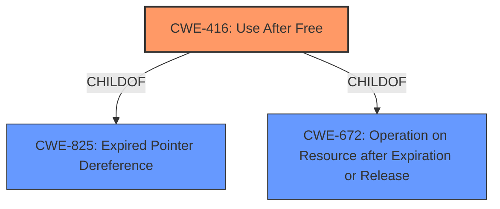

# Enhanced Analysis for CVE-2022-0460

# Summary
| CWE ID | CWE Name | Confidence | CWE Abstraction Level | CWE Vulnerability Mapping Label | CWE-Vulnerability Mapping Notes |
|---|---|---|---|---|---|
| CWE-416 | Use After Free | 1.0 | Variant | Allowed | Primary CWE |

## Evidence and Confidence

*   **Confidence Score:** 1.0
*   **Evidence Strength:** HIGH

## Relationship Analysis
The primary relationship influencing the decision is that CWE-416 is a **Variant** of CWE-825 (Expired Pointer Dereference) and CWE-672 (Operation on Resource after Expiration or Release). Given the explicit mention of "use after free" as the root cause in both the vulnerability description and the CVE reference links, mapping to the **Variant** CWE-416 is the most specific and accurate choice.



## Vulnerability Chain
The vulnerability chain is straightforward:
  - **Root Cause:** **Use After Free** (CWE-416)
  - **Impact:** Potential **heap corruption** and arbitrary code execution

## Summary of Analysis
The initial analysis strongly points to CWE-416 (**Use After Free**) as the primary CWE. The vulnerability description explicitly mentions "**use after free**" as the **root cause**, and the CVE Reference Links Content Summary confirms this. The description also mentions "**heap corruption**" as a weakness, which can be a consequence of a use-after-free vulnerability.

The retriever results also list CWE-416 as the top candidate.

The relationship graph shows that CWE-416 is a **Variant** of more general CWEs, making it the most specific and appropriate choice.

The evidence supporting this decision is strong and clear, leading to a high confidence score of 1.0.

Relevant CWE Information:

# Enhanced Context (25 CWEs)
The following CWEs were identified as potentially relevant to this vulnerability:

## CWE-366: Race Condition within a Thread
**Abstraction Level**: Base
**Similarity Score**: 0.80
**Source**: dense

**Description**:
If two threads of execution use a resource simultaneously, there exists the possibility that resources may be used while invalid, in turn making the state of execution undefined.

**Mapping Guidance**:
- Usage: Allowed
- Rationale: This CWE entry is at the Base level of abstraction, which is a preferred level of abstraction for mapping to the root causes of vulnerabilities.

**Analysis:** CWE-366 was considered because race conditions can lead to use-after-free vulnerabilities. However, there is no explicit evidence of a race condition in the vulnerability description, so it was not selected.

## CWE-843: Access of Resource Using Incompatible Type ('Type Confusion')
**Abstraction Level**: Base
**Similarity Score**: 0.77
**Source**: dense

**Description**:
The product allocates or initializes a resource such as a pointer, object, or variable using one type, but it later accesses that resource using a type that is incompatible with the original type.

**Mapping Guidance**:
- Usage: Allowed
- Rationale: This CWE entry is at the Base level of abstraction, which is a preferred level of abstraction for mapping to the root causes of vulnerabilities.

**Analysis:** CWE-843 was considered because type confusion can sometimes be related to memory corruption issues. However, the description focuses specifically on type incompatibilities, and there is no evidence of this in the vulnerability description.

## CWE-122: Heap-based Buffer Overflow
**Abstraction Level**: Variant
**Similarity Score**: 0.77
**Source**: dense

**Description**:
A heap overflow condition is a buffer overflow, where the buffer that can be overwritten is allocated in the heap portion of memory, generally meaning that the buffer was allocated using a routine such as malloc().

**Mapping Guidance**:
- Usage: Allowed
- Rationale: This CWE entry is at the Variant level of abstraction, which is a preferred level of abstraction for mapping to the root causes of vulnerabilities.

**Analysis:** CWE-122 was considered because the description mentions "**heap corruption**". However, the **root cause** is **use after free**, not a buffer overflow. Therefore, CWE-122 is not the most accurate mapping.

## CWE-415: Double Free
**Abstraction Level**: Variant
**Similarity Score**: 0.77
**Source**: dense

**Description**:
The product calls free() twice on the same memory address, potentially leading to modification of unexpected memory locations.

**Mapping Guidance**:
- Usage: Allowed
- Rationale: This CWE entry is at the Variant level of abstraction, which is a preferred level of abstraction for mapping to the root causes of vulnerabilities.

**Analysis:** CWE-415 was not selected because the vulnerability is explicitly a **use after free**, not a double free.

## CWE-123: Write-what-where Condition
**Abstraction Level**: Base
**Similarity Score**: 0.77
**Source**: dense

**Description**:
Any condition where the attacker has the ability to write an arbitrary value to an arbitrary location, often as the result of a buffer overflow.

**Mapping Guidance**:
- Usage: Allowed
- Rationale: This CWE entry is at the Base level of abstraction, which is a preferred level of abstraction for mapping to the root causes of vulnerabilities.

**Analysis:** While a **use after free** can potentially lead to an arbitrary write, the more specific **root cause** is the **use after free** itself, making CWE-416 a better fit.


## CWE Relationship Analysis

Current CWEs represent these abstraction levels: .


### Vulnerability Chain Analysis

**Chain starting from CWE-825:**
- 825 (Expired Pointer Dereference) - ROOT


**Chain starting from CWE-672:**
- 672 (Operation on a Resource after Expiration or Release) - ROOT


### CWE Relationship Diagram

```mermaid
graph TD
    classDef primary fill:#f96,stroke:#333,stroke-width:2px
    classDef secondary fill:#69f,stroke:#333
    classDef tertiary fill:#9e9,stroke:#333
```