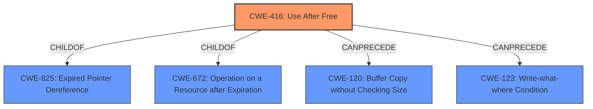

# Analysis for CVE-2022-0464

# Summary
| CWE ID | CWE Name | Confidence | CWE Abstraction Level | CWE Vulnerability Mapping Label | CWE-Vulnerability Mapping Notes |
|---|---|---|---|---|---|
| CWE-416 | Use After Free | 1.0 | Variant | Primary | Allowed |

## Evidence and Confidence

*   **Confidence Score:** 1.0
*   **Evidence Strength:** HIGH

## Relationship Analysis
The primary identified weakness is CWE-416 (**CWE-416: Use After Free**). This is a variant level CWE, making it a specific type of weakness. CWE-416 is a child of CWE-825 (**CWE-825: Expired Pointer Dereference**) and CWE-672 (**CWE-672: Operation on a Resource after Expiration**). It can precede CWE-120 (**CWE-120: Buffer Copy without Checking Size of Input ('Classic Buffer Overflow')**) and CWE-123 (**CWE-123: Write-what-where Condition**). The direct match of the vulnerability description with the CWE description, particularly the key phrase "**Use after free**" as the root cause, makes the selection of CWE-416 highly confident.

## Vulnerability Chain
The vulnerability chain starts with a **Use after free** condition (CWE-416) in the Accessibility component of Google Chrome, potentially leading to heap corruption. The exploitation can lead to arbitrary code execution.

## Summary of Analysis
The initial analysis correctly identifies CWE-416 (**CWE-416: Use After Free**) as the primary weakness. This assessment is heavily based on the vulnerability description, which explicitly states "**Use after free**" as the root cause. The CVE Reference Links Content Summary further supports this by stating "Root cause of vulnerability: **Use after free**" and "Weaknesses/vulnerabilities present: **Use after free** in Accessibility." The selection of CWE-416 is at the optimal level of specificity, as it's a variant that accurately captures the nature of the vulnerability. The confidence in this assessment is high (1.0) due to the clear and direct evidence provided in the vulnerability description and supporting summaries.

Other CWEs considered but not used:

*   CWE-366 (**CWE-366: Race Condition within a Thread**): While a race condition could potentially lead to a use-after-free, the description does not explicitly mention any concurrent execution or timing issues. Therefore, CWE-366 is not applicable.
*   CWE-122 (**CWE-122: Heap-based Buffer Overflow**): The vulnerability description mentions heap corruption as an impact, but the root cause is a **use-after-free**, not a buffer overflow. Therefore, CWE-122 is not applicable.
*   CWE-843 (**CWE-843: Access of Resource Using Incompatible Type ('Type Confusion')**): There is no evidence of type confusion in the vulnerability description. Therefore, CWE-843 is not applicable.
*   CWE-362 (**CWE-362: Concurrent Execution using Shared Resource with Improper Synchronization ('Race Condition')**): Similar to CWE-366, there is no explicit mention of concurrency or synchronization issues. Therefore, CWE-362 is not applicable.
*   CWE-1021 (**CWE-1021: Improper Restriction of Rendered UI Layers or Frames**): This CWE relates to UI redress attacks like clickjacking, which is not relevant to the **use-after-free** vulnerability described.
*   CWE-364 (**CWE-364: Signal Handler Race Condition**): This is specific to signal handlers, which are not mentioned in the vulnerability description.
*   CWE-665 (**CWE-665: Improper Initialization**): There is no indication of improper initialization in the provided description.
*   CWE-415 (**CWE-415: Double Free**): The root cause is **use-after-free**, not a double free.
*   CWE-404 (**CWE-404: Improper Resource Shutdown or Release**): The vulnerability is not related to improper resource shutdown or release but rather using memory after it has been freed.