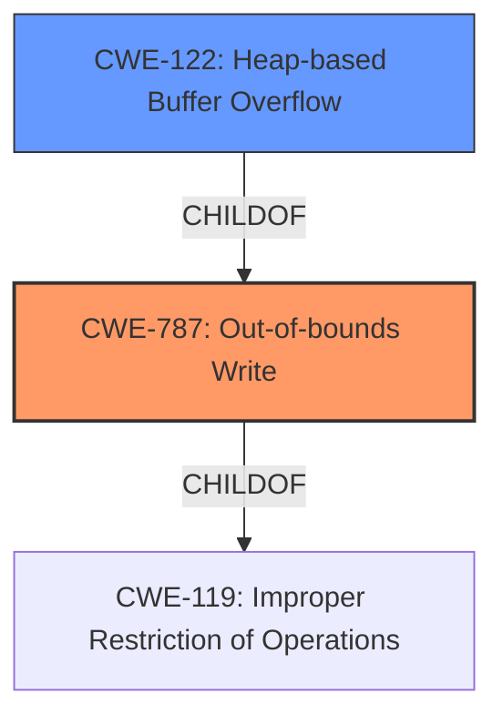

# Analysis for CVE-2022-0470

# Summary

| CWE ID  | CWE Name                                                                                                        | Confidence | CWE Abstraction Level | CWE Vulnerability Mapping Label | CWE-Vulnerability Mapping Notes |
| :-------- | :---------------------------------------------------------------------------------------------------------------- | :--------- | :---------------------- | :------------------------------ | :------------------------------ |
| CWE-787 | Out-of-bounds Write                                                                                             | 1          | Base                    | Primary                         | Allowed                         |
| CWE-122 | Heap-based Buffer Overflow | 0.7        | Variant                 | Secondary                       | Allowed                         |

## Evidence and Confidence

*   **Confidence Score:** 0.85
*   **Evidence Strength:** HIGH

## Relationship Analysis

The primary CWE, CWE-787 (**CWE-787: Out-of-bounds Write**), is a base-level CWE, which makes it a good choice for directly representing the **out-of-bounds memory access**. CWE-787 is a child of CWE-119 (**CWE-119: Improper Restriction of Operations Within the Bounds of a Memory Buffer**), indicating a general class of memory corruption issues. CWE-122 (**CWE-122: Heap-based Buffer Overflow**) is a more specific variant, clarifying that the overflow occurs on the heap. The relationship between CWE-787 and CWE-122 shows a progression from a general out-of-bounds write to a more specific heap-based overflow.

## Vulnerability Chain

The vulnerability chain starts with **out-of-bounds memory access** (CWE-787), leading to **heap corruption** (CWE-122). The crafted HTML page is the attack vector, and the ultimate impact is the potential for remote code execution.

## Summary of Analysis

The initial assessment points strongly to CWE-787 (**CWE-787: Out-of-bounds Write**) due to the explicit mention of **out-of-bounds memory access** in the vulnerability description and the "CVE Reference Links Content Summary". The description states: "**Out of bounds memory access** in V8 in Google Chrome prior to 98.0.4758.80 allowed a remote attacker to potentially exploit **heap corruption** via a crafted HTML page." This aligns perfectly with the definition of CWE-787, where data is written past the end or before the beginning of the intended buffer.

The retriever results and similar CVE descriptions also support this choice, with CWE-787 being the primary CWE match. Furthermore, the **heap corruption** aspect suggests that the out-of-bounds write is specifically occurring in the heap memory region, making CWE-122 (**CWE-122: Heap-based Buffer Overflow**) a relevant secondary consideration, since CWE-122 is a variant of CWE-787.

The evidence from the vulnerability description and the supporting data strongly indicate that CWE-787 is the most appropriate primary CWE, with CWE-122 as a secondary candidate to further specify the location of the out-of-bounds write.

Relevant CWE Information:

# Enhanced Context (25 CWEs)

## CWE-823: Use of Out-of-range Pointer Offset
**Abstraction Level**: Base
**Similarity Score**: 0.78
**Source**: dense

**Description**:
The product performs pointer arithmetic on a valid pointer, but it uses an offset that can point outside of the intended range of valid memory locations for the resulting pointer.

**Mapping Guidance**:
- Usage: Allowed
- Rationale: This CWE entry is at the Base level of abstraction, which is a preferred level of abstraction for mapping to the root causes of vulnerabilities.

*This CWE was considered but not selected because the description focuses on pointer arithmetic and offsets, which is not explicitly mentioned in the vulnerability description. The core issue is the out-of-bounds write, rather than the specific mechanism of pointer manipulation.*

## CWE-193: Off-by-one Error
**Abstraction Level**: Base
**Similarity Score**: 0.77
**Source**: dense

**Description**:
A product calculates or uses an incorrect maximum or minimum value that is 1 more, or 1 less, than the correct value.

**Mapping Guidance**:
- Usage: Allowed
- Rationale: This CWE entry is at the Base level of abstraction, which is a preferred level of abstraction for mapping to the root causes of vulnerabilities.

*This CWE was considered but not selected because there is no specific mention or evidence of an off-by-one error in the provided description.*

## CWE-131: Incorrect Calculation of Buffer Size
**Abstraction Level**: Base
**Similarity Score**: 0.77
**Source**: dense

**Description**:
The product does not correctly calculate the size to be used when allocating a buffer, which could lead to a buffer overflow.

**Mapping Guidance**:
- Usage: Allowed
- Rationale: This CWE entry is at the Base level of abstraction, which is a preferred level of abstraction for mapping to the root causes of vulnerabilities.

*This CWE was considered but not selected because the description doesn't directly mention incorrect buffer size calculation as the root cause. The primary issue is the **out-of-bounds memory access**, regardless of how the buffer size was determined.*

## CWE-366: Race Condition within a Thread
**Abstraction Level**: Base
**Similarity Score**: 0.77
**Source**: dense

**Description**:
If two threads of execution use a resource simultaneously, there exists the possibility that resources may be used while invalid, in turn making the state of execution undefined.

**Mapping Guidance**:
- Usage: Allowed
- Rationale: This CWE entry is at the Base level of abstraction, which is a preferred level of abstraction for mapping to the root causes of vulnerabilities.

*This CWE was considered but not selected because there is no evidence of a race condition in the provided description.*

## CWE-191: Integer Underflow (Wrap or Wraparound)
**Abstraction Level**: Base
**Similarity Score**: 0.76
**Source**: dense

**Description**:
The product subtracts one value from another, such that the result is less than the minimum allowable integer value, which produces a value that is not equal to the correct result.

**Mapping Guidance**:
- Usage: Allowed
- Rationale: This CWE entry is at the Base level of abstraction, which is a preferred level of abstraction for mapping to the root causes of vulnerabilities.

*This CWE was considered but not selected because there is no evidence of integer underflow in the provided description.*

## CWE-667: Improper Locking
**Abstraction Level**: Class
**Similarity Score**: 0.76
**Source**: dense

**Description**:
The product does not properly acquire or release a lock on a resource, leading to unexpected resource state changes and behaviors.

**Mapping Guidance**:
- Usage: Allowed-with-Review
- Rationale: This CWE entry is a Class and might have Base-level children that would be more appropriate

*This CWE was considered but not selected because there is no evidence of improper locking in the provided description.*

## CWE-805: Buffer Access with Incorrect Length Value
**Abstraction Level**: Base
**Similarity Score**: 0.76
**Source**: dense

**Description**:
The product uses a sequential operation to read or write a buffer, but it uses an incorrect length value that causes it to access memory that is outside of the bounds of the buffer.

**Mapping Guidance**:
- Usage: Allowed
- Rationale: This CWE entry is at the Base level of abstraction, which is a preferred level of abstraction for mapping to the root causes of vulnerabilities.

*This CWE was considered but not selected because while the vulnerability does involve out-of-bounds access, the core issue is the out-of-bounds write itself, not necessarily the incorrect length value used in the access.*

## CWE-197: Numeric Truncation Error
**Abstraction Level**: Base
**Similarity Score**: 0.76
**Source**: dense

**Description**:
Truncation errors occur when a primitive is cast to a primitive of a smaller size and data is lost in the conversion.

**Mapping Guidance**:
- Usage: Allowed
- Rationale: This CWE entry is at the Base level of abstraction, which is a preferred level of abstraction for mapping to the root causes of vulnerabilities.

*This CWE was considered but not selected because there is no evidence of numeric truncation in the provided description.*

## CWE-125: Out-of-bounds Read
**Abstraction Level**: Base
**Similarity Score**: 0.76
**Source**: dense

**Description**:
The