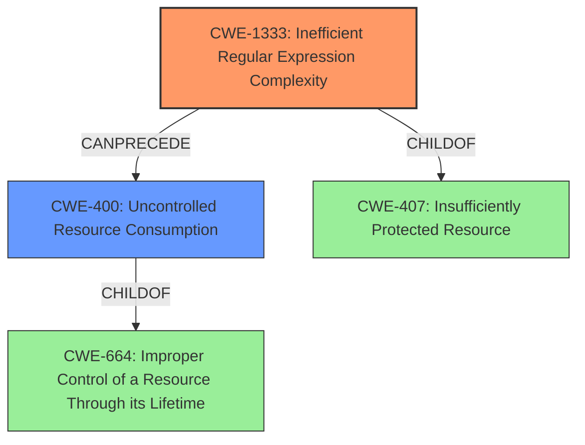

# Raw Analyzer Response for CVE-2022-0488

# Summary
| CWE ID    | CWE Name                                      | Confidence | CWE Abstraction Level | CWE Vulnerability Mapping Label | CWE-Vulnerability Mapping Notes |
| :-------- | :-------------------------------------------- | :--------- | :-------------------- | :------------------------------ | :------------------------------ |
| CWE-1333 | Inefficient Regular Expression Complexity  | 0.75       | Base                  | Allowed                         | Primary CWE                     |
| CWE-400 | Uncontrolled Resource Consumption       | 0.50       | Class                   | Discouraged                      | Secondary Candidate             |

## Evidence and Confidence

*   **Confidence Score:** 0.70
*   **Evidence Strength:** MEDIUM

## Relationship Analysis
The primary relationship considered was the child-of relationship between CWE-1333 and CWE-407 (Insufficiently Protected Resource). While CWE-400 is a broader class, CWE-1333 more precisely describes the **root cause** of the resource consumption. There's also a peer relationship between CWE-400 and other resource management issues like CWE-770 (Allocation of Resources Without Limits or Throttling), but the regex inefficiency is the more direct cause.

## Vulnerability Chain
The vulnerability chain starts with the introduction of an inefficient regular expression (CWE-1333) in the markdown processing logic. This **inefficient regex** allows an attacker to craft input (a specific amount of blockquotes) that triggers excessive backtracking, leading to high CPU consumption and ultimately causing a timeout (resource exhaustion/denial of service).

## Summary of Analysis
The initial assessment focused on identifying the **root cause** of the timeout. The description clearly states that a "specific amount of block-quotes" can "trigger a timeout on a page with markdown." While the result is a timeout (which could be related to resource exhaustion), the underlying issue is the **inefficient regular expression**.

The Retriever Results identified CWE-1333 (Inefficient Regular Expression Complexity) as the top candidate, which aligns directly with the vulnerability description. CWE-400 (Uncontrolled Resource Consumption) was also considered, but it is a more general class and less specific to the **root cause**.

The decision to prioritize CWE-1333 is based on the following evidence:

*   **Vulnerability Description Key Phrases:** The phrase "trigger timeout on page with markdown by using a specific amount of block-quotes" suggests a parsing or processing inefficiency related to markdown syntax.
*   **Retriever Results:** CWE-1333 has the highest similarity score and directly addresses the complexity of regular expressions.
*   **CWE Description:** The description of CWE-1333 mentions "crafted inputs that intentionally cause the regular expression to use excessive backtracking in a way that causes the CPU consumption to spike," which aligns perfectly with the vulnerability.

While CWE-400 could be considered a secondary effect, mapping it as the primary CWE would obscure the underlying weakness related to the regular expression's complexity. Therefore, CWE-1333 is chosen as the primary CWE due to its specificity and direct relevance to the **root cause**.

Relevant CWE Information:

# Enhanced Context (25 CWEs)
The following CWEs were identified as potentially relevant to this vulnerability:

## CWE-639: Authorization Bypass Through User-Controlled Key
**Abstraction Level**: Base
**Similarity Score**: 0.76
**Source**: dense

**Description**:
The system's authorization functionality does not prevent one user from gaining access to another user's data or record by modifying the key value identifying the data.

**Mapping Guidance**:
- Usage: Allowed
- Rationale: This CWE entry is at the Base level of abstraction, which is a preferred level of abstraction for mapping to the root causes of vulnerabilities.

## CWE-1289: Improper Validation of Unsafe Equivalence in Input
**Abstraction Level**: Base
**Similarity Score**: 0.76
**Source**: dense

**Description**:
The product receives an input value that is used as a resource identifier or other type of reference, but it does not validate or incorrectly validates that the input is equivalent to a potentially-unsafe value.

**Mapping Guidance**:
- Usage: Allowed
- Rationale: This CWE entry is at the Base level of abstraction, which is a preferred level of abstraction for mapping to the root causes of vulnerabilities.

## CWE-404: Improper Resource Shutdown or Release
**Abstraction Level**: Class
**Similarity Score**: 0.76
**Source**: dense

**Description**:
The product does not release or incorrectly releases a resource before it is made available for re-use.

**Mapping Guidance**:
- Usage: Allowed-with-Review
- Rationale: This CWE entry is a Class and might have Base-level children that would be more appropriate

## CWE-41: Improper Resolution of Path Equivalence
**Abstraction Level**: Base
**Similarity Score**: 0.76
**Source**: dense

**Description**:
The product is vulnerable to file system contents disclosure through path equivalence. Path equivalence involves the use of special characters in file and directory names. The associated manipulations are intended to generate multiple names for the same object.

**Mapping Guidance**:
- Usage: Allowed
- Rationale: This CWE entry is at the Base level of abstraction, which is a preferred level of abstraction for mapping to the root causes of vulnerabilities.

## CWE-668: Exposure of Resource to Wrong Sphere
**Abstraction Level**: Class
**Similarity Score**: 0.75
**Source**: dense

**Description**:
The product exposes a resource to the wrong control sphere, providing unintended actors with inappropriate access to the resource.

**Mapping Guidance**:
- Usage: Discouraged
- Rationale: CWE-668 is high-level and is often misused as a catch-all when lower-level CWE IDs might be applicable. It is sometimes used for low-information vulnerability reports [REF-1287]. It is a level-1 Class (i.e., a child of a Pillar). It is not useful for trend analysis.

## CWE-807: Reliance on Untrusted Inputs in a Security Decision
**Abstraction Level**: Base
**Similarity Score**: 0.75
**Source**: dense

**Description**:
The product uses a protection mechanism that relies on the existence or values of an input, but the input can be modified by an untrusted actor in a way that bypasses the protection mechanism.

**Mapping Guidance**:
- Usage: Allowed
- Rationale: This CWE entry is at the Base level of abstraction, which is a preferred level of abstraction for mapping to the root causes of vulnerabilities.

## CWE-664: Improper Control of a Resource Through its Lifetime
**Abstraction Level**: Pillar
**Similarity Score**: 0.75
**Source**: dense

**Description**:
The product does not maintain or incorrectly maintains control over a resource throughout its lifetime of creation, use, and release.

**Mapping Guidance**:
- Usage: Discouraged
- Rationale: This CWE entry is high-level when lower-level children are available.

## CWE-1390: Weak Authentication
**Abstraction Level**: Class
**Similarity Score**: 0.74
**Source**: dense

**Description**:
The product uses an authentication mechanism to restrict access to specific users or identities, but the mechanism does not sufficiently prove that the claimed identity is correct.

**Mapping Guidance**:
- Usage: Allowed-with-Review
- Rationale: This CWE entry is a Class and might have Base-level children that would be more appropriate

## CWE-226: Sensitive Information in Resource Not Removed Before Reuse
**Abstraction Level**: Base
**Similarity Score**: 0.74
**Source**: dense

**Description**:
The product releases a resource such as memory or a file so that it can be made available for reuse, but it does not clear or "zeroize" the information contained in the resource before the product performs a critical state transition or makes the resource available for reuse by other entities.

**Mapping Guidance**:
- Usage: Allowed
- Rationale: This CWE entry is at the Base level of abstraction, which is a preferred level of abstraction for mapping to the root causes of vulnerabilities.

## CWE-405: Asymmetric Resource Consumption (Amplification)
**Abstraction Level**: Class
**Similarity Score**: 0.74
**Source**: dense

**Description**:
The product does not properly control situations in