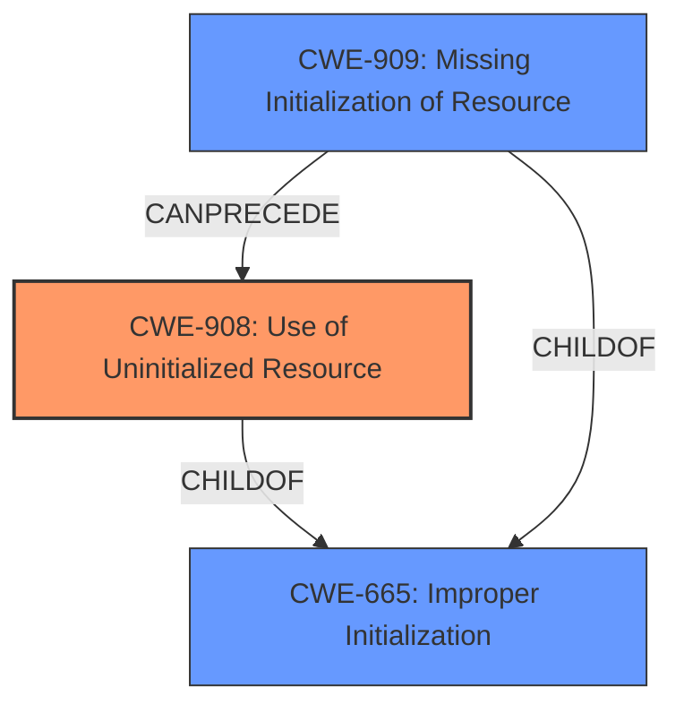

# Analysis for CVE-2022-0494

# Summary
| CWE ID | CWE Name | Confidence | CWE Abstraction Level | CWE Vulnerability Mapping Label | CWE-Vulnerability Mapping Notes |
|---|---|---|---|---|---|
| CWE-908 | Use of Uninitialized Resource | 0.9 | Base | Allowed | Primary CWE |
| CWE-226 | Sensitive Information in Resource Not Removed Before Reuse | 0.6 | Base | Allowed | Secondary Candidate |
| CWE-909 | Missing Initialization of Resource | 0.5 | Class | Allowed-with-Review | Secondary Candidate |

## Evidence and Confidence

*   **Confidence Score:** 0.9
*   **Evidence Strength:** HIGH

## Relationship Analysis
The primary relationship influencing my decision is the ChildOf relationship where CWE-908 (Use of Uninitialized Resource) is a child of CWE-665 (Improper Initialization). The vulnerability description explicitly states the root cause is a missing initialization that results in the use of uninitialized data. I selected the more specific CWE-908 because the evidence directly supports the "use" of the uninitialized resource. The relationship of CWE-909 (Missing Initialization of Resource) CanPrecede CWE-908 is also relevant, however, CWE-908 is a better fit because it focuses on the consequence of using the uninitialized resource, which is what the vulnerability description highlights.

## Vulnerability Chain
The chain of events is as follows:
1.  Missing initialization of a buffer (`bio_copy_kern` function)
2.  Use of the uninitialized buffer, potentially containing sensitive data
3.  Information leak to user space

The root cause is the missing initialization, and the direct consequence is the use of that uninitialized resource, which leads to the information leak.

## Summary of Analysis
Initially, the vulnerability description points to a kernel information leak due to a **missing initialization**. The "CVE Reference Links Content Summary" confirms this, stating that the root cause is the **missing initialization** of a buffer in `bio_copy_kern` and the absence of the `__GFP_ZERO` flag during memory allocation. This leads to an **information leak** because the uninitialized buffer may contain sensitive data.

The retriever results suggested CWE-908 (Use of Uninitialized Resource) as the top candidate, and upon review of the complete CWE specifications, it aligns well with the vulnerability description. The description of CWE-908 states, "The product uses or accesses a resource that has not been initialized," which directly matches the scenario where the `bio_copy_kern` function uses an uninitialized buffer. The "CVE Reference Links Content Summary" confirms the data in the uninitialized buffer will be copied to user space which is specified by `sic->data` parameter of `sg_scsi_ioctl` function.

CWE-908 is a base level CWE, which is the preferred level.

CWE-226 (Sensitive Information in Resource Not Removed Before Reuse) was considered. While the uninitialized memory could contain sensitive information from previous operations, the core issue is the lack of initialization before use, not the failure to clear existing data. Therefore, CWE-908 is a more precise fit.

CWE-909 (Missing Initialization of Resource) was also considered. While the root cause is indeed a missing initialization, CWE-908 focuses on the use of the uninitialized resource, which is a more direct representation of the vulnerability. CWE-909 is a Class level CWE and the retriever results suggests to examine children of this entry to see if there is a better fit.

Based on the evidence and the CWE specifications, CWE-908 is the most appropriate and specific CWE for this vulnerability.