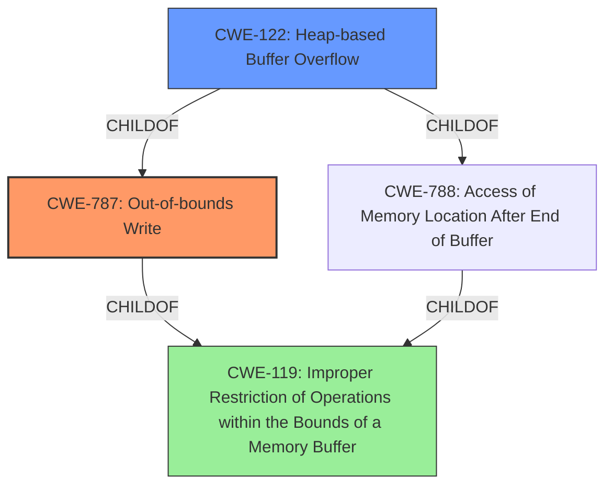

# Enhanced Analysis for CVE-2022-0518

# Summary

| CWE ID    | CWE Name                                                                 | Confidence | CWE Abstraction Level | CWE Vulnerability Mapping Label | CWE-Vulnerability Mapping Notes |
| :-------- | :----------------------------------------------------------------------- | :--------- | :-------------------- | :------------------------------ | :------------------------------ |
| **CWE-787** | Out-of-bounds Write                                                      | 1.0        | Base                  | Primary CWE                     | Allowed                       |
| CWE-122   | Heap-based Buffer Overflow                                               | 0.8        | Variant               | Secondary Candidate             | Allowed                       |
| CWE-119   | Improper Restriction of Operations within the Bounds of a Memory Buffer | 0.6        | Class                 | Secondary Candidate             | Discouraged                    |

## Evidence and Confidence

*   **Confidence Score:** 0.9
*   **Evidence Strength:** HIGH

## Relationship Analysis
The primary CWE is CWE-787, which is a base-level CWE. CWE-122, Heap-based Buffer Overflow, is a variant of CWE-787 and CWE-788 (Access of Memory Location After End of Buffer) which in turn is a child of CWE-119. CWE-119 is a class-level CWE and is too general, but it is the parent of CWE-787. The relationships show that the vulnerability is specifically a heap-based out-of-bounds write.



## Vulnerability Chain
The vulnerability chain starts with **insufficient bounds checking**, leading to a **heap-based buffer overflow** (CWE-122), which is a specific type of **out-of-bounds write** (CWE-787). The impact is **arbitrary code execution** or **crash**.

## Summary of Analysis
The initial assessment, based on the vulnerability description and similar CVEs, pointed to CWE-787 as the primary candidate. The detailed analysis of the CVE Reference Links Content Summary confirms that the root cause is indeed a **heap-based buffer overflow** due to **insufficient bounds checking**, leading to an **out-of-bounds write**.

The evidence supporting this is:

*   Vulnerability Description Key Phrases: "**Heap-based Buffer Overflow**"
*   CVE Reference Links Content Summary: "The vulnerability is a heap-based buffer overflow in radare2, specifically within the `r_bin_java_inner_classes_attr_new` function when processing Java class files. This occurs because of **insufficient bounds checking** when reading the "inner classes" attribute."
*   CVE Reference Links Content Summary: "**Heap-based Buffer Overflow:** The code attempts to read data into a buffer on the heap. If the provided data in the class file indicates a larger number of inner classes than there is space for, this can overwrite adjacent memory regions allocated on the heap."

CWE-787 is the most specific and accurate representation of the vulnerability, as it clearly identifies the **out-of-bounds write** condition. While CWE-122 is also relevant, it is a variant of CWE-787 and describes the location of the buffer (heap), which is a characteristic but not the core weakness. CWE-119 is too general and discouraged by MITRE when more specific CWEs are available. The retriever results listed CWE-119, CWE-190, CWE-122, CWE-126, and CWE-681 as candidates, but CWE-787 was not listed. However, the "CWE for similar CVE Descriptions" section had CWE-787 as the primary match.

Therefore, CWE-787 is the optimal choice because it directly addresses the root cause (out-of-bounds write) and is supported by strong evidence from the vulnerability description.

**CWE Considerations:**

*   CWE-190 (Integer Overflow or Wraparound) was considered due to the potential for integer overflows to lead to buffer overflows, but the provided information does not indicate an integer overflow is directly involved. The root cause is a lack of bounds checking, not an incorrect calculation.
*   CWE-126 (Buffer Over-read) was considered, but the vulnerability is specifically an out-of-bounds *write*, not a read.
*   CWE-681 (Incorrect Conversion between Numeric Types) was considered, but there is no evidence of incorrect type conversions being the root cause.

Relevant CWE Information:

# Enhanced Context (25 CWEs)
The following CWEs were identified as potentially relevant to this vulnerability:

## CWE-805: Buffer Access with Incorrect Length Value
**Abstraction Level**: Base
**Similarity Score**: 0.80
**Source**: dense

**Description**:
The product uses a sequential operation to read or write a buffer, but it uses an incorrect length value that causes it to access memory that is outside of the bounds of the buffer.

**Mapping Guidance**:
- Usage: Allowed
- Rationale: This CWE entry is at the Base level of abstraction, which is a preferred level of abstraction for mapping to the root causes of vulnerabilities.

## CWE-131: Incorrect Calculation of Buffer Size
**Abstraction Level**: Base
**Similarity Score**: 0.77
**Source**: dense

**Description**:
The product does not correctly calculate the size to be used when allocating a buffer, which could lead to a buffer overflow.

**Mapping Guidance**:
- Usage: Allowed
- Rationale: This CWE entry is at the Base level of abstraction, which is a preferred level of abstraction for mapping to the root causes of vulnerabilities.

## CWE-191: Integer Underflow (Wrap or Wraparound)
**Abstraction Level**: Base
**Similarity Score**: 0.77
**Source**: dense

**Description**:
The product subtracts one value from another, such that the result is less than the minimum allowable integer value, which produces a value that is not equal to the correct result.

**Mapping Guidance**:
- Usage: Allowed
- Rationale: This CWE entry is at the Base level of abstraction, which is a preferred level of abstraction for mapping to the root causes of vulnerabilities.

## CWE-124: Buffer Underwrite ('Buffer Underflow')
**Abstraction Level**: Base
**Similarity Score**: 0.76
**Source**: dense

**Description**:
The product writes to a buffer using an index or pointer that references a memory location prior to the beginning of the buffer.

**Mapping Guidance**:
- Usage: Allowed
- Rationale: This CWE entry is at the Base level of abstraction, which is a preferred level of abstraction for mapping to the root causes of vulnerabilities.

## CWE-130: Improper Handling of Length Parameter Inconsistency
**Abstraction Level**: Base
**Similarity Score**: 0.76
**Source**: dense

**Description**:
The product parses a formatted message or structure, but it does not handle or incorrectly handles a length field that is inconsistent with the actual length of the associated data.

**Mapping Guidance**:
- Usage: Allowed
- Rationale: This CWE entry is at the Base level of abstraction, which is a preferred level of abstraction for mapping to the root causes of vulnerabilities.

## CWE-126: Buffer Over-read
**Abstraction Level**: Variant
**Similarity Score**: 0.76
**Source**: dense

**Description**:
The product reads from a buffer using buffer access mechanisms such as indexes or pointers that reference memory locations after the targeted buffer.

**Mapping Guidance**:
- Usage: Allowed
- Rationale: This CWE entry is at the Variant level of abstraction, which is a preferred level of abstraction for mapping to the root causes of vulnerabilities.

## CWE-786: Access of Memory Location Before Start of Buffer
**Abstraction Level**: Base
**Similarity Score**: 0.75
**Source**: dense

**Description**:
The product reads or writes to a buffer using an index or pointer that references a memory location prior to the beginning of the buffer.

**Mapping Guidance**:
- Usage: Discouraged
- Rationale: The CWE entry might be misused when lower-level CWE entries might be available. It also overlaps existing CWE entries and might be deprecated in the future.

## CWE-680: Integer Overflow to Buffer Overflow
**Abstraction Level**: Compound
**Similarity Score**:


## CWE Relationship Analysis

Current CWEs represent these abstraction levels: .


### Vulnerability Chain Analysis

**Chain starting from CWE-190:**
- 190 (Integer Overflow or Wraparound) - ROOT


**Chain starting from CWE-131:**
- 131 (Incorrect Calculation of Buffer Size) - ROOT


### CWE Relationship Diagram

```mermaid
graph TD
    classDef primary fill:#f96,stroke:#333,stroke-width:2px
    classDef secondary fill:#69f,stroke:#333
    classDef tertiary fill:#9e9,stroke:#333
```