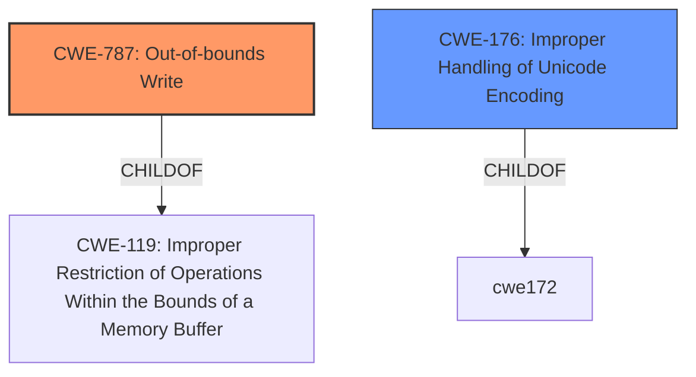

# Analysis for CVE-2022-0530

# Summary
| CWE ID | CWE Name | Confidence | CWE Abstraction Level | CWE Vulnerability Mapping Label | CWE-Vulnerability Mapping Notes |
|---|---|---|---|---|---|
| CWE-787 | Out-of-bounds Write | 1 | Base | Primary | Allowed |
| CWE-176 | Improper Handling of Unicode Encoding | 0.6 | Variant | Secondary | Allowed |

## Evidence and Confidence

*   **Confidence Score:** 0.8
*   **Evidence Strength:** HIGH

## Relationship Analysis
The primary CWE, CWE-787 (Out-of-bounds Write), is a child of CWE-119 (Improper Restriction of Operations Within the Bounds of a Memory Buffer). The secondary CWE, CWE-176 (Improper Handling of Unicode Encoding), is a variant that describes the specific issue of handling unicode in this vulnerability. The root cause, an out-of-bounds write, leads to memory corruption, potentially resulting in a crash or code execution.

## Vulnerability Chain
The vulnerability chain starts with a specially crafted zip file containing a malicious filename with specific UTF-8 characters. This leads to **improper handling of Unicode encoding** (CWE-176) during the conversion of a wide string to a local string. This conversion flaw results in a **heap of out-of-bound write** (CWE-787), which causes memory corruption and can lead to a crash or code execution.

## Summary of Analysis
The initial analysis identified CWE-787 (Out-of-bounds Write) as the primary weakness due to the **heap of out-of-bound write** as described in the vulnerability. The analysis was further supported by the "CWE for similar CVE Descriptions" identifying CWE-787 as the primary match. The "CVE Reference Links Content Summary" also confirmed the root cause related to a flawed conversion process leading to memory corruption.

CWE-176 (Improper Handling of Unicode Encoding) was added as a secondary CWE because the vulnerability occurs specifically during the conversion of a UTF-8 string to a local string.

The graph relationships confirm that CWE-787 is a child of CWE-119, representing a more specific type of memory corruption. The selected CWEs are at the optimal level of specificity because they accurately represent the root cause and the specific context of the vulnerability.

Relevant CWE Information:
- **Vulnerability Description**: "A flaw was found in Unzip. The vulnerability occurs during the conversion of a wide string to a local string that leads to a **heap of out-of-bound write**. This flaw allows an attacker to input a specially crafted zip file, leading to a crash or code execution."
- **Vulnerability Description Key Phrases**: "rootcause: **heap of out-of-bound write**"
- **CVE Reference Links Content Summary**: "The vulnerability stems from a flaw in the `unzip` utility during the conversion of a UTF-8 string to a local string... This occurs when handling a specially crafted ZIP file, leading to a segmentation fault."

CWE-122 (Heap-based Buffer Overflow) was considered but not used. The vulnerability description explicitly states an out-of-bounds write, which is more accurately represented by CWE-787, rather than an overflow condition. While CWE-122 is a child of CWE-787, the description points to an out-of-bounds write.
CWE-190 (Integer Overflow or Wraparound) was considered, but the vulnerability description focuses on memory corruption due to an out-of-bounds write rather than an integer overflow.
CWE-125 (Out-of-bounds Read) was considered, but the vulnerability clearly indicates an out-of-bounds *write*, not a read.
CWE-1284 (Improper Validation of Specified Quantity in Input) was considered. However, the vulnerability stems from improper conversion of unicode, rather than improper validation of input quantity.
CWE-409 (Improper Handling of Highly Compressed Data (Data Amplification)) was not selected because the vulnerability stems from UTF-8 conversion issues, not from handling highly compressed data.
CWE-909 (Missing Initialization of Resource) and other initialization CWEs were considered, but there's no evidence that the vulnerability relates to missing initialization.
CWE-170 (Improper Null Termination) and other string-related CWEs were considered. However, the primary issue is not related to null termination but rather to the out-of-bounds write.

I am confident in this assessment based on the information provided.