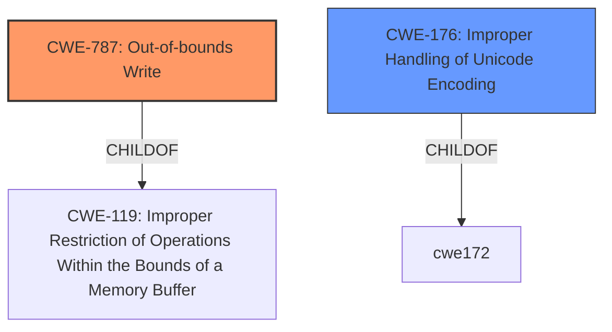

# Analysis for CVE-2022-0530

# Summary
| CWE ID | CWE Name | Confidence | CWE Abstraction Level | CWE Vulnerability Mapping Label | CWE-Vulnerability Mapping Notes |
|---|---|---|---|---|---|
| CWE-787 | Out-of-bounds Write | 1 | Base | Primary | Allowed |
| CWE-176 | Improper Handling of Unicode Encoding | 0.6 | Variant | Secondary | Allowed |

## Evidence and Confidence

*   **Confidence Score:** 0.8
*   **Evidence Strength:** HIGH

## Relationship Analysis
The primary CWE, CWE-787 (Out-of-bounds Write), is a child of CWE-119 (Improper Restriction of Operations Within the Bounds of a Memory Buffer). The secondary CWE, CWE-176 (Improper Handling of Unicode Encoding), is a variant that describes the specific issue of handling unicode in this vulnerability. The root cause, an out-of-bounds write, leads to memory corruption, potentially resulting in a crash or code execution.

## Vulnerability Chain
The vulnerability chain starts with a specially crafted zip file containing a malicious filename with specific UTF-8 characters. This leads to **improper handling of Unicode encoding** (CWE-176) during the conversion of a wide string to a local string. This conversion flaw results in a **heap of out-of-bound write** (CWE-787), which causes memory corruption and can lead to a crash or code execution.

## Summary of Analysis
The initial analysis identified CWE-787 (Out-of-bounds Write) as the primary weakness due to the **heap of out-of-bound write** as described in the vulnerability. The analysis was further supported by the "CWE for similar CVE Descriptions" identifying CWE-787 as the primary match. The "CVE Reference Links Content Summary" also confirmed the root cause related to a flawed conversion process leading to memory corruption.

CWE-176 (Improper Handling of Unicode Encoding) was added as a secondary CWE because the vulnerability occurs specifically during the conversion of a UTF-8 string to a local string.

The graph relationships confirm that CWE-787 is a child of CWE-119, representing a more specific type of memory corruption. The selected CWEs are at the optimal level of specificity because they accurately represent the root cause and the specific context of the vulnerability.

Relevant CWE Information:
- **Vulnerability Description**: "A flaw was found in Unzip. The vulnerability occurs during the conversion of a wide string to a local string that leads to a **heap of out-of-bound write**. This flaw allows an attacker to input a specially crafted zip file, leading to a crash or code execution."
- **Vulnerability Description Key Phrases**: "rootcause: **heap of out-of-bound write**"
- **CVE Reference Links Content Summary**: "The vulnerability stems from a flaw in the `unzip` utility during the conversion of a UTF-8 string to a local string... This occurs when handling a specially crafted ZIP file, leading to a segmentation fault."

CWE-122 (Heap-based Buffer Overflow) was considered but not used. The vulnerability description explicitly states an out-of-bounds write, which is more accurately represented by CWE-787, rather than an overflow condition. While CWE-122 is a child of CWE-787, the description points to an out-of-bounds write.
CWE-190 (Integer Overflow or Wraparound) was considered, but the vulnerability description focuses on memory corruption due to an out-of-bounds write rather than an integer overflow.
CWE-125 (Out-of-bounds Read) was considered, but the vulnerability clearly indicates an out-of-bounds *write*, not a read.
CWE-1284 (Improper Validation of Specified Quantity in Input) was considered. However, the vulnerability stems from improper conversion of unicode, rather than improper validation of input quantity.
CWE-409 (Improper Handling of Highly Compressed Data (Data Amplification)) was not selected because the vulnerability stems from UTF-8 conversion issues, not from handling highly compressed data.
CWE-909 (Missing Initialization of Resource) and other initialization CWEs were considered, but there's no evidence that the vulnerability relates to missing initialization.
CWE-170 (Improper Null Termination) and other string-related CWEs were considered. However, the primary issue is not related to null termination but rather to the out-of-bounds write.

I am confident in this assessment based on the information provided.

# Enhanced Query for CVE-2022-0530

## Vulnerability Description
A flaw was found in Unzip. The vulnerability occurs during the conversion of a wide string to a local string that leads to a **heap of out-of-bound write**. This flaw allows an attacker to input a specially crafted zip file, leading to a crash or code execution.

### Vulnerability Description Key Phrases
- **rootcause:** **heap of out-of-bound write**
- **impact:** crash and code execution
- **vector:** specially crafted zip file
- **attacker:** attacker
- **product:** Unzip

### CWE for similar CVE Descriptions
### Primary CWE Match
CWE-787

#### Top CWEs
- CWE-787 (Count: 6)
- CWE-476 (Count: 3)

## CVE Reference Links Content Summary
Based on the provided information, here's an analysis of CVE-2022-0530:

**Root Cause of Vulnerability:**
The vulnerability stems from a flaw in the `unzip` utility during the conversion of a UTF-8 string to a local string. This occurs when handling a specially crafted ZIP file, leading to a segmentation fault.

**Weaknesses/Vulnerabilities Present:**
- **Improper Input Handling:** The `unzip` program fails to correctly handle specific UTF-8 encoded filenames within a ZIP archive, triggering a crash during character set conversion.
- **Memory Corruption:** The flawed conversion process leads to a segmentation fault, indicating memory corruption during the operation.

**Impact of Exploitation:**
- **Denial of Service (DoS):** A specially crafted ZIP file can cause the `unzip` process to crash (SIGSEGV), leading to a denial of service.
- **Potential Arbitrary Code Execution:** Some sources suggest that this vulnerability could *potentially* lead to arbitrary code execution, although this isn't explicitly confirmed in all the provided documents.

**Attack Vectors:**
- **Malicious ZIP File:** An attacker needs to create a specially crafted ZIP file containing a malicious filename with specific UTF-8 characters.

**Required Attacker Capabilities/Position:**
- **Ability to provide a crafted ZIP file:** The attacker needs to deliver the malicious ZIP file to a system using the vulnerable unzip utility. This can be done through various means, such as email attachments, file downloads, or network shares.
- **User interaction:** In some scenarios, the user might be tricked into attempting to unzip the malicious archive.

**Additional details:**
- The vulnerability affects `unzip` versions prior to 6.0_p27.
- Patches are available in various operating systems, including Debian, macOS, and Gentoo.
- Red Hat tracks this issue under bug ID 2051395
- Apple addressed this in macOS Big Sur 11.6.6, macOS Monterey 12.4 and Security Update 2022-004 Catalina.

The provided content provides more details than the basic CVE description by detailing how the vulnerability is triggered (UTF-8 string conversion), its impact (DoS and potential code execution), and the attack vector (crafted ZIP file).

## Retriever Results

### Top Combined Results

| Rank | CWE ID | Name | Abstraction | Usage  | Retrievers | Individual Scores |
|------|--------|------|-------------|-------|------------|-------------------|
| 1 | 176 | Improper Handling of Unicode Encoding | Variant | Allowed | sparse | 0.508 |
| 2 | 190 | Integer Overflow or Wraparound | Base | Allowed | sparse | 0.409 |
| 3 | 125 | Out-of-bounds Read | Base | Allowed | sparse | 0.408 |
| 4 | 122 | Heap-based Buffer Overflow | Variant | Allowed | sparse | 0.394 |
| 5 | 1284 | Improper Validation of Specified Quantity in Input | Base | Allowed | sparse | 0.393 |
| 6 | 409 | Improper Handling of Highly Compressed Data (Data Amplification) | Base | Allowed | dense | 0.595 |
| 7 | 128 | Wrap-around Error | Base | Allowed | graph | 0.002 |
| 8 | 193 | Off-by-one Error | Base | Allowed | sparse | 0.387 |
| 9 | 787 | Out-of-bounds Write | Base | Allowed | sparse | 0.385 |
| 10 | 909 | Missing Initialization of Resource | Class | Allowed-with-Review | sparse | 0.381 |

# Complete CWE Specifications

## CWE-176: Improper Handling of Unicode Encoding
**Abstraction:** Variant
**Status:** Draft

### Description
The product does not properly handle when an input contains Unicode encoding.

### Extended Description
Not provided

### Alternative Terms
None

### Relationships
ChildOf -> CWE-172

### Mapping Guidance
**Usage:** Allowed
**Rationale:** This CWE entry is at the Variant level of abstraction, which is a preferred level of abstraction for mapping to the root causes of vulnerabilities.
**Comments:** Carefully read both the name and description to ensure that this mapping is an appropriate fit. Do not try to 'force' a mapping to a lower-level Base/Variant simply to comply with this preferred level of abstraction.
**Reasons:**
- Acceptable-Use

### Observed Examples
- **CVE-2000-0884:** Server allows remote attackers to read documents outside of the web root, and possibly execute arbitrary commands, via malformed URLs that contain Unicode encoded characters.
- **CVE-2001-0709:** Server allows a remote attacker to obtain source code of ASP files via a URL encoded with Unicode.
- **CVE-2001-0669:** Overlaps interaction error.

## CWE-190: Integer Overflow or Wraparound
**Abstraction:** Base
**Status:** Stable

### Description
The product performs a calculation that can
         produce an integer overflow or wraparound when the logic
         assumes that the resulting value will always be larger than
         the original value. This occurs when an integer value is
         incremented to a value that is too large to store in the
         associated representation. When this occurs, the value may
         become a very small or negative number.

### Extended Description
Not provided

### Alternative Terms
Overflow: The terms "overflow" and "wraparound" are used interchangeably by some people, but they can have more precise distinctions by others. See Terminology Notes.
Wraparound: The terms "overflow" and "wraparound" are used interchangeably by some people, but they can have more precise distinctions by others. See Terminology Notes.
wrap, wrap-around, wrap around: Alternate spellings of "wraparound"

### Relationships
ChildOf -> CWE-682
ChildOf -> CWE-682
ChildOf -> CWE-20
CanPrecede -> CWE-119

### Mapping Guidance
**Usage:** Allowed
**Rationale:** This CWE entry is at the Base level of abstraction, which is a preferred level of abstraction for mapping to the root causes of vulnerabilities.
**Comments:** Be careful of terminology problems with "overflow," "underflow," and "wraparound" - see Terminology Notes. Carefully read both the name and description to ensure that this mapping is an appropriate fit. Do not try to 'force' a mapping to a lower-level Base/Variant simply to comply with this preferred level of abstraction.
**Reasons:**
- Acceptable-Use
**Suggested Alternatives:**
- CWE-191: Integer Underflow (Wrap or Wraparound). Consider CWE-191 when the result is less than the minimum value that can be represented (sometimes called "underflows").

### Additional Notes
**[Relationship]** Integer overflows can be primary to buffer overflows when they cause less memory to be allocated than expected.

**[Terminology]** 

"Integer overflow" is sometimes used to cover several types of errors, including signedness errors, or buffer overflows that involve manipulation of integer data types instead of characters. Part of the confusion results from the fact that 0xffffffff is -1 in a signed context. Other confusion also arises because of the role that integer overflows have in chains.

A "wraparound" is a well-defined, standard behavior that follows specific rules for how to handle situations when the intended numeric value is too large or too small to be represented, as specified in standards such as C11.

"Overflow" is sometimes conflated with "wraparound" but typically indicates a non-standard or undefined behavior.

The "overflow" term is sometimes used to indicate cases where either the maximum or the minimum is exceeded, but others might only use "overflow" to indicate exceeding the maximum while using "underflow" for exceeding the minimum.

Some people use "overflow" to mean any value outside the representable range - whether greater than the maximum, or less than the minimum - but CWE uses "underflow" for cases in which the intended result is less than the minimum.

See [REF-1440] for additional explanation of the ambiguity of terminology.

**[Other]** While there may be circumstances in which the logic intentionally relies on wrapping - such as with modular arithmetic in timers or counters - it can have security consequences if the wrap is unexpected. This is especially the case if the integer overflow can be triggered using user-supplied inputs.

### Observed Examples
- **CVE-2021-43537:** Chain: in a web browser, an unsigned 64-bit integer is forcibly cast to a 32-bit integer (CWE-681) and potentially leading to an integer overflow (CWE-190). If an integer overflow occurs, this can cause heap memory corruption (CWE-122)
- **CVE-2022-21668:** Chain: Python library does not limit the resources used to process images that specify a very large number of bands (CWE-1284), leading to excessive memory consumption (CWE-789) or an integer overflow (CWE-190).
- **CVE-2022-0545:** Chain: 3D renderer has an integer overflow (CWE-190) leading to write-what-where condition (CWE-123) using a crafted image.

## CWE-125: Out-of-bounds Read
**Abstraction:** Base
**Status:** Draft

### Description
The product reads data past the end, or before the beginning, of the intended buffer.

### Extended Description
Not provided

### Alternative Terms
OOB read: Shorthand for "Out of bounds" read

### Relationships
ChildOf -> CWE-119
ChildOf -> CWE-119
ChildOf -> CWE-119
ChildOf -> CWE-119

### Mapping Guidance
**Usage:** Allowed
**Rationale:** This CWE entry is at the Base level of abstraction, which is a preferred level of abstraction for mapping to the root causes of vulnerabilities.
**Comments:** Carefully read both the name and description to ensure that this mapping is an appropriate fit. Do not try to 'force' a mapping to a lower-level Base/Variant simply to comply with this preferred level of abstraction.
**Reasons:**
- Acceptable-Use

### Observed Examples
- **CVE-2023-1018:** The reference implementation code for a Trusted Platform Module does not implement length checks on data, allowing for an attacker to read 2 bytes past the end of a buffer.
- **CVE-2020-11899:** Out-of-bounds read in IP stack used in embedded systems, as exploited in the wild per CISA KEV.
- **CVE-2014-0160:** Chain: "Heartbleed" bug receives an inconsistent length parameter (CWE-130) enabling an out-of-bounds read (CWE-126), returning memory that could include private cryptographic keys and other sensitive data.

## CWE-122: Heap-based Buffer Overflow
**Abstraction:** Variant
**Status:** Draft

### Description
A heap overflow condition is a buffer overflow, where the buffer that can be overwritten is allocated in the heap portion of memory, generally meaning that the buffer was allocated using a routine such as malloc().

### Extended Description
Not provided

### Alternative Terms
None

### Relationships
ChildOf -> CWE-788
ChildOf -> CWE-787

### Mapping Guidance
**Usage:** Allowed
**Rationale:** This CWE entry is at the Variant level of abstraction, which is a preferred level of abstraction for mapping to the root causes of vulnerabilities.
**Comments:** Carefully read both the name and description to ensure that this mapping is an appropriate fit. Do not try to 'force' a mapping to a lower-level Base/Variant simply to comply with this preferred level of abstraction.
**Reasons:**
- Acceptable-Use

### Additional Notes
**[Relationship]** Heap-based buffer overflows are usually just as dangerous as stack-based buffer overflows.

### Observed Examples
- **CVE-2021-43537:** Chain: in a web browser, an unsigned 64-bit integer is forcibly cast to a 32-bit integer (CWE-681) and potentially leading to an integer overflow (CWE-190). If an integer overflow occurs, this can cause heap memory corruption (CWE-122)
- **CVE-2007-4268:** Chain: integer signedness error (CWE-195) passes signed comparison, leading to heap overflow (CWE-122)
- **CVE-2009-2523:** Chain: product does not handle when an input string is not NULL terminated (CWE-170), leading to buffer over-read (CWE-125) or heap-based buffer overflow (CWE-122).

## CWE-1284: Improper Validation of Specified Quantity in Input
**Abstraction:** Base
**Status:** Incomplete

### Description
The product receives input that is expected to specify a quantity (such as size or length), but it does not validate or incorrectly validates that the quantity has the required properties.

### Extended Description

Specified quantities include size, length, frequency, price, rate, number of operations, time, and others. Code may rely on specified quantities to allocate resources, perform calculations, control iteration, etc. When the quantity is not properly validated, then attackers can specify malicious quantities to cause excessive resource allocation, trigger unexpected failures, enable buffer overflows, etc.

### Alternative Terms
None

### Relationships
ChildOf -> CWE-20
ChildOf -> CWE-20
CanPrecede -> CWE-789

### Mapping Guidance
**Usage:** Allowed
**Rationale:** This CWE entry is at the Base level of abstraction, which is a preferred level of abstraction for mapping to the root causes of vulnerabilities.
**Comments:** Carefully read both the name and description to ensure that this mapping is an appropriate fit. Do not try to 'force' a mapping to a lower-level Base/Variant simply to comply with this preferred level of abstraction.
**Reasons:**
- Acceptable-Use

### Additional Notes
**[Maintenance]** This entry is still under development and will continue to see updates and content improvements.

### Observed Examples
- **CVE-2022-21668:** Chain: Python library does not limit the resources used to process images that specify a very large number of bands (CWE-1284), leading to excessive memory consumption (CWE-789) or an integer overflow (CWE-190).
- **CVE-2008-1440:** lack of validation of length field leads to infinite loop
- **CVE-2008-2374:** lack of validation of string length fields allows memory consumption or buffer over-read

## CWE-409: Improper Handling of Highly Compressed Data (Data Amplification)
**Abstraction:** Base
**Status:** Incomplete

### Description
The product does not handle or incorrectly handles a compressed input with a very high compression ratio that produces a large output.

### Extended Description
An example of data amplification is a "decompression bomb," a small ZIP file that can produce a large amount of data when it is decompressed.

### Alternative Terms
None

### Relationships
ChildOf -> CWE-405

### Mapping Guidance
**Usage:** Allowed
**Rationale:** This CWE entry is at the Base level of abstraction, which is a preferred level of abstraction for mapping to the root causes of vulnerabilities.
**Comments:** Carefully read both the name and description to ensure that this mapping is an appropriate fit. Do not try to 'force' a mapping to a lower-level Base/Variant simply to comply with this preferred level of abstraction.
**Reasons:**
- Acceptable-Use

### Observed Examples
- **CVE-2009-1955:** XML bomb in web server module
- **CVE-2003-1564:** Parsing library allows XML bomb

## CWE-128: Wrap-around Error
**Abstraction:** Base
**Status:** Incomplete

### Description
Wrap around errors occur whenever a value is incremented past the maximum value for its type and therefore "wraps around" to a very small, negative, or undefined value.

### Extended Description
Not provided

### Alternative Terms
None

### Relationships
ChildOf -> CWE-682
CanPrecede -> CWE-119
PeerOf -> CWE-190

### Mapping Guidance
**Usage:** Allowed
**Rationale:** This CWE entry is at the Base level of abstraction, which is a preferred level of abstraction for mapping to the root causes of vulnerabilities.
**Comments:** Carefully read both the name and description to ensure that this mapping is an appropriate fit. Do not try to 'force' a mapping to a lower-level Base/Variant simply to comply with this preferred level of abstraction.
**Reasons:**
- Acceptable-Use

### Additional Notes
**[Relationship]** The relationship between overflow and wrap-around needs to be examined more closely, since several entries (including CWE-190) are closely related.

## CWE-193: Off-by-one Error
**Abstraction:** Base
**Status:** Draft

### Description
A product calculates or uses an incorrect maximum or minimum value that is 1 more, or 1 less, than the correct value.

### Extended Description
Not provided

### Alternative Terms
off-by-five: An "off-by-five" error was reported for sudo in 2002 (CVE-2002-0184), but that is more like a "length calculation" error.

### Relationships
ChildOf -> CWE-682
ChildOf -> CWE-682
CanPrecede -> CWE-617
CanPrecede -> CWE-170
CanPrecede -> CWE-119

### Mapping Guidance
**Usage:** Allowed
**Rationale:** This CWE entry is at the Base level of abstraction, which is a preferred level of abstraction for mapping to the root causes of vulnerabilities.
**Comments:** Carefully read both the name and description to ensure that this mapping is an appropriate fit. Do not try to 'force' a mapping to a lower-level Base/Variant simply to comply with this preferred level of abstraction.
**Reasons:**
- Acceptable-Use

### Additional Notes
**[Relationship]** This is not always a buffer overflow. For example, an off-by-one error could be a factor in a partial comparison, a read from the wrong memory location, an incorrect conditional, etc.

### Observed Examples
- **CVE-2003-0252:** Off-by-one error allows remote attackers to cause a denial of service and possibly execute arbitrary code via requests that do not contain newlines.
- **CVE-2001-1391:** Off-by-one vulnerability in driver allows users to modify kernel memory.
- **CVE-2002-0083:** Off-by-one error allows local users or remote malicious servers to gain privileges.

## CWE-787: Out-of-bounds Write
**Abstraction:** Base
**Status:** Draft

### Description
The product writes data past the end, or before the beginning, of the intended buffer.

### Extended Description
Not provided

### Alternative Terms
Memory Corruption: Often used to describe the consequences of writing to memory outside the bounds of a buffer, or to memory that is otherwise invalid.

### Relationships
ChildOf -> CWE-119
ChildOf -> CWE-119
ChildOf -> CWE-119
ChildOf -> CWE-119

### Mapping Guidance
**Usage:** Allowed
**Rationale:** This CWE entry is at the Base level of abstraction, which is a preferred level of abstraction for mapping to the root causes of vulnerabilities.
**Comments:** Carefully read both the name and description to ensure that this mapping is an appropriate fit. Do not try to 'force' a mapping to a lower-level Base/Variant simply to comply with this preferred level of abstraction.
**Reasons:**
- Acceptable-Use

### Observed Examples
- **CVE-2023-1017:** The reference implementation code for a Trusted Platform Module does not implement length checks on data, allowing for an attacker to write 2 bytes past the end of a buffer.
- **CVE-2021-21220:** Chain: insufficient input validation (CWE-20) in browser allows heap corruption (CWE-787), as exploited in the wild per CISA KEV.
- **CVE-2021-28664:** GPU kernel driver allows memory corruption because a user can obtain read/write access to read-only pages, as exploited in the wild per CISA KEV.

## CWE-909: Missing Initialization of Resource
**Abstraction:** Class
**Status:** Incomplete

### Description
The product does not initialize a critical resource.

### Extended Description
Many resources require initialization before they can be properly used. If a resource is not initialized, it could contain unpredictable or expired data, or it could be initialized to defaults that are invalid. This can have security implications when the resource is expected to have certain properties or values.

### Alternative Terms
None

### Relationships
ChildOf -> CWE-665
ChildOf -> CWE-665
CanPrecede -> CWE-908

### Mapping Guidance
**Usage:** Allowed-with-Review
**Rationale:** This CWE entry is a Class and might have Base-level children that would be more appropriate
**Comments:** Examine children of this entry to see if there is a better fit
**Reasons:**
- Abstraction

### Observed Examples
- **CVE-2020-20739:** A variable that has its value set in a conditional statement is sometimes used when the conditional fails, sometimes causing data leakage
- **CVE-2005-1036:** Chain: Bypass of access restrictions due to improper authorization (CWE-862) of a user results from an improperly initialized (CWE-909) I/O permission bitmap

