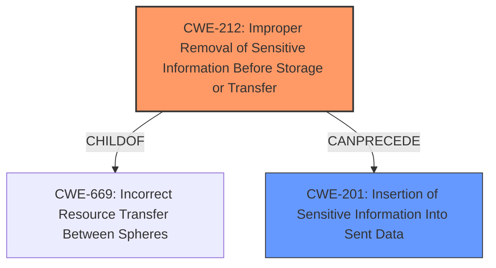

# Enhanced Analysis for CVE-2022-0536

# Summary

| CWE ID    | CWE Name                                                                                                                  | Confidence | CWE Abstraction Level | CWE Vulnerability Mapping Label | CWE-Vulnerability Mapping Notes |
| :-------- | :------------------------------------------------------------------------------------------------------------------------ | :--------- | :---------------------- | :------------------------------ | :------------------------------ |
| CWE-212   | Improper Removal of Sensitive Information Before Storage or Transfer                                                     | 1          | Base                    | Primary                         | Allowed                         |
| CWE-201   | Insertion of Sensitive Information Into Sent Data                                                                       | 0.8        | Base                    | Secondary                       | Allowed                         |

## Evidence and Confidence

*   **Confidence Score:** 0.9
*   **Evidence Strength:** HIGH

## Relationship Analysis

The primary relationship influencing the decision is the direct match of the vulnerability description to CWE-212. CWE-201 is considered as a secondary CWE since the sensitive information is being sent as part of the data. The Abstraction level was kept at the Base level as per the guidance.



## Vulnerability Chain

The vulnerability chain starts with the **improper removal of sensitive information** (CWE-212), which leads to the **insertion of sensitive information into sent data** (CWE-201). This exposure can then lead to account takeover or data breach.

## Summary of Analysis

The initial analysis focused on identifying the root cause of the vulnerability, which is the **improper removal of sensitive information**. The vulnerability description key phrases clearly indicate this. The CVE Reference Links Content Summary further clarifies that the `follow-redirects` library fails to remove sensitive headers, leading to potential exposure.

The Retriever Results listed CWE-212 as a top candidate, and its description aligns well with the vulnerability. The final decision was to map the vulnerability to CWE-212 as the primary CWE and CWE-201 as the secondary CWE.

The evidence supporting this decision is:

*   "**Improper Removal of Sensitive Information Before Storage or Transfer** in NPM follow-redirects prior to 1.14.8" - This directly matches the definition of CWE-212.
*   "The vulnerability stems from the `follow-redirects` library not correctly dropping confidential headers when redirecting to a different scheme (e.g., from HTTPS to HTTP) or a different domain (not a subdomain)" - This explains the technical details behind the **improper removal**.
*   "The core issue is the failure to remove sensitive headers like `Authorization` and `Cookie` when a redirect leads to a different scheme or domain. This can expose sensitive data to unintended recipients." - This shows how the **improper removal** leads to sensitive data being sent.

The selected CWEs are at the optimal level of specificity because they accurately represent the weakness without being overly broad or narrow. CWE-212 directly addresses the core issue of **improper removal**, while CWE-201 captures the consequence of that failure of the data being sent.

**CWEs Considered But Not Used:**

*   CWE-120: Buffer Copy without Checking Size of Input ('Classic Buffer Overflow') - While present in the Retriever Results, this CWE is not applicable as the vulnerability does not involve buffer copies or overflows.
*   CWE-312: Cleartext Storage of Sensitive Information - This CWE relates to storage, while the described vulnerability relates to the transmission of sensitive information.
*   CWE-922: Insecure Storage of Sensitive Information - Similar to CWE-312, this CWE focuses on storage-related issues, not the transmission of sensitive information.
*   CWE-532: Insertion of Sensitive Information into Log File - The vulnerability doesn't relate to log files.


## CWE Relationship Analysis

Current CWEs represent these abstraction levels: .


### Vulnerability Chain Analysis

**Chain starting from CWE-201:**
- 201 (Insertion of Sensitive Information Into Sent Data) - ROOT


**Chain starting from CWE-669:**
- 669 (Incorrect Resource Transfer Between Spheres) - ROOT


### CWE Relationship Diagram

```mermaid
graph TD
    classDef primary fill:#f96,stroke:#333,stroke-width:2px
    classDef secondary fill:#69f,stroke:#333
    classDef tertiary fill:#9e9,stroke:#333
```