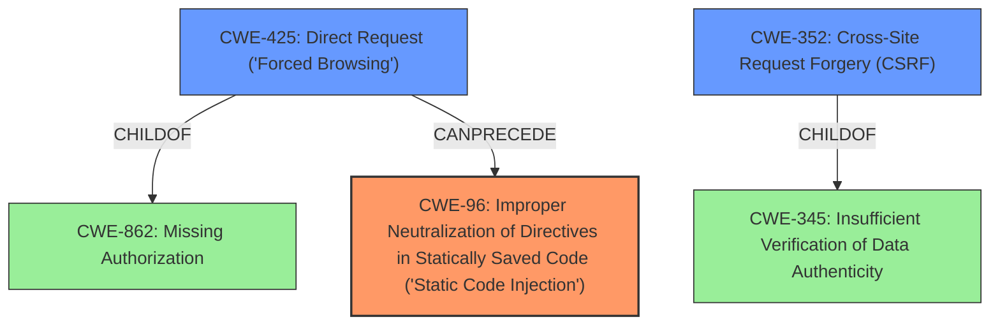

# Analysis for CVE-2022-0541

# Summary
| CWE ID | CWE Name | Confidence | CWE Abstraction Level | CWE Vulnerability Mapping Label | CWE-Vulnerability Mapping Notes |
|---|---|---|---|---|---|
| CWE-96 | Improper Neutralization of Directives in Statically Saved Code ('Static Code Injection') | 0.9 | Base | Allowed | Primary CWE. The plugin injects code into the `wp-config.php` file, a statically saved code file. |
| CWE-425 | Direct Request ('Forced Browsing') | 0.7 | Base | Allowed | Secondary CWE.  The vulnerability allows an attacker to initiate a new site install by setting a cookie, bypassing expected authorization checks. |
| CWE-352 | Cross-Site Request Forgery (CSRF) | 0.6 | Compound | Allowed | Secondary CWE. The attack leverages the setting of a cookie, potentially without proper CSRF protection. |

## Evidence and Confidence

*   **Confidence Score:** 0.8
*   **Evidence Strength:** HIGH

## Relationship Analysis
The primary weakness is CWE-96, which describes the **improper neutralization of directives in statically saved code**. The attacker's ability to inject code into `wp-config.php` directly aligns with this CWE.

CWE-425, **Direct Request ('Forced Browsing')**, is related because the attacker can bypass intended authorization mechanisms by directly triggering the site install process. It's a child of CWE-862 (Missing Authorization).

CWE-352, **Cross-Site Request Forgery (CSRF)**, is a compound weakness. The injection could be triggered via a forged request, making CSRF a relevant, though not primary, concern.

## Vulnerability Chain
The vulnerability chain starts with **missing authentication/authorization**, leading to a **direct request** to initiate a new site install. This request then triggers **static code injection** into `wp-config.php`, leading to a **full site takeover**.

Missing Authentication/Authorization -> Direct Request (CWE-425) -> Static Code Injection (CWE-96) -> Full Site Takeover.

## Summary of Analysis
The initial analysis identified the **insecure code injection** as the primary weakness. The retriever results suggested CWE-352, CWE-79, CWE-89, and CWE-434, but none fully captured the essence of the vulnerability as well as CWE-96. The key evidence supporting CWE-96 is the "Root cause of vulnerability: The plugin injects code into `wp-config.php` when creating a cloned site" and "Weaknesses/vulnerabilities present: ... and **insecure code injection**".

CWE-425 is included because the attacker can directly trigger the site install, bypassing authorization checks. The phrase "allowing any attacker to initiate a new site install" supports this.

CWE-352 is considered because the attack vector involves setting a cookie, which might be exploitable via CSRF.

The final selection of CWEs reflects a combination of direct evidence and related weaknesses. CWE-96 is the most specific and directly applicable, while CWE-425 and CWE-352 provide additional context. The selected CWEs are at the optimal level of specificity, with CWE-96 being a Base-level CWE.

Relevant CWE Information:
# Enhanced Context (25 CWEs)
The following CWEs were identified as potentially relevant to this vulnerability:

## CWE-80: Improper Neutralization of Script-Related HTML Tags in a Web Page (Basic XSS)
**Abstraction Level**: Variant
**Similarity Score**: 0.78
**Source**: dense

**Description**:
The product receives input from an upstream component, but it does not neutralize or incorrectly neutralizes special characters such as "<", ">", and "&" that could be interpreted as web-scripting elements when they are sent to a downstream component that processes web pages.

**Mapping Guidance**:
- Usage: Allowed
- Rationale: This CWE entry is at the Variant level of abstraction, which is a preferred level of abstraction for mapping to the root causes of vulnerabilities.

**Why Not Used**: This CWE is about XSS, which is not the primary issue here. The vulnerability involves code injection on the server-side, not the client-side.

## CWE-74: Improper Neutralization of Special Elements in Output Used by a Downstream Component ('Injection')
**Abstraction Level**: Class
**Similarity Score**: 0.78
**Source**: dense

**Description**:
The product constructs all or part of a command, data structure, or record using externally-influenced input from an upstream component, but it does not neutralize or incorrectly neutralizes special elements that could modify how it is parsed or interpreted when it is sent to a downstream component.

**Mapping Guidance**:
- Usage: Discouraged
- Rationale: CWE-74 is high-level and often misused when lower-level weaknesses are more appropriate.

**Why Not Used**: While this is a general injection CWE, it is too high-level. CWE-96 is a more specific and appropriate base-level CWE for the type of injection occurring.

## CWE-184: Incomplete List of Disallowed Inputs
**Abstraction Level**: Base
**Similarity Score**: 0.77
**Source**: dense

**Description**:
The product implements a protection mechanism that relies on a list of inputs (or properties of inputs) that are not allowed by policy or otherwise require other action to neutralize before additional processing takes place, but the list is incomplete.

**Mapping Guidance**:
- Usage: Allowed
- Rationale: This CWE entry is at the Base level of abstraction, which is a preferred level of abstraction for mapping to the root causes of vulnerabilities.

**Why Not Used**: There's no indication that the plugin uses a list of disallowed inputs. The issue is more about the lack of any input validation or sanitization.

## CWE-1289: Improper Validation of Unsafe Equivalence in Input
**Abstraction Level**: Base
**Similarity Score**: 0.76
**Source**: dense

**Description**:
The product receives an input value that is used as a resource identifier or other type of reference, but it does not validate or incorrectly validates that the input is equivalent to a potentially-unsafe value.

**Mapping Guidance**:
- Usage: Allowed
- Rationale: This CWE entry is at the Base level of abstraction, which is a preferred level of abstraction for mapping to the root causes of vulnerabilities.

**Why Not Used**: This CWE doesn't fit well. The vulnerability isn't specifically about failing to validate equivalence to an unsafe value. It is about injecting code.

## CWE-138: Improper Neutralization of Special Elements
**Abstraction Level**: Class
**Similarity Score**: 0.76
**Source**: dense

**Description**:
The product receives input from an upstream component, but it does not neutralize or incorrectly neutralizes special elements that could be interpreted as control elements or syntactic markers when they are sent to a downstream component.

**Mapping Guidance**:
- Usage: Discouraged
- Rationale: This CWE entry is a level-1 Class (i.e., a child of a Pillar). It might have lower-level children that would be more appropriate

**Why Not Used**: This CWE is too general. CWE-96 is a more specific base-level CWE.

## CWE-113: Improper Neutralization of CRLF Sequences in HTTP Headers ('HTTP Request/Response Splitting')
**Abstraction Level**: Variant
**Similarity Score**: 0.76
**Source**: dense

**Description**:
The product receives data from an HTTP agent/component (e.g., web server, proxy, browser, etc.), but it does not neutralize or incorrectly neutralizes CR and LF characters before the data is included in outgoing HTTP headers.

**Mapping Guidance**:
- Usage: Allowed
- Rationale: This CWE entry is at the Variant level of abstraction, which is a preferred level of abstraction for mapping to the root causes of vulnerabilities.

**Why Not Used**: This CWE is specific to HTTP header injection, which is not relevant to this vulnerability.

## CWE-41: Improper Resolution of Path Equivalence
**Abstraction Level**: Base
**Similarity Score**: