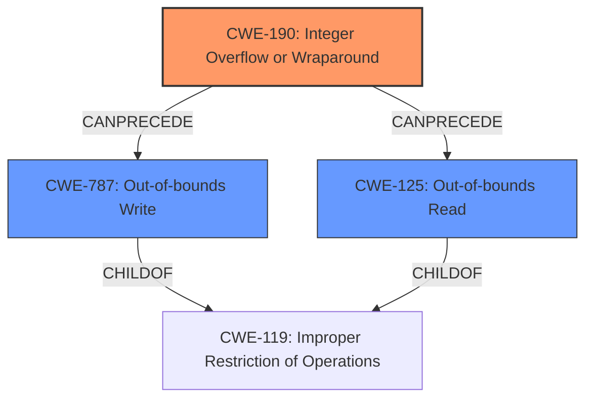

# Analysis for CVE-2022-0545

# Summary
| CWE ID    | CWE Name                                                        | Confidence | CWE Abstraction Level | CWE Vulnerability Mapping Label | CWE-Vulnerability Mapping Notes |
| :-------- | :-------------------------------------------------------------- | :--------- | :-------------------- | :------------------------------ | :------------------------------ |
| CWE-190   | Integer Overflow or Wraparound                                | 0.9        | Base                  | Primary                         | Allowed                         |
| CWE-125   | Out-of-bounds Read                                              | 0.8        | Base                  | Secondary                       | Allowed                         |
| CWE-787   | Out-of-bounds Write                                             | 0.8        | Base                  | Secondary                       | Allowed                         |

## Evidence and Confidence

*   **Confidence Score:** 0.85
*   **Evidence Strength:** HIGH

## Relationship Analysis
The analysis focuses on the root cause of the vulnerability, which is an **integer overflow** (CWE-190). This leads to subsequent issues like an **out-of-bounds write** (CWE-787) and an **out-of-bounds read** (CWE-125). These are related in a chain where the integer overflow allows writing to arbitrary memory locations and reading from out-of-bounds memory. The relationship is hierarchical in that CWE-787 and CWE-125 are both children of CWE-119 (Improper Restriction of Operations within the Bounds of a Memory Buffer), but the description provides enough detail to specify CWE-787 and CWE-125 directly.

## Vulnerability Chain
The vulnerability chain starts with an **integer overflow** (CWE-190) during the processing of 2D images. This leads to a **write-what-where** condition (CWE-787) and an **out-of-bounds read** vulnerability (CWE-125), allowing an attacker to leak sensitive information or achieve code execution.

## Summary of Analysis
The initial assessment identified CWE-190 as the primary root cause due to the explicit mention of "**integer overflow**". The subsequent "**write-what-where**" and "**out-of-bounds read**" conditions are direct consequences of this overflow. While other CWEs like CWE-122 (Heap-based Buffer Overflow) were considered, they were less directly supported by the evidence. The final decision is based on the clear progression from the **integer overflow** to the out-of-bounds access, with CWE-190 being the initiating weakness. The selection of CWE-190, CWE-787, and CWE-125 provides an optimal level of specificity, capturing the root cause and the resulting vulnerabilities accurately.

Relevant CWE Information:

# Enhanced Context (25 CWEs)
The following CWEs were identified as potentially relevant to this vulnerability:

## CWE-129: Improper Validation of Array Index
**Abstraction Level**: Variant
**Similarity Score**: 0.72
**Source**: dense

**Description**:
The product uses untrusted input when calculating or using an array index, but the product does not validate or incorrectly validates the index to ensure the index references a valid position within the array.

**Mapping Guidance**:
- Usage: Allowed
- Rationale: This CWE entry is at the Variant level of abstraction, which is a preferred level of abstraction for mapping to the root causes of vulnerabilities.

## CWE-131: Incorrect Calculation of Buffer Size
**Abstraction Level**: Base
**Similarity Score**: 0.72
**Source**: dense

**Description**:
The product does not correctly calculate the size to be used when allocating a buffer, which could lead to a buffer overflow.

**Mapping Guidance**:
- Usage: Allowed
- Rationale: This CWE entry is at the Base level of abstraction, which is a preferred level of abstraction for mapping to the root causes of vulnerabilities.

## CWE-824: Access of Uninitialized Pointer
**Abstraction Level**: Base
**Similarity Score**: 0.72
**Source**: dense

**Description**:
The product accesses or uses a pointer that has not been initialized.

**Mapping Guidance**:
- Usage: Allowed
- Rationale: This CWE entry is at the Base level of abstraction, which is a preferred level of abstraction for mapping to the root causes of vulnerabilities.

## CWE-125: Out-of-bounds Read
**Abstraction Level**: Base
**Similarity Score**: 0.71
**Source**: dense

**Description**:
The product reads data past the end, or before the beginning, of the intended buffer.

**Mapping Guidance**:
- Usage: Allowed
- Rationale: This CWE entry is at the Base level of abstraction, which is a preferred level of abstraction for mapping to the root causes of vulnerabilities.

## CWE-497: Exposure of Sensitive System Information to an Unauthorized Control Sphere
**Abstraction Level**: Base
**Similarity Score**: 0.70
**Source**: dense

**Description**:
The product does not properly prevent sensitive system-level information from being accessed by unauthorized actors who do not have the same level of access to the underlying system as the product does.

**Mapping Guidance**:
- Usage: Allowed
- Rationale: This CWE entry is at the Base level of abstraction, which is a preferred level of abstraction for mapping to the root causes of vulnerabilities.

## CWE-703: Improper Check or Handling of Exceptional Conditions
**Abstraction Level**: Pillar
**Similarity Score**: 0.70
**Source**: dense

**Description**:
The product does not properly anticipate or handle exceptional conditions that rarely occur during normal operation of the product.

**Mapping Guidance**:
- Usage: Discouraged
- Rationale: This CWE entry is extremely high-level, a Pillar.

## CWE-788: Access of Memory Location After End of Buffer
**Abstraction Level**: Base
**Similarity Score**: 0.70
**Source**: dense

**Description**:
The product reads or writes to a buffer using an index or pointer that references a memory location after the end of the buffer.

**Mapping Guidance**:
- Usage: Discouraged
- Rationale: The CWE entry might be misused when lower-level CWE entries might be available. It also overlaps existing CWE entries and might be deprecated in the future.

## CWE-1391: Use of Weak Credentials
**Abstraction Level**: Class
**Similarity Score**: 0.70
**Source**: dense

**Description**:
The product uses weak credentials (such as a default key or hard-coded password) that can be calculated, derived, reused, or guessed by an attacker.

**Mapping Guidance**:
- Usage: Allowed-with-Review
- Rationale: This CWE entry is a Class and might have Base-level children that would be more appropriate

## CWE-754: Improper Check for Unusual or Exceptional Conditions
**Abstraction Level**: Class
**Similarity Score**: 0.69
**Source**: dense

**Description**:
The product does not check or incorrectly checks for unusual or exceptional conditions that are not expected to occur frequently during day to day operation of the product.

**Mapping Guidance**:
- Usage: Allowed-with-Review
- Rationale: This CWE entry is a Class and might have Base-level children that would be more appropriate

## CWE-451: User Interface (UI) Misrepresentation of Critical Information
**Abstraction Level**: Class
**Similarity Score**: 0.69
**Source**: dense

**Description**:
The user interface (UI) does not properly represent critical information to the user, allowing the information - or its source - to be obscured or spoofed. This is often a component in phishing attacks.

**Mapping Guidance**:
- Usage: Allowed-with-Review
- Rationale: This CWE entry is a Class and might have Base-level children that would be more appropriate

## CWE-190: Integer Overflow or Wraparound
**Abstraction Level**: Base
**Similarity Score**: 4695.54
**Source**: sparse

**Description**:
The product performs a calculation that can
         produce an **integer overflow** or wraparound when the logic
         assumes that the resulting value will always be larger than
         the original value. This occurs when an integer value is
         incremented to a value that is too large to store in the
         associated representation. When this occurs

# Enhanced Query for CVE-2022-0545

# Vulnerability Description

    An **integer overflow** in the processing of loaded 2D images leads to a **write-what-where** vulnerability and an **out-of-bounds read** vulnerability, allowing an attacker to leak sensitive information or achieve code execution in the context of the Blender process when a specially crafted image file is loaded. This flaw affects Blender versions prior to 2.83.19, 2.93.8 and 3.1.

    # Keyphrase-Specific CWE Analysis
    This vulnerability contains multiple keyphrases that may map to different CWEs. 
    Please analyze each keyphrase separately and determine the most appropriate CWE(s) for each.

    ## ROOTCAUSE: 'integer overflow'

Relevant CWEs for this ROOTCAUSE:

### 1. CWE-190: Integer Overflow or Wraparound (Score: 537.05)

The product performs a calculation that can
         produce an integer overflow or wraparound when the logic
         assumes that the resulting value will always be larger than
         the original value. This occurs when an integer value is
         incremented to a value that is too large to st...

### 2. CWE-191: Integer Underflow (Wrap or Wraparound) (Score: 523.18)

The product subtracts one value from another, such that the result is less than the minimum allowable integer value, which produces a value that is not equal to the correct result....

### 3. CWE-125: Out-of-bounds Read (Score: 456.29)

The product reads data past the end, or before the beginning, of the intended buffer....

### 4. CWE-122: Heap-based Buffer Overflow (Score: 452.42)

A heap overflow condition is a buffer overflow, where the buffer that can be overwritten is allocated in the heap portion of memory, generally meaning that the buffer was allocated using a routine such as malloc()....

### 5. CWE-787: Out-of-bounds Write (Score: 440.44)

The product writes data past the end, or before the beginning, of the intended buffer....

## WEAKNESS: 'write-what-where'

Relevant CWEs for this WEAKNESS:

### 1. CWE-190: Integer Overflow or Wraparound (Score: 537.05)

The product performs a calculation that can
         produce an integer overflow or wraparound when the logic
         assumes that the resulting value will always be larger than
         the original value. This occurs when an integer value is
         incremented to a value that is too large to st...

### 2. CWE-191: Integer Underflow (Wrap or Wraparound) (Score: 523.18)

The product subtracts one value from another, such that the result is less than the minimum allowable integer value, which produces a value that is not equal to the correct result....

### 3. CWE-125: Out-of-bounds Read (Score: 456.29)

The product reads data past the end, or before the beginning, of the intended buffer....

### 4. CWE-122: Heap-based Buffer Overflow (Score: 452.42)

A heap overflow condition is a buffer overflow, where the buffer that can be overwritten is allocated in the heap portion of memory, generally meaning that the buffer was allocated using a routine such as malloc()....

### 5. CWE-787: Out-of-bounds Write (Score: 440.44)

The product writes data past the end, or before the beginning, of the intended buffer....

## WEAKNESS: 'out-of-bounds read'

Relevant CWEs for this WEAKNESS:

### 1. CWE-190: Integer Overflow or Wraparound (Score: 537.05)

The product performs a calculation that can
         produce an integer overflow or wraparound when the logic
         assumes that the resulting value will always be larger than
         the original value. This occurs when an integer value is
         incremented to a value that is too large to st...

### 2. CWE-191: Integer Underflow (Wrap or Wraparound) (Score: 523.18)

The product subtracts one value from another, such that the result is less than the minimum allowable integer value, which produces a value that is not equal to the correct result....

### 3. CWE-125: Out-of-bounds Read (Score: 456.29)

The product reads data past the end, or before the beginning, of the intended buffer....

### 4. CWE-122: Heap-based Buffer Overflow (Score: 452.42)

A heap overflow condition is a buffer overflow, where the buffer that can be overwritten is allocated in the heap portion of memory, generally meaning that the buffer was allocated using a routine such as malloc()....

### 5. CWE-787: Out-of-bounds Write (Score: 440.44)

The product writes data past the end, or before the beginning, of the intended buffer....

## IMPACT: 'leak sensitive information'

Relevant CWEs for this IMPACT:

### 1. CWE-190: Integer Overflow or Wraparound (Score: 537.05)

The product performs a calculation that can
         produce an integer overflow or wraparound when the logic
         assumes that the resulting value will always be larger than
         the original value. This occurs when an integer value is
         incremented to a value that is too large to st...

### 2. CWE-191: Integer Underflow (Wrap or Wraparound) (Score: 523.18)

The product subtracts one value from another, such that the result is less than the minimum allowable integer value, which produces a value that is not equal to the correct result....

### 3. CWE-125: Out-of-bounds Read (Score: 456.29)

The product reads data past the end, or before the beginning, of the intended buffer....

### 4. CWE-787: Out-of-bounds Write (Score: 440.44)

The product writes data past the end, or before the beginning, of the intended buffer....

### 5. CWE-193: Off-by-one Error (Score: 137.83)

A product calculates or uses an incorrect maximum or minimum value that is 1 more, or 1 less, than the correct value....

## IMPACT: 'code execution'

Relevant CWEs for this IMPACT:

### 1. CWE-190: Integer Overflow or Wraparound (Score: 537.05)

The product performs a calculation that can
         produce an integer overflow or wraparound when the logic
         assumes that the resulting value will always be larger than
         the original value. This occurs when an integer value is
         incremented to a value that is too large to st...

### 2. CWE-191: Integer Underflow (Wrap or Wraparound) (Score: 523.18)

The product subtracts one value from another, such that the result is less than the minimum allowable integer value, which produces a value that is not equal to the correct result....

### 3. CWE-125: Out-of-bounds Read (Score: 456.29)

The product reads data past the end, or before the beginning, of the intended buffer....

### 4. CWE-122: Heap-based Buffer Overflow (Score: 452.42)

A heap overflow condition is a buffer overflow, where the buffer that can be overwritten is allocated in the heap portion of memory, generally meaning that the buffer was allocated using a routine such as malloc()....

### 5. CWE-787: Out-of-bounds Write (Score: 440.44)

The product writes data past the end, or before the beginning, of the intended buffer....

## VECTOR: 'specially crafted image file'

Relevant CWEs for this VECTOR:

### 1. CWE-190: Integer Overflow or Wraparound (Score: 537.05)

The product performs a calculation that can
         produce an integer overflow or wraparound when the logic
         assumes that the resulting value will always be larger than
         the original value. This occurs when an integer value is
         incremented to a value that is too large to st...

### 2. CWE-191: Integer Underflow (Wrap or Wraparound) (Score: 523.18)

The product subtracts one value from another, such that the result is less than the minimum allowable integer value, which produces a value that is not equal to the correct result....

### 3. CWE-125: Out-of-bounds Read (Score: 456.29)

The product reads data past the end, or before the beginning, of the intended buffer....

### 4. CWE-122: Heap-based Buffer Overflow (Score: 452.42)

A heap overflow condition is a buffer overflow, where the buffer that can be overwritten is allocated in the heap portion of memory, generally meaning that the buffer was allocated using a routine such as malloc()....

### 5. CWE-787: Out-of-bounds Write (Score: 440.44)

The product writes data past the end, or before the beginning, of the intended buffer....

## ATTACKER: 'attacker'

Relevant CWEs for this ATTACKER:

### 1. CWE-190: Integer Overflow or Wraparound (Score: 537.05)

The product performs a calculation that can
         produce an integer overflow or wraparound when the logic
         assumes that the resulting value will always be larger than
         the original value. This occurs when an integer value is
         incremented to a value that is too large to st...

### 2. CWE-191: Integer Underflow (Wrap or Wraparound) (Score: 523.18)

The product subtracts one value from another, such that the result is less than the minimum allowable integer value, which produces a value that is not equal to the correct result....

### 3. CWE-125: Out-of-bounds Read (Score: 456.29)

The product reads data past the end, or before the beginning, of the intended buffer....

### 4. CWE-122: Heap-based Buffer Overflow (Score: 452.42)

A heap overflow condition is a buffer overflow, where the buffer that can be overwritten is allocated in the heap portion of memory, generally meaning that the buffer was allocated using a routine such as malloc()....

### 5. CWE-787: Out-of-bounds Write (Score: 440.44)

The product writes data past the end, or before the beginning, of the intended buffer....

## PRODUCT: 'Blender'

Relevant CWEs for this PRODUCT:

### 1. CWE-190: Integer Overflow or Wraparound (Score: 537.05)

The product performs a calculation that can
         produce an integer overflow or wraparound when the logic
         assumes that the resulting value will always be larger than
         the original value. This occurs when an integer value is
         incremented to a value that is too large to st...

### 2. CWE-191: Integer Underflow (Wrap or Wraparound) (Score: 523.18)

The product subtracts one value from another, such that the result is less than the minimum allowable integer value, which produces a value that is not equal to the correct result....

### 3. CWE-125: Out-of-bounds Read (Score: 456.29)

The product reads data past the end, or before the beginning, of the intended buffer....

### 4. CWE-122: Heap-based Buffer Overflow (Score: 452.42)

A heap overflow condition is a buffer overflow, where the buffer that can be overwritten is allocated in the heap portion of memory, generally meaning that the buffer was allocated using a routine such as malloc()....

### 5. CWE-787: Out-of-bounds Write (Score: 440.44)

The product writes data past the end, or before the beginning, of the intended buffer....

## VERSION: 'prior to 2.83.19, 2.93.8 and 3.1'

Relevant CWEs for this VERSION:

### 1. CWE-190: Integer Overflow or Wraparound (Score: 537.05)

The product performs a calculation that can
         produce an integer overflow or wraparound when the logic
         assumes that the resulting value will always be larger than
         the original value. This occurs when an integer value is
         incremented to a value that is too large to st...

### 2. CWE-191: Integer Underflow (Wrap or Wraparound) (Score: 523.18)

The product subtracts one value from another, such that the result is less than the minimum allowable integer value, which produces a value that is not equal to the correct result....

### 3. CWE-122: Heap-based Buffer Overflow (Score: 452.42)

A heap overflow condition is a buffer overflow, where the buffer that can be overwritten is allocated in the heap portion of memory, generally meaning that the buffer was allocated using a routine such as malloc()....

### 4. CWE-787: Out-of-bounds Write (Score: 440.44)

The product writes data past the end, or before the beginning, of the intended buffer....

### 5. CWE-20: Improper Input Validation (Score: 173.44)

The product receives input or data, but it does
        not validate or incorrectly validates that the input has the
        properties that are required to process the data safely and
        correctly....

    # Analysis Instructions
    1. For each keyphrase, identify the most appropriate CWE(s) that represent the weakness.
    2. Consider how the different keyphrases might relate to each other in the vulnerability chain.
    3. Provide a final determination of primary CWE(s) and any secondary CWEs.
    4. Format your response using the standard analysis template.

    Please analyze how these different weaknesses interact and provide a comprehensive CWE classification.
    