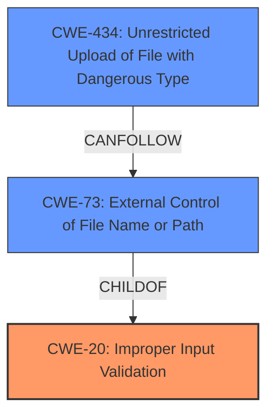

# Analysis Report for CVE-2022-0550

# Vulnerability Analysis Report: CVE-2022-0550

## Description


## Analysis (with Relationship Data)

# Summary
| CWE ID | CWE Name | Confidence | CWE Abstraction Level | CWE Vulnerability Mapping Label | CWE-Vulnerability Mapping Notes |
|---|---|---|---|---|---|
| CWE-20 | Improper Input Validation | 0.9 | Class | Primary | Discouraged |
| CWE-434 | Unrestricted Upload of File with Dangerous Type | 0.6 | Base | Secondary | Allowed |
| CWE-73 | External Control of File Name or Path | 0.6 | Base | Secondary | Allowed |

## Evidence and Confidence

*   **Confidence Score:** 0.9
*   **Evidence Strength:** HIGH

## Relationship Analysis
The primary identified weakness is CWE-20, which is a class-level CWE.
However, the description indicates more specific file-related issues, suggesting a chain involving CWE-73 and/or CWE-434.
CWE-73 (External Control of File Name or Path) can lead to issues like CWE-22 (Path Traversal) or CWE-434 (Unrestricted Upload of File with Dangerous Type).



## Vulnerability Chain
The vulnerability chain starts with **Improper Input Validation** (CWE-20) during the custom report logo upload. This leads to the possibility of external control of file names or paths (CWE-73) and subsequently, the potential unrestricted upload of dangerous file types (CWE-434), enabling remote command execution.

## Summary of Analysis
Initial Analysis:
The vulnerability description clearly states "**Improper Input Validation**" as the root cause. The CVE description and key phrases directly support this.
The primary CWE match from similar CVE descriptions is CWE-20.

Criticism:
CWE-20 is a high-level class and is generally discouraged as a primary mapping. However, the description doesn't immediately point to a more specific variant. The action of uploading a "custom report logo" suggests a file upload context, which opens the door for further specific CWEs related to file handling.
The retriever results also suggest CWE-73, CWE-434, and CWE-22, which align with the file upload scenario.

Conclusion:
Given the evidence, CWE-20 is a valid starting point, but it's crucial to consider more specific CWEs.
The fact that the vulnerability involves "custom report logo upload" strongly implies the possibility of uploading a file with a dangerous type (CWE-434) or manipulating the file path (CWE-73).
Therefore, I'm selecting CWE-20 as the primary due to the explicit mention of "**Improper Input Validation**", but adding CWE-434 and CWE-73 as secondary CWEs to represent the file upload aspect.

"**Improper Input Validation** vulnerability in custom report logo upload"
"**Root cause of vulnerability:** Improper input validation during custom report logo upload."

The selected CWEs are at the optimal level of specificity, balancing the direct evidence of **Improper Input Validation** with the context of file uploading.

Relevant CWE Information:

# Enhanced Context (25 CWEs)

## CWE-1289: Improper Validation of Unsafe Equivalence in Input
**Abstraction Level**: Base
**Similarity Score**: 0.79
**Source**: dense

**Description**:
The product receives an input value that is used as a resource identifier or other type of reference, but it does not validate or incorrectly validates that the input is equivalent to a potentially-unsafe value.
*This is not a bad candidate, but there is insufficient evidence to say that is the case.*

## CWE-807: Reliance on Untrusted Inputs in a Security Decision
**Abstraction Level**: Base
**Similarity Score**: 0.76
**Source**: dense

**Description**:
The product uses a protection mechanism that relies on the existence or values of an input, but the input can be modified by an untrusted actor in a way that bypasses the protection mechanism.
*This is possible, but there is no strong evidence for this.*

## CWE-184: Incomplete List of Disallowed Inputs
**Abstraction Level**: Base
**Similarity Score**: 0.75
**Source**: dense

**Description**:
The product implements a protection mechanism that relies on a list of inputs (or properties of inputs) that are not allowed by policy or otherwise require other action to neutralize before additional processing takes place, but the list is incomplete.
*This is possible, but there is no strong evidence for this.*

## CWE-183: Permissive List of Allowed Inputs
**Abstraction Level**: Base
**Similarity Score**: 0.75
**Source**: dense

**Description**:
The product implements a protection mechanism that relies on a list of inputs (or properties of inputs) that are explicitly allowed by policy because the inputs are assumed to be safe, but the list is too permissive - that is, it allows an input that is unsafe, leading to resultant weaknesses.
*This is possible, but there is no strong evidence for this.*

## CWE-703: Improper Check or Handling of Exceptional Conditions
**Abstraction Level**: Pillar
**Similarity Score**: 0.75
**Source**: dense

**Description**:
The product does not properly anticipate or handle exceptional conditions that rarely occur during normal operation of the product.
*This is too high level.*

## CWE-691: Insufficient Control Flow Management
**Abstraction Level**: Pillar
**Similarity Score**: 0.75
**Source**: dense

**Description**:
The code does not sufficiently manage its control flow during execution, creating conditions in which the control flow can be modified in unexpected ways.
*This is too high level.*

## CWE-73: External Control of File Name or Path
**Abstraction Level**: Base
**Similarity Score**: 0.75
**Source**: dense

**Description**:
The product allows user input to control or influence paths or file names that are used in filesystem operations.
*This is a good candidate.*

## CWE-41: Improper Resolution of Path Equivalence
**Abstraction Level**: Base
**Similarity Score**: 0.75
**Source**: dense

**Description**:
The product is vulnerable to file system contents disclosure through path equivalence. Path equivalence involves the use of special characters in file and directory names. The associated manipulations are intended to generate multiple names for the same object.
*This is possible, but there is no strong evidence for this.*

## CWE-252: Unchecked Return Value
**Abstraction Level**: Base
**Similarity Score**: 0.75
**Source**: dense

**Description**:
The product does not check the return value from a method or function, which can prevent it from detecting unexpected states and conditions.
*This is possible, but there is no strong evidence for this.*

## CWE-274: Improper Handling of Insufficient Privileges
**Abstraction Level**: Base
**Similarity Score**: 0.75
**Source**: dense

**Description**:
The product does not handle or incorrectly handles when it has insufficient privileges to perform an operation, leading to resultant weaknesses.
*This is possible, but there is no strong evidence for this.*

## CWE-22: Improper Limitation of a Pathname to a Restricted Directory ('Path Traversal')
**Abstraction Level**: Base
**Similarity Score**: 7497.30
**Source**: sparse

**Description**:
The product uses external input to construct a pathname that is intended to identify a file or directory that is located underneath a restricted parent directory, but the product does not properly neutralize special elements within the pathname that can cause the pathname to resolve to a location that is outside of the restricted directory.
*This is possible, and can be related to CWE-73.*

## CWE-23: Relative Path Traversal
**Abstraction Level**: Base
**Similarity Score**: 7173.10
**Source**: sparse

**Description**:
The product uses external input to construct a pathname that should be within a restricted directory, but it does not properly neutralize sequences such as ".." that can resolve to a location that is outside of that directory.
*This is possible, and can be related to CWE-73.*

## CWE-73: External Control of File Name or Path
**Abstraction Level**: Base
**Similarity Score**: 7012.27
**Source**: sparse

**Description**:
The product allows user input to control or influence paths or file names that are used in filesystem operations.
*This is a good candidate.*

## CWE-184: Incomplete List of Disallowed Inputs
**Abstraction Level**: Base
**Similarity Score**: 6987.93
**Source**: sparse

**Description**:
The product implements a


## CWE Relationship Analysis

Current CWEs represent these abstraction levels: .


### Vulnerability Chain Analysis

**Chain starting from CWE-434:**
- 434 (Unrestricted Upload of File with Dangerous Type) - ROOT


**Chain starting from CWE-41:**
- 41 (Improper Resolution of Path Equivalence) - ROOT


### CWE Relationship Diagram

```mermaid
graph TD
    classDef primary fill:#f96,stroke:#333,stroke-width:2px
    classDef secondary fill:#69f,stroke:#333
    classDef tertiary fill:#9e9,stroke:#333
```


*Report generated on 2025-03-31 12:59:01*
