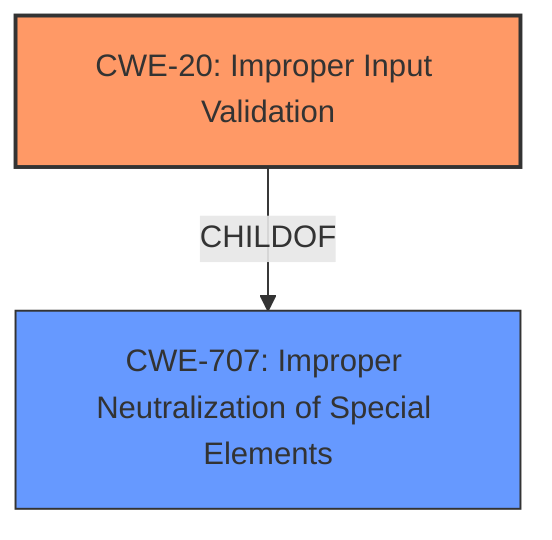

# Raw Analyzer Response for CVE-2022-0551

# Summary
| CWE ID | CWE Name | Confidence | CWE Abstraction Level | CWE Vulnerability Mapping Label | CWE-Vulnerability Mapping Notes |
|---|---|---|---|---|---|
| CWE-20 | Improper Input Validation | 0.9 | Class | Discouraged | The vulnerability is due to the **improper input validation** during project file upload. |

## Evidence and Confidence

*   **Confidence Score:** 0.9
*   **Evidence Strength:** HIGH

## Relationship Analysis
The primary identified CWE is CWE-20.

## Vulnerability Chain
The vulnerability chain starts with **improper input validation**, which leads to the ability to execute unattended commands.
  - Initial Flaw: **Improper Input Validation** in project file upload.
  - Final Impact: Execution of arbitrary commands with web server user privileges.

## Summary of Analysis
The analysis is primarily based on the provided evidence, specifically the "Vulnerability Description Key Phrases" and "CVE Reference Links Content Summary," which highlight **Improper Input Validation** as the root cause.
The vulnerability description explicitly states "**Improper Input Validation** vulnerability in project file upload". The CVE Reference Links Content Summary confirms this by stating the "Root cause of vulnerability: **Improper input validation** during project file upload."
The provided information strongly supports the selection of CWE-20 as the primary CWE. While CWE-20 is a class-level CWE and is generally discouraged, in this particular case, the provided evidence does not give enough information to select a more specific CWE from its children.

Relevant CWE Information:

# Enhanced Context (25 CWEs)

## CWE-20: Improper Input Validation
**Abstraction:** Class
**Status:** Stable

### Description
The product receives input or data, but it does
        not validate or incorrectly validates that the input has the
        properties that are required to process the data safely and
        correctly.
### Mapping Guidance
**Usage:** Discouraged
**Rationale:** CWE-20 is commonly misused in low-information vulnerability reports when lower-level CWEs could be used instead, or when more details about the vulnerability are available [REF-1287]. It is not useful for trend analysis. It is also a level-1 Class (i.e., a child of a Pillar).
**Comments:** Consider lower-level children such as Improper Use of Validation Framework (CWE-1173) or improper validation involving specific types or properties of input such as Specified Quantity (CWE-1284); Specified Index, Position, or Offset (CWE-1285); Syntactic Correctness (CWE-1286); Specified Type (CWE-1287); Consistency within Input (CWE-1288); or Unsafe Equivalence (CWE-1289).
**Reasons:**
- Frequent Misuse

### Observed Examples
- **CVE-2021-30860:** Chain: **improper input validation** (CWE-20) leads to integer overflow (CWE-190) in mobile OS, as exploited in the wild per CISA KEV.

CWE-20 is the most suitable given the information provided. The description directly aligns with the vulnerability description, where the product doesn't properly validate the uploaded project file. The impact of this weakness, as indicated by the ability to "execute unattended commands," demonstrates the security implications of **improper input validation**. While the mapping guidance discourages using CWE-20 when more specific information is available, the provided evidence does not allow a more granular classification.