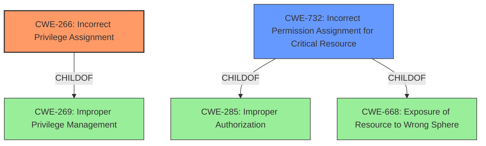

# Raw Analyzer Response for CVE-2022-0556

# Summary
| CWE ID | CWE Name | Confidence | CWE Abstraction Level | CWE Vulnerability Mapping Label | CWE-Vulnerability Mapping Notes |
|---|---|---|---|---|---|
| CWE-266 | Incorrect Privilege Assignment | 1.0 | Base | Allowed | Primary CWE |
| CWE-732 | Incorrect Permission Assignment for Critical Resource | 0.7 | Class | Allowed-with-Review | Secondary Candidate |

## Evidence and Confidence

*   **Confidence Score:** 0.9
*   **Evidence Strength:** HIGH

## Relationship Analysis
The primary relationship that impacted the decision was the parent-child relationship where CWE-266 is a child of CWE-269, and CWE-732 is a child of CWE-285 and CWE-668. CWE-266 is a Base level CWE, making it more specific than CWE-269 (Class). CWE-732, while related, focuses on the incorrect assignment of *permissions* for a critical resource, while the vulnerability description speaks of **incorrect permission assignment** more generally, making CWE-266 a closer fit.

## Vulnerability Chain
The chain starts with the **incorrect permission assignment** (CWE-266), leading to the ability to execute arbitrary code as a local administrator. The vulnerability chain is: Incorrect Permission Assignment -> Arbitrary Code Execution.

## Summary of Analysis
The initial analysis focused on the **incorrect permission assignment** as the root cause. The Retriever Results pointed to CWE-732 and CWE-266 as potential candidates.

The vulnerability description states: "A local privilege escalation vulnerability caused by **incorrect permission assignment** in some directories of the Zyxel AP Configurator (ZAC) version 1.1.4, which could allow an attacker to execute arbitrary code as a local administrator."

CWE-266 (Incorrect Privilege Assignment) is a Base level CWE that directly addresses the **incorrect assignment** of a privilege. The description of CWE-266, "A product incorrectly assigns a privilege to a particular actor, creating an unintended sphere of control for that actor," aligns well with the vulnerability.

CWE-732 (Incorrect Permission Assignment for Critical Resource) is a Class level CWE that focuses on incorrect permission assignment for a *critical resource*. While relevant, the provided description doesn't explicitly state that the **incorrect permission assignment** was on a critical resource, making CWE-266 a more precise fit.

Therefore, CWE-266 is the most appropriate CWE because it is a Base level CWE that directly addresses the **incorrect assignment** of privileges, leading to privilege escalation.

CWE-732 was considered but not used as the primary CWE because it focuses on the incorrect assignment of permissions for a *critical resource*, which isn't explicitly mentioned in the vulnerability description. However, it is still a relevant secondary candidate.

Relevant CWE Information:

# Enhanced Context (25 CWEs)

## CWE-266: Incorrect Privilege Assignment
**Abstraction Level**: Base
**Similarity Score**: 0.76
**Source**: dense

**Description**:
A product incorrectly assigns a privilege to a particular actor, creating an unintended sphere of control for that actor.

**Mapping Guidance**:
- Usage: Allowed
- Rationale: This CWE entry is at the Base level of abstraction, which is a preferred level of abstraction for mapping to the root causes of vulnerabilities.

## CWE-732: Incorrect Permission Assignment for Critical Resource
**Abstraction Level**: Class
**Similarity Score**: 5773.61
**Source**: sparse

**Description**:
The product specifies permissions for a security-critical resource in a way that allows that resource to be read or modified by unintended actors.

**Mapping Guidance**:
- Usage: Allowed-with-Review
- Rationale: While the name itself indicates an assignment of permissions for resources, this is often misused for vulnerabilities in which "permissions" are not checked, which is an "authorization" weakness (CWE-285 or descendants) within CWE's model [REF-1287].