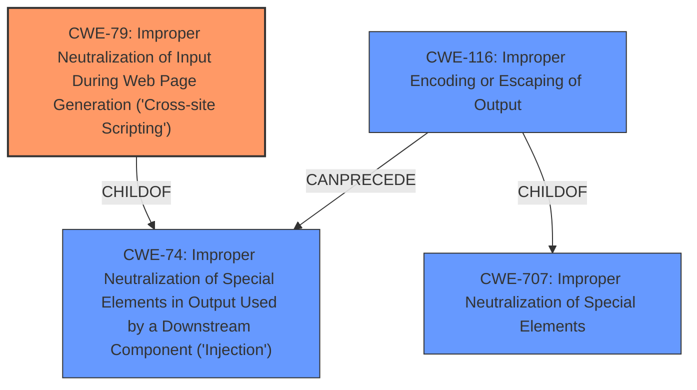

# Raw Analyzer Response for CVE-2022-0565

# Summary
| CWE ID | CWE Name | Confidence | CWE Abstraction Level | CWE Vulnerability Mapping Label | CWE-Vulnerability Mapping Notes |
|---|---|---|---|---|---|
| CWE-79 | Improper Neutralization of Input During Web Page Generation ('Cross-site Scripting') | 1.0 | Base | Allowed | Primary CWE |
| CWE-116 | Improper Encoding or Escaping of Output | 0.7 | Class | Allowed-with-Review | Secondary Candidate |

## Evidence and Confidence

*   **Confidence Score:** 0.9
*   **Evidence Strength:** HIGH

## Relationship Analysis
The primary CWE is CWE-79, which is a base-level CWE that describes the root cause of the vulnerability: the **improper neutralization of input during web page generation**, leading to cross-site scripting. CWE-79 is a child of CWE-74 (Improper Neutralization of Special Elements in Output Used by a Downstream Component ('Injection')). CWE-116 (Improper Encoding or Escaping of Output) is a Class-level CWE that highlights the **missing or incorrect encoding/escaping** of data, contributing to the XSS vulnerability. CWE-116 is a child of CWE-707 and can precede CWE-74.

## Vulnerability Chain
The vulnerability chain starts with the **lack of proper sanitization of SVG files** (root cause), which leads to the possibility of injecting malicious code. This malicious code, when included in a web page, results in **cross-site scripting (XSS)**. The chain can be represented as: **Improper SVG Sanitization** -> **Improper Encoding/Escaping of Output** -> **Cross-Site Scripting (CWE-79)**.

## Summary of Analysis
The initial analysis correctly identifies the vulnerability as Cross-site Scripting in Packagist pimcore/pimcore prior to 10.3.1. The commit message "Svg sanitization (#11386)" and the changes made in `AssetSanitizationListener.php`, `SettingsController.php`, and `composer.json` strongly suggest that this commit is a fix for a vulnerability related to unsanitized SVG uploads, which could potentially lead to Cross-Site Scripting (XSS) or other security issues. The primary CWE is CWE-79, as the vulnerability directly results from the **improper neutralization of input** (malicious SVG content) during web page generation. The supporting evidence from the CVE Reference Links Content Summary confirms this, stating the **root cause** as "the **lack of proper sanitization of SVG files** uploaded through Pimcore."

CWE-116 is considered a secondary candidate because the fix involves sanitizing the SVG content, which can be seen as a form of encoding or escaping the output to prevent the malicious code from being executed. However, CWE-79 is a more direct representation of the vulnerability's impact, which is XSS.

The chosen CWEs are at the optimal level of specificity, with CWE-79 being a base-level CWE and CWE-116 being a class-level CWE. These levels provide a good balance between detail and generality, accurately capturing the nature of the vulnerability.

Relevant CWE Information:
- **CWE-79:** Directly addresses the XSS vulnerability resulting from improper neutralization of input.
- **CWE-116:** Addresses the aspect of improper encoding or escaping of output, which contributes to the XSS vulnerability.
- **CWE-83:** Considered but not used. While it relates to script in attributes, the primary issue is the overall lack of neutralization leading to XSS, making CWE-79 more appropriate.
- **CWE-80:** Considered but not used. It relates to script-related HTML tags, but the issue is broader than just HTML tags, encompassing SVG content.
- **CWE-352:** Considered but not used. This is about Cross-Site Request Forgery, and there's no evidence of that attack vector here.