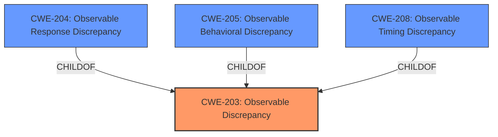

# Analysis Report for CVE-2022-0569

# Vulnerability Analysis Report: CVE-2022-0569

## Description


## Analysis (with Relationship Data)

# Summary
| CWE ID  | CWE Name                                                     | Confidence | CWE Abstraction Level | CWE Vulnerability Mapping Label | CWE-Vulnerability Mapping Notes |
| ------- | ------------------------------------------------------------ | ---------- | ----------------------- | ------------------------------- | ------------------------------- |
| CWE-203 | Observable Discrepancy                                       | 0.7        | Base                    | Primary CWE                     | Allowed                        |
| CWE-205 | Observable Behavioral Discrepancy                            | 0.6        | Base                    | Secondary Candidate             | Allowed                        |
| CWE-208 | Observable Timing Discrepancy                            | 0.5        | Base                    | Secondary Candidate             | Allowed                        |
| CWE-204 | Observable Response Discrepancy                            | 0.4        | Base                    | Secondary Candidate             | Allowed                        |

## Evidence and Confidence

*   **Confidence Score:** 0.7
*   **Evidence Strength:** LOW

## Relationship Analysis

The primary relationship influencing the CWE selection is the parent-child relationship between CWE-203 and other more specific CWEs like CWE-204, CWE-205 and CWE-208. Given the limited information, the more general CWE-203 is chosen, but more specific variants are considered as secondary candidates.



## Vulnerability Chain

The vulnerability chain is simple: the **observable discrepancy** (root cause) leads to potential information disclosure (impact). No further links can be confidently added based on the available description.

## Summary of Analysis

The initial analysis identified **Observable Discrepancy** as the **root cause**.
The final decision is based on the limited information available and the root cause mentioned in the description. The evidence is weak due to the lack of details in the CVE description and reference links.

The vulnerability description mentions "**Observable Discrepancy** in Packagist snipe/snipe-it prior to v5.3.9.". The primary CWE is CWE-203, which represents a general **observable discrepancy**.

CWE-203 is chosen because it is the **root cause** explicitly stated in the description key phrases. The retriever results also list CWE-203 as a candidate.

Other CWEs like CWE-204, CWE-205, and CWE-208 are more specific types of observable discrepancies. They are considered as secondary candidates, but without more details about the vulnerability, it is difficult to choose one of them over CWE-203.

Relevant CWE Information:

# Enhanced Context (25 CWEs)

## CWE-1420: Exposure of Sensitive Information during Transient Execution
**Abstraction Level**: Base
**Similarity Score**: 0.83
**Source**: dense

**Description**:
A processor event or prediction may allow incorrect operations (or correct operations with incorrect data) to execute transiently, potentially exposing data over a covert channel.

**Mapping Guidance**:
- Usage: Allowed-with-Review
- Rationale: This CWE entry is at the Base level of abstraction, which is a preferred level of abstraction for mapping to the root causes of vulnerabilities.

## CWE-205: Observable Behavioral Discrepancy
**Abstraction Level**: Base
**Similarity Score**: 0.77
**Source**: dense

**Description**:
The product's behaviors indicate important differences that may be observed by unauthorized actors in a way that reveals (1) its internal state or decision process, or (2) differences from other products with equivalent functionality.

**Mapping Guidance**:
- Usage: Allowed
- Rationale: This CWE entry is at the Base level of abstraction, which is a preferred level of abstraction for mapping to the root causes of vulnerabilities.

## CWE-1421: Exposure of Sensitive Information in Shared Microarchitectural Structures during Transient Execution
**Abstraction Level**: Base
**Similarity Score**: 0.77
**Source**: dense

**Description**:

A processor event may allow transient operations to access
architecturally restricted data (for example, in another address
space) in a shared microarchitectural structure (for example, a CPU
cache), potentially exposing the data over a covert channel.

**Mapping Guidance**:
- Usage: Allowed
- Rationale: This CWE entry is at the Base level of abstraction, which is a preferred level of abstraction for mapping to the root causes of vulnerabilities

## CWE-1422: Exposure of Sensitive Information caused by Incorrect Data Forwarding during Transient Execution
**Abstraction Level**: Base
**Similarity Score**: 0.76
**Source**: dense

**Description**:
A processor event or prediction may allow incorrect or stale data to
be forwarded to transient operations, potentially exposing data over a
covert channel.

**Mapping Guidance**:
- Usage: Allowed
- Rationale: This CWE entry is at the Base level of abstraction, which is a preferred level of abstraction for mapping to the root causes of vulnerabilities

## CWE-208: Observable Timing Discrepancy
**Abstraction Level**: Base
**Similarity Score**: 0.76
**Source**: dense

**Description**:
Two separate operations in a product require different amounts of time to complete, in a way that is observable to an actor and reveals security-relevant information about the state of the product, such as whether a particular operation was successful or not.

**Mapping Guidance**:
- Usage: Allowed
- Rationale: This CWE entry is at the Base level of abstraction, which is a preferred level of abstraction for mapping to the root causes of vulnerabilities.

## CWE-1342: Information Exposure through Microarchitectural State after Transient Execution
**Abstraction Level**: Base
**Similarity Score**: 0.76
**Source**: dense

**Description**:
The processor does not properly clear microarchitectural state after incorrect microcode assists or speculative execution, resulting in transient execution.

**Mapping Guidance**:
- Usage: Allowed
- Rationale: This CWE entry is at the Base level of abstraction, which is a preferred level of abstraction for mapping to the root causes of vulnerabilities.

## CWE-203: Observable Discrepancy
**Abstraction Level**: Base
**Similarity Score**: 0.73
**Source**: dense

**Description**:
The product behaves differently or sends different responses under different circumstances in a way that is observable to an unauthorized actor, which exposes security-relevant information about the state of the product, such as whether a particular operation was successful or not.

**Mapping Guidance**:
- Usage: Allowed
- Rationale: This CWE entry is at the Base level of abstraction, which is a preferred level of abstraction for mapping to the root causes of vulnerabilities.

## CWE-207: Observable Behavioral Discrepancy With Equivalent Products
**Abstraction Level**: Variant
**Similarity Score**: 0.73
**Source**: dense

**Description**:
The product operates in an environment in which its existence or specific identity should not be known, but it behaves differently than other products with equivalent functionality, in a way that is observable to an attacker.

**Mapping Guidance**:
- Usage: Allowed
- Rationale: This CWE entry is at the Variant level of abstraction, which is a preferred level of abstraction for mapping to the root causes of vulnerabilities.

## CWE-204: Observable Response Discrepancy
**Abstraction Level**: Base
**Similarity Score**: 0.73
**Source**: dense

**Description**:
The product provides different responses to incoming requests in a way that reveals internal state information to an unauthorized actor outside of the intended control sphere.

**Mapping Guidance**:
- Usage: Allowed
- Rationale: This CWE entry is at the Base level of abstraction, which is a preferred level of abstraction for mapping to the root causes of vulnerabilities.

## CWE-206: Observable Internal Behavioral Discrepancy
**Abstraction Level**: Variant
**Similarity Score**: 0.73
**Source**: dense

**Description**:
The product performs multiple behaviors that are combined to produce a single result, but the individual behaviors are observable separately in a way that allows attackers to reveal internal state or internal decision points.

**Mapping Guidance**:
- Usage: Allowed
- Rationale: This CWE entry is at the Variant level of abstraction, which is a preferred level of abstraction for mapping to the root causes of vulnerabilities.

## CWE-203: Observable Discrepancy
**Abstraction Level**: Base
**Similarity Score**: 6194.02
**Source**: sparse

**Description**:


## CWE Relationship Analysis

Current CWEs represent these abstraction levels: .


### Vulnerability Chain Analysis

**Chain starting from CWE-1421:**
- 1421 (Exposure of Sensitive Information in Shared Microarchitectural Structures during Transient Execution) - ROOT


**Chain starting from CWE-208:**
- 208 (Observable Timing Discrepancy) - ROOT


### CWE Relationship Diagram

```mermaid
graph TD
    classDef primary fill:#f96,stroke:#333,stroke-width:2px
    classDef secondary fill:#69f,stroke:#333
    classDef tertiary fill:#9e9,stroke:#333
```


*Report generated on 2025-03-31 05:08:02*
