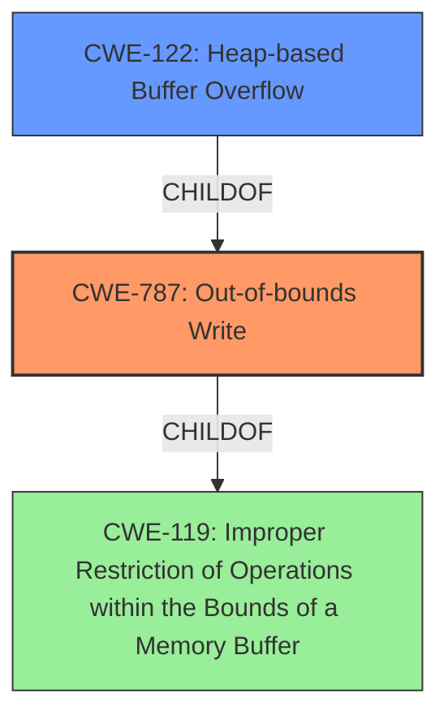

# Enhanced Analysis for CVE-2022-0572

# Summary

| CWE ID | CWE Name | Confidence | CWE Abstraction Level | CWE Vulnerability Mapping Label | CWE-Vulnerability Mapping Notes |
|---|---|---|---|---|---|
| CWE-787 | Out-of-bounds Write | 1.0 | Base | Allowed | Primary CWE |
| CWE-122 | Heap-based Buffer Overflow | 0.8 | Variant | Allowed | Secondary Candidate |
| CWE-119 | Improper Restriction of Operations within the Bounds of a Memory Buffer | 0.6 | Class | Discouraged | Secondary Candidate |

## Evidence and Confidence

*   **Confidence Score:** 0.9
*   **Evidence Strength:** HIGH

## Relationship Analysis

The primary CWE is CWE-787 **Out-of-bounds Write**, which is a base-level CWE. CWE-122 **Heap-based Buffer Overflow** is a variant of CWE-787, specifically when the overflow occurs in the heap. CWE-119 **Improper Restriction of Operations within the Bounds of a Memory Buffer** is a class-level CWE that is a parent of both CWE-787 and CWE-122. The choice of CWE-787 as the primary is based on the clear evidence of an out-of-bounds write due to the **Heap-based Buffer Overflow**.



## Vulnerability Chain

The vulnerability chain starts with the use of the `:retab` command, which leads to the line becoming excessively long. This, in turn, causes a **heap-based buffer overflow** (CWE-122), which is a specific type of **out-of-bounds write** (CWE-787). The impact is a crash of the application.

## Summary of Analysis

The initial analysis focused on the **Heap-based Buffer Overflow** weakness. The CVE description key phrases and the CVE reference links content summary clearly point to this vulnerability. The retriever results also suggest CWE-787 **Out-of-bounds Write** and CWE-122 **Heap-based Buffer Overflow** as relevant CWEs. The final decision was to classify the vulnerability as CWE-787 **Out-of-bounds Write**, with CWE-122 **Heap-based Buffer Overflow** as a secondary classification, because the overflow occurs on the heap.

The evidence supporting this decision is:

*   Vulnerability Description: "**Heap-based Buffer Overflow** in GitHub repository vim/vim prior to 8.2."
*   CVE Reference Links Content Summary: "The vulnerability lies in the `:retab` command of Vim...When repeatedly using the `:retab` command, the line could become excessively long...leading to a crash."
*   CVE Reference Links Content Summary: "The patch introduces a check to bail out when the line gets too long...Specifically, it adds a check within the `ex_retab` function in `src/indent.c` to see if the calculated virtual column `vcol` exceeds `MAXCOL`. If it does, the function displays an error message `emsg(_(e_resulting_text_too_long))` and breaks the loop."
*   CVE Reference Links Content Summary: "**Heap overflow** in ex_retab()."

The graph relationships influenced the decision by showing the hierarchical structure of the CWEs, helping to choose the most specific and accurate classification. CWE-787 is at the optimal level of specificity because it captures the essence of the vulnerability, which is an out-of-bounds write.

Relevant CWE Information:

## Enhanced Context (25 CWEs)

### CWE-787: Out-of-bounds Write
**Abstraction Level**: Base
**Similarity Score**: 3.30

**Description**:
CWE-787: Out-of-bounds Write

**Mapping Guidance**:
- Usage: Allowed
- Rationale: This CWE entry is at the Base level of abstraction, which is a preferred level of abstraction for mapping to the root causes of vulnerabilities.

**Relationships**:
- CANFOLLOW -> CWE-825
- CANFOLLOW -> CWE-824
- CANFOLLOW -> CWE-823
- CANFOLLOW -> CWE-822
- PARENTOF -> CWE-124

This CWE is selected as the primary because the root cause is an **out-of-bounds write**.

### CWE-122: Heap-based Buffer Overflow
**Abstraction Level**: Variant
**Similarity Score**: 0.178

**Description**:
A heap overflow condition is a buffer overflow, where the buffer that can be overwritten is allocated in the heap portion of memory, generally meaning that the buffer was allocated using a routine such as malloc().

### CWE-119: Improper Restriction of Operations within the Bounds of a Memory Buffer
**Abstraction Level**: Class
**Similarity Score**: 0.800

**Description**:
The product performs operations on a memory buffer, but it reads from or writes to a memory location outside the buffer's intended boundary. This may result in read or write operations on unexpected memory locations that could be linked to other variables, data structures, or internal program data.

CWE-119 was considered but not used as the primary CWE because it is a class-level CWE and less specific than CWE-787. While CWE-119 describes the general issue of out-of-bounds access, CWE-787 specifically identifies the **out-of-bounds write**, making it a more accurate representation of the vulnerability.


## CWE Relationship Analysis

Current CWEs represent these abstraction levels: .


### Vulnerability Chain Analysis

**Chain starting from CWE-825:**
- 825 (Expired Pointer Dereference) - ROOT


**Chain starting from CWE-823:**
- 823 (Use of Out-of-range Pointer Offset) - ROOT


### CWE Relationship Diagram

```mermaid
graph TD
    classDef primary fill:#f96,stroke:#333,stroke-width:2px
    classDef secondary fill:#69f,stroke:#333
    classDef tertiary fill:#9e9,stroke:#333
```