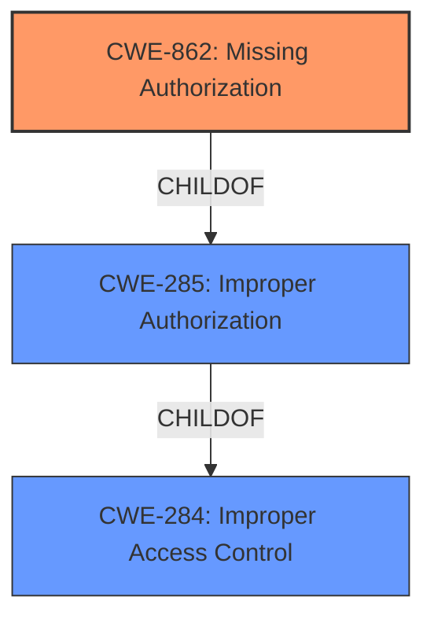

# Raw Analyzer Response for CVE-2022-0579

# Summary
| CWE ID | CWE Name | Confidence | CWE Abstraction Level | CWE Vulnerability Mapping Label | CWE-Vulnerability Mapping Notes |
|---|---|---|---|---|---|
| CWE-862 | Missing Authorization | 1.0 | Class | Primary | Allowed-with-Review |
| CWE-285 | Improper Authorization | 0.5 | Class | Secondary | Discouraged |
| CWE-284 | Improper Access Control | 0.3 | Pillar | Secondary | Discouraged |

## Evidence and Confidence

*   **Confidence Score:** 1.0
*   **Evidence Strength:** HIGH

## Relationship Analysis
The primary CWE is CWE-862, **Missing Authorization**, which is a child of CWE-285, **Improper Authorization**, and CWE-284, **Improper Access Control**. The vulnerability description clearly states "**missing authorization**", aligning directly with CWE-862. While CWE-285 and CWE-284 are broader, the specific nature of the vulnerability (a complete absence of authorization) makes CWE-862 the most appropriate choice. The abstraction levels also influenced the selection, favoring the more specific Class level of CWE-862 over the Pillar level of CWE-284.

## Vulnerability Chain
The vulnerability chain consists of a single point: the **missing authorization** check. This allows unauthorized access to supplier information, potentially leading to information disclosure. There are no preceding or following weaknesses explicitly mentioned in the provided information.

## Summary of Analysis
The initial analysis pointed towards CWE-862, **Missing Authorization**, due to the explicit mention of "**missing authorization**" in the vulnerability description. The commit message "Adds gate to supplier view" further reinforces this assessment, confirming the absence of an authorization check in the `show` method of `SuppliersController.php`.

The analysis is heavily based on the provided evidence, specifically:

*   **Vulnerability Description Key Phrases:** "**rootcause:** **missing authorization**"
*   **CVE Reference Links Content Summary:** "The vulnerability was a **missing authorization** check in the `show` method of `SuppliersController.php`."
*   **CVE Reference Links Content Summary:** "The commit message "Adds gate to supplier view" and the code change ` $this->authorize('view', Supplier::class);` indicate that a **missing authorization** check was identified and addressed."

The graph relationships confirm that CWE-862 is a more specific child of the broader CWE-285 and CWE-284. The selection of CWE-862 is at the optimal level of specificity, as it directly represents the **missing authorization** issue. While CWE-285 (**Improper Authorization**) could be considered, CWE-862 is more precise in this case. Similarly, CWE-284 (**Improper Access Control**) is too general. Therefore, CWE-862 is the most appropriate mapping.

Relevant CWE Information:

# Enhanced Context (25 CWEs)
The following CWEs were identified as potentially relevant to this vulnerability:

## CWE-807: Reliance on Untrusted Inputs in a Security Decision
**Abstraction Level**: Base
**Similarity Score**: 0.76
**Source**: dense

**Description**:
The product uses a protection mechanism that relies on the existence or values of an input, but the input can be modified by an untrusted actor in a way that bypasses the protection mechanism.

**Mapping Guidance**:
- Usage: Allowed
- Rationale: This CWE entry is at the Base level of abstraction, which is a preferred level of abstraction for mapping to the root causes of vulnerabilities.

**Why Not Used:** This CWE doesn't fit because the issue isn't about relying on untrusted input, but rather the complete absence of an authorization check.

## CWE-639: Authorization Bypass Through User-Controlled Key
**Abstraction Level**: Base
**Similarity Score**: 0.76
**Source**: dense

**Description**:
The system's authorization functionality does not prevent one user from gaining access to another user's data or record by modifying the key value identifying the data.

**Mapping Guidance**:
- Usage: Allowed
- Rationale: This CWE entry is at the Base level of abstraction, which is a preferred level of abstraction for mapping to the root causes of vulnerabilities.

**Why Not Used:** This CWE doesn't fit because the vulnerability isn't about bypassing authorization through a user-controlled key, but about the complete absence of an authorization check.

## CWE-1390: Weak Authentication
**Abstraction Level**: Class
**Similarity Score**: 0.75
**Source**: dense

**Description**:
The product uses an authentication mechanism to restrict access to specific users or identities, but the mechanism does not sufficiently prove that the claimed identity is correct.

**Mapping Guidance**:
- Usage: Allowed-with-Review
- Rationale: This CWE entry is a Class and might have Base-level children that would be more appropriate

**Why Not Used:** This CWE doesn't fit because the issue isn't about weak authentication, but about a missing authorization check after authentication (or even without authentication).

## CWE-303: Incorrect Implementation of Authentication Algorithm
**Abstraction Level**: Base
**Similarity Score**: 0.75
**Source**: dense

**Description**:
The requirements for the product dictate the use of an established authentication algorithm, but the implementation of the algorithm is incorrect.

**Mapping Guidance**:
- Usage: Allowed
- Rationale: This CWE entry is at the Base level of abstraction, which is a preferred level of abstraction for mapping to the root causes of vulnerabilities.

**Why Not Used:** This CWE is not about authentication implementation issues.

## CWE-668: Exposure of Resource to Wrong Sphere
**Abstraction Level**: Class
**Similarity Score**: 0.75
**Source**: dense

**Description**:
The product exposes a resource to the wrong control sphere, providing unintended actors with inappropriate access to the resource.

**Mapping Guidance**:
- Usage: Discouraged
- Rationale: CWE-668 is high-level and is often misused as a catch-all when lower-level CWE IDs might be applicable. It is sometimes used for low-information vulnerability reports [REF-1287]. It is a level-1 Class (i.e., a child of a Pillar). It is not useful for trend analysis.

**Why Not Used:** Too general; CWE-862 is more specific.

## CWE-274: Improper Handling of Insufficient Privileges
**Abstraction Level**: Base
**Similarity Score**: 0.74
**Source**: dense

**Description**:
The product does not handle or incorrectly handles when it has insufficient privileges to perform an operation, leading to resultant weaknesses.

**Mapping Guidance**:
- Usage: Discouraged
- Rationale: This CWE entry could be deprecated in a future version of CWE.

**Why Not Used:** Not about privilege handling, but missing authorization.

## CWE-345: Insufficient Verification of Data Authenticity
**Abstraction Level**: Class
**Similarity Score**: 0.74
**Source**: dense

**Description**:
The product does not sufficiently verify the origin or authenticity of data, in a way that causes it to accept invalid data.

**Mapping Guidance**:
- Usage: Discouraged
- Rationale: This CWE entry is a level-1 Class (i.e., a child of a Pillar). It might have lower-level children that would be more appropriate

**Why Not Used:** The problem is not the authenticity of data, but the missing authorization check.

## CWE-1220: Insufficient Granularity of Access Control
**Abstraction Level**: Base
**Similarity Score**: 0.74
**Source**: dense

**Description**:
The product implements access controls via a policy or other feature with the intention to disable or restrict accesses (reads and/or writes) to assets in a system from untrusted agents. However, implemented access controls lack required granularity, which renders the control policy too broad because it allows accesses from unauthorized agents to the security-sensitive assets.

**Why Not Used:** Access control is missing completely, not just lacking granularity.

## CWE-41: Improper Resolution of Path Equivalence
**Abstraction Level**: Base
**Similarity Score**: 0.74
**Source**: dense

**Description**:
The product is vulnerable to file system contents disclosure through path equivalence. Path equivalence involves the use of special characters in file and directory names. The associated manipulations are intended to generate multiple names for the same object.

**Why Not Used:** Not related to path equivalence.

## CWE-472: External Control