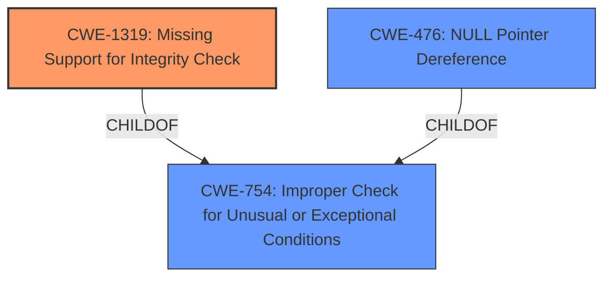

# Enhanced Analysis for CVE-2022-0582

# Summary
| CWE ID | CWE Name | Confidence | CWE Abstraction Level | CWE Vulnerability Mapping Label | CWE-Vulnerability Mapping Notes |
|---|---|---|---|---|---|
| CWE-1319 | Missing Support for Integrity Check | 0.75 | Variant | Primary | Allowed |
| CWE-754 | Improper Check for Unusual or Exceptional Conditions | 0.65 | Class | Secondary | Discouraged |
| CWE-476 | NULL Pointer Dereference | 0.5 | Base | Secondary | Allowed |

## Evidence and Confidence

*   **Confidence Score:** 0.7
*   **Evidence Strength:** MEDIUM

## Relationship Analysis
The primary weakness appears to be a **missing integrity check**, which is a variant of **improper handling of exceptional conditions**. This can lead to other issues like a **null pointer dereference**, which is a type of **improper input validation**.



## Vulnerability Chain
The vulnerability chain starts with the lack of an integrity check, leading to the processing of a malformed packet, which then results in a crash or other runtime errors such as a store to misaligned address or null pointer dereference, ultimately causing a denial of service.

## Summary of Analysis
The initial analysis focused on the **unaligned access** as the root cause. However, further examination of the description and the associated details indicates that the core issue is the **missing integrity check** which leads to the **unaligned access**.

The vulnerability description clearly states that there is "**unaligned access** in the CSN.1 protocol dissector". The **CVE Reference Links Content Summary** indicates that the vulnerability is caused by "a flaw in the CSN.1 protocol dissector within Wireshark" and that "The main weakness is the possibility of a crash within the CSN.1 dissector when processing a malformed packet. This indicates an issue with error handling or input validation within the dissector". It also mentions "A "store to misaligned address" error can also occur related to the CSN.1 dissector as a result of the vulnerability."

Given this evidence, CWE-1319, Missing Support for Integrity Check, is the most appropriate primary CWE. It directly addresses the **missing integrity check** in the CSN.1 dissector, which is the root cause. It is also a Variant level CWE, which is preferred.

CWE-754 is included as a secondary CWE because the root cause is related to improper error handling and **improper handling of exceptional conditions**.

CWE-476, NULL Pointer Dereference, is considered as a secondary CWE since it is mentioned in the **CVE Reference Links Content Summary**.

CWE-119 was considered, but it is too broad and discouraged.

Relevant CWE Information:

# Enhanced Context (25 CWEs)

## CWE-1319: Missing Support for Integrity Check
**Abstraction Level**: Variant
**Similarity Score**: N/A
**Source**: N/A

**Description**:
The software does not perform any integrity checks on data read from a resource or provided as input.

**Mapping Guidance**:
- Usage: Allowed

**Relationships**:
- ChildOf: CWE-754

## CWE-754: Improper Check for Unusual or Exceptional Conditions
**Abstraction Level**: Class
**Similarity Score**: N/A
**Source**: N/A

**Description**:
The software does not check for all relevant error conditions, or it handles errors in a way that is incomplete, inconsistent, or does not sufficiently inform the user.

**Mapping Guidance**:
- Usage: Discouraged
- Rationale: This CWE entry is a Class and might have Base-level children that would be more appropriate

**Relationships**:
- ParentOf: CWE-1319

## CWE-476: NULL Pointer Dereference
**Abstraction Level**: Base
**Similarity Score**: 0.253
**Source**: sparse

**Description**:
The product dereferences a pointer that it expects to be valid but is NULL.

**Mapping Guidance**:
**Usage:** Allowed

**Relationships**:
- ChildOf -> CWE-710
- ChildOf -> CWE-754
- ChildOf -> CWE-754


## CWE Relationship Analysis

Current CWEs represent these abstraction levels: .


### Vulnerability Chain Analysis

**Chain starting from CWE-1319:**
- 1319 (Improper Protection against Electromagnetic Fault Injection (EM-FI)) - ROOT


**Chain starting from CWE-476:**
- 476 (NULL Pointer Dereference) - ROOT


### CWE Relationship Diagram

```mermaid
graph TD
    classDef primary fill:#f96,stroke:#333,stroke-width:2px
    classDef secondary fill:#69f,stroke:#333
    classDef tertiary fill:#9e9,stroke:#333
```