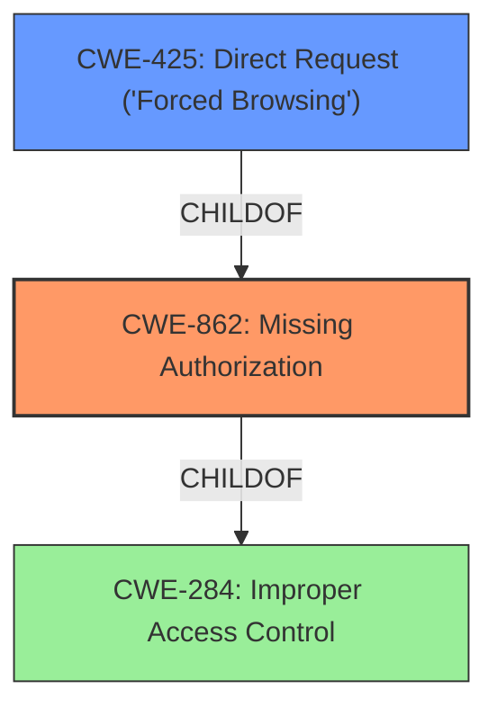

# Analysis Report for CVE-2022-0594

# Vulnerability Analysis Report: CVE-2022-0594

## Description


## Analysis (with Relationship Data)

# Summary
| CWE ID | CWE Name | Confidence | CWE Abstraction Level | CWE Vulnerability Mapping Label | CWE-Vulnerability Mapping Notes |
|---|---|---|---|---|---|
| CWE-862 | Missing Authorization | 0.9 | Class | Primary | Allowed-with-Review |
| CWE-425 | Direct Request ('Forced Browsing') | 0.7 | Base | Secondary | Allowed |

## Evidence and Confidence

*   **Confidence Score:** 0.9
*   **Evidence Strength:** HIGH

## Relationship Analysis
The primary weakness is CWE-862, **Missing Authorization**, because the plugin **lacks a proper authorization check**. CWE-862 is a class-level CWE, and the description fits well since the product does not perform an authorization check when an actor attempts to access a resource or perform an action. CWE-425, **Direct Request ('Forced Browsing')**, is a related weakness because the **lack of authorization** allows direct access to the AJAX action. CWE-425 is a child of CWE-862, indicating a more specific scenario where authorization is missing, allowing direct access to resources.



## Vulnerability Chain
The vulnerability chain starts with the **lack of proper authorization check** (CWE-862). This allows unauthenticated or improperly authenticated users to directly request sensitive information via an AJAX action (CWE-425). The final impact is the disclosure of sensitive information, such as the list of active plugins, PHP version, cURL version, and WordPress version.

## Summary of Analysis
The initial analysis identified the **lack of proper authorization check** as the root cause of the vulnerability. The retriever results and the vulnerability description key phrases both support this assessment. The primary CWE is CWE-862, **Missing Authorization**, as the plugin **lacks an authorization check** for the AJAX action. This allows direct access to sensitive information. The evidence from the "Vulnerability Description Key Phrases" section states "**rootcause: lack of proper authorization check**". The "CVE Reference Links Content Summary" also indicates that "The Shareaholic plugin had an AJAX action (`shareaholic_debug_info`) that **lacked proper authorization checks**."

CWE-425, **Direct Request ('Forced Browsing')**, is considered as a secondary CWE because the **lack of authorization** allows attackers to directly request the sensitive information. This CWE is a child of CWE-862, representing a specific scenario where authorization is missing, thus enabling direct access.

The selected CWEs are at the optimal level of specificity. CWE-862 accurately captures the root cause, and CWE-425 further specifies how the missing authorization leads to direct access.

CWE-284, **Improper Access Control**, was considered but not used as it is a high-level Pillar, and CWE-862 and CWE-425 are more specific and relevant.

Relevant CWE Information:
- CWE-862: Missing Authorization
- CWE-425: Direct Request ('Forced Browsing')


## CWE Relationship Analysis

Current CWEs represent these abstraction levels: .


### Vulnerability Chain Analysis

**Chain starting from CWE-862:**
- 862 (Missing Authorization) - ROOT


**Chain starting from CWE-425:**
- 425 (Direct Request ('Forced Browsing')) - ROOT


### CWE Relationship Diagram

```mermaid
graph TD
    classDef primary fill:#f96,stroke:#333,stroke-width:2px
    classDef secondary fill:#69f,stroke:#333
    classDef tertiary fill:#9e9,stroke:#333
```


*Report generated on 2025-03-31 10:46:49*
