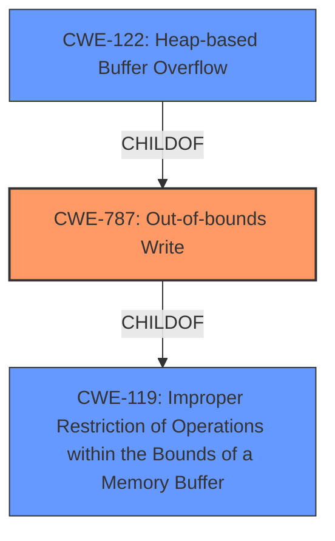

# Enhanced Analysis for CVE-2022-0604

# Summary
| CWE ID | CWE Name | Confidence | CWE Abstraction Level | CWE Vulnerability Mapping Label | CWE-Vulnerability Mapping Notes |
|---|---|---|---|---|---|
| CWE-787 | Out-of-bounds Write | 1.0 | Base | Primary | Allowed |
| CWE-122 | Heap-based Buffer Overflow | 0.8 | Variant | Secondary | Allowed |
| CWE-119 | Improper Restriction of Operations within the Bounds of a Memory Buffer | 0.6 | Class | Secondary | Discouraged |

## Evidence and Confidence

*   **Confidence Score:** 0.9
*   **Evidence Strength:** HIGH

## Relationship Analysis
The primary CWE is CWE-787 (Out-of-bounds Write), which is a base-level CWE and a child of CWE-119 (Improper Restriction of Operations within the Bounds of a Memory Buffer). CWE-122 (Heap-based Buffer Overflow) is a variant of CWE-787. The hierarchical relationship indicates that CWE-787 is a more specific and accurate representation of the vulnerability than its parent, CWE-119. The variant CWE-122 is also accurate because the vulnerability description explicitly mentions a heap **buffer overflow**. This influenced the selection of CWE-787 as the primary CWE, as it is more specific than CWE-119, but more general than CWE-122.



## Vulnerability Chain
The chain of root cause and weaknesses for the vulnerability description is as follows:
1.  **Root Cause:** Heap **buffer overflow** due to writing data past the end of the intended buffer (CWE-787).
2.  **Weakness:** **Heap corruption** due to the out-of-bounds write.
3.  **Impact:** Potential for arbitrary code execution due to successful exploitation of the **heap corruption**.

The chain starts with the **buffer overflow**, which is the root cause. This leads to **heap corruption**, which is the weakness. The final impact is the potential for arbitrary code execution.

## Summary of Analysis
The initial analysis identified a **heap buffer overflow** as the root cause of the vulnerability. The vulnerability description explicitly mentions the term "**buffer overflow**" and "**heap corruption**". The "CVE Reference Links Content Summary" confirms that the root cause of the vulnerability is a **heap buffer overflow**. This information strongly supports the selection of CWE-787 (Out-of-bounds Write) as the primary CWE.

The Retriever Results listed CWE-119 (Improper Restriction of Operations within the Bounds of a Memory Buffer) as the top combined result. However, the mapping guidance for CWE-119 discourages its use when more specific CWEs are available. Since the vulnerability description explicitly mentions a **buffer overflow**, and the "CVE Reference Links Content Summary" confirms that the root cause is a **heap buffer overflow**, CWE-787 (Out-of-bounds Write) is a more appropriate choice. The Retriever Results also listed CWE-122 (Heap-based Buffer Overflow) and this is a good candidate since the buffer is allocated in the heap.

The graph relationships influenced the final selection by highlighting the hierarchical structure between CWE-119, CWE-787, and CWE-122. This helped to determine the optimal level of specificity for the CWE mapping.

The selected CWEs are at the optimal level of specificity because they accurately represent the root cause of the vulnerability, as described in the vulnerability description and "CVE Reference Links Content Summary". CWE-787 captures the **out-of-bounds write** condition, while CWE-122 specifies that the overflow occurs on the heap, making it more specific.

Relevant CWE Information:

# Enhanced Context (25 CWEs)
The following CWEs were identified as potentially relevant to this vulnerability:

## CWE-787: Out-of-bounds Write
**Abstraction:** Base
**Description**:
The product writes data past the end, or before the beginning, of the intended buffer.
**Mapping Guidance**:
Usage: Allowed
**Evidence**:
The vulnerability description explicitly states: "Heap **buffer overflow** in Tab Groups in Google Chrome prior to 98.0.4758.102 allowed an attacker who convinced a user to install a malicious extension and engage in specific user interaction to potentially exploit **heap corruption** via a crafted HTML page." The **rootcause** is **buffer overflow** and the **weakness** is **heap corruption**.

## CWE-122: Heap-based Buffer Overflow
**Abstraction:** Variant
**Description**:
A heap overflow condition is a buffer overflow, where the buffer that can be overwritten is allocated in the heap portion of memory, generally meaning that the buffer was allocated using a routine such as malloc().
**Mapping Guidance**:
Usage: Allowed
**Evidence**:
The vulnerability description explicitly states: "Heap **buffer overflow** in Tab Groups in Google Chrome prior to 98.0.4758.102 allowed an attacker who convinced a user to install a malicious extension and engage in specific user interaction to potentially exploit **heap corruption** via a crafted HTML page."

## CWE-119: Improper Restriction of Operations within the Bounds of a Memory Buffer
**Abstraction:** Class
**Description**:
The product performs operations on a memory buffer, but it reads from or writes to a memory location outside the buffer's intended boundary. This may result in read or write operations on unexpected memory locations that could be linked to other variables, data structures, or internal program data.
**Mapping Guidance**:
Usage: Discouraged
**Rationale**: CWE-119 is commonly misused in low-information vulnerability reports when lower-level CWEs could be used instead, or when more details about the vulnerability are available.
**Evidence**:
The vulnerability description explicitly states: "Heap **buffer overflow** in Tab Groups in Google Chrome prior to 98.0.4758.102 allowed an attacker who convinced a user to install a malicious extension and engage in specific user interaction to potentially exploit **heap corruption** via a crafted HTML page." While this CWE is applicable since the vulnerability is a **buffer overflow**, more specific CWEs (CWE-787, CWE-122) exist.

## Other CWEs Considered and Not Used:
*   CWE-190 (Integer Overflow or Wraparound): This CWE was considered because integer overflows can sometimes lead to **buffer overflows**. However, there is no evidence in the vulnerability description to suggest that an integer overflow is involved in this case.
*   CWE-416 (Use After Free): This CWE was considered because **heap corruption** can sometimes be caused by use-after-free vulnerabilities. However, there is no evidence in the vulnerability description to suggest that a use-after-free is involved in this case.
*   CWE-120 (Buffer Copy without Checking Size of Input ('Classic Buffer Overflow')): While this CWE relates to **buffer overflows**, the description provided does not specify the mechanism of the overflow. CWE-787 is more general and thus more appropriate.
*   CWE-193 (Off-by-one Error): Although possible, there is no direct evidence in the summary that it is caused by an off-by-one error.
*   CWE-366 (Race Condition within a Thread): Although possible, there is no direct evidence in the summary that it is caused by a race condition.
*   CWE-843 (Access of Resource Using Incompatible Type ('Type Confusion')): Although possible, there is no direct evidence in the summary that it is caused by a type confusion.


## CWE Relationship Analysis

Current CWEs represent these abstraction levels: .


### Vulnerability Chain Analysis

**Chain starting from CWE-190:**
- 190 (Integer Overflow or Wraparound) - ROOT


**Chain starting from CWE-843:**
- 843 (Access of Resource Using Incompatible Type ('Type Confusion')) - ROOT


### CWE Relationship Diagram

```mermaid
graph TD
    classDef primary fill:#f96,stroke:#333,stroke-width:2px
    classDef secondary fill:#69f,stroke:#333
    classDef tertiary fill:#9e9,stroke:#333
```