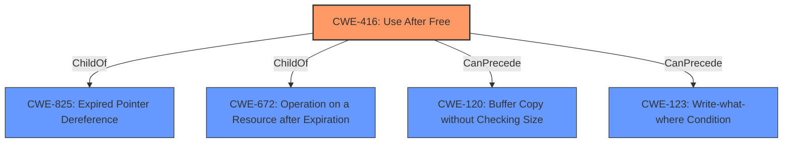

# Enhanced Analysis for CVE-2022-0605

# Summary
| CWE ID | CWE Name | Confidence | CWE Abstraction Level | CWE Vulnerability Mapping Label | CWE-Vulnerability Mapping Notes |
|---|---|---|---|---|---|
| CWE-416 | Use After Free | 1.0 | Variant | Allowed | Primary CWE |

## Evidence and Confidence

*   **Confidence Score:** 1.0
*   **Evidence Strength:** HIGH

## Relationship Analysis
The primary relationship impacting the decision is the direct identification of **Use After Free** as the root cause, which maps directly to CWE-416. While other CWEs like CWE-122 (Heap-based Buffer Overflow) and CWE-366 (Race Condition within a Thread) were considered, the explicit mention of "use after free" makes CWE-416 the most accurate and specific classification.



## Vulnerability Chain
The vulnerability chain starts with a user installing a malicious extension and engaging in specific user interaction. This leads to a **use-after-free** condition (CWE-416) which then causes **heap corruption**.

## Summary of Analysis
The analysis is strongly based on the provided evidence, specifically the "Vulnerability Description Key Phrases" which identifies "**rootcause: use after free**". The "CVE Reference Links Content Summary" further supports this by stating: "Root cause of vulnerability: Use after free" and "Weaknesses/vulnerabilities present: Use after free in Webstore API."

The graph relationships influenced the decision by confirming that CWE-416 is a Variant level weakness, which is a preferred level of abstraction.

CWE-416 is the optimal level of specificity because the vulnerability description directly mentions "use after free."

Relevant CWE Information:

# Enhanced Context (25 CWEs)

## CWE-416: Use After Free
**Abstraction:** Variant
**Status:** Stable

### Description
The product reuses or references memory after it has been freed. At some point afterward, the memory may be allocated again and saved in another pointer, while the original pointer references a location somewhere within the new allocation. Any operations using the original pointer are no longer valid because the memory "belongs" to the code that operates on the new pointer.

### Extended Description
Not provided

### Alternative Terms
Dangling pointer: a pointer that no longer points to valid memory, often after it has been freed
UAF: commonly used acronym for Use After Free
Use-After-Free

### Relationships
ChildOf -> CWE-825
ChildOf -> CWE-672
ChildOf -> CWE-672
ChildOf -> CWE-672
CanPrecede -> CWE-120
CanPrecede -> CWE-123

### Mapping Guidance
**Usage:** Allowed
**Rationale:** This CWE entry is at the Variant level of abstraction, which is a preferred level of abstraction for mapping to the root causes of vulnerabilities.
**Comments:** Carefully read both the name and description to ensure that this mapping is an appropriate fit. Do not try to 'force' a mapping to a lower-level Base/Variant simply to comply with this preferred level of abstraction.
**Reasons:**
- Acceptable-Use

### Observed Examples
- **CVE-2022-20141:** Chain: an operating system kernel has insufficent resource locking (CWE-413) leading to a use after free (CWE-416).
- **CVE-2022-2621:** Chain: two threads in a web browser use the same resource (CWE-366), but one of those threads can destroy the resource before the other has completed (CWE-416).
- **CVE-2021-0920:** Chain: mobile platform race condition (CWE-362) leading to use-after-free (CWE-416), as exploited in the wild per CISA KEV.

## CWEs Considered But Not Used:

*   **CWE-122: Heap-based Buffer Overflow:** While the vulnerability leads to **heap corruption**, the root cause is the **use-after-free** condition. Therefore, CWE-416 is more precise.
*   **CWE-366: Race Condition within a Thread:** There is no mention of a race condition in the vulnerability description or reference links.
*   **CWE-843: Access of Resource Using Incompatible Type ('Type Confusion'):** There is no type confusion described in the vulnerability.
*   **CWE-356: Product UI does not Warn User of Unsafe Actions:** While the vulnerability involves a malicious extension, the core issue is memory corruption, not a UI warning.
*   **CWE-415: Double Free:** There is no mention of a double free in the vulnerability description or reference links.


## CWE Relationship Analysis

Current CWEs represent these abstraction levels: .


### Vulnerability Chain Analysis

**Chain starting from CWE-413:**
- 413 (Improper Resource Locking) - ROOT


**Chain starting from CWE-825:**
- 825 (Expired Pointer Dereference) - ROOT


### CWE Relationship Diagram

```mermaid
graph TD
    classDef primary fill:#f96,stroke:#333,stroke-width:2px
    classDef secondary fill:#69f,stroke:#333
    classDef tertiary fill:#9e9,stroke:#333
```