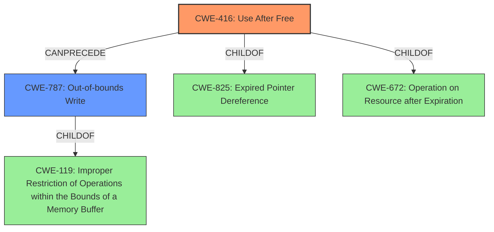

# Analysis Report for CVE-2022-0607

# Vulnerability Analysis Report: CVE-2022-0607

## Description


## Analysis (with Relationship Data)

# Summary
| CWE ID | CWE Name | Confidence | CWE Abstraction Level | CWE Vulnerability Mapping Label | CWE-Vulnerability Mapping Notes |
|---|---|---|---|---|---|
| CWE-416 | Use After Free | 1.0 | Variant | Allowed | Primary CWE |
| CWE-787 | Out-of-bounds Write | 0.6 | Base | Allowed | Secondary CWE |

## Evidence and Confidence

*   **Confidence Score:** 0.9
*   **Evidence Strength:** HIGH

## Relationship Analysis
The primary relationship is that **CWE-416 (Use After Free)** is a variant. There are several potential parents, including CWE-825 (Expired Pointer Dereference) and CWE-672 (Operation on Resource after Expiration). CWE-787 (Out-of-bounds Write) is considered as a potential outcome of memory corruption and could follow CWE-416 in a vulnerability chain. This relationship influenced the decision to include CWE-787 as a secondary, potential weakness.



## Vulnerability Chain
The vulnerability chain starts with a **Use After Free (CWE-416)**, which leads to **heap corruption**. The **heap corruption** may then lead to an **Out-of-bounds Write (CWE-787)**. The initial flaw is the **Use After Free**, and the final impact is the potential for **heap corruption** and exploitation.

## Summary of Analysis
The initial assessment, supported by the vulnerability description and the "CVE Reference Links Content Summary", points strongly to **CWE-416 (Use After Free)** as the primary weakness. The description explicitly mentions "Use after free" as the root cause. The "CVE Reference Links Content Summary" also identifies "Use after free in GPU" as a weakness. The retriever results also list **CWE-416 (Use After Free)** as the top candidate.

The vulnerability description also mentions "heap corruption". **CWE-787 (Out-of-bounds Write)** is a plausible consequence of **heap corruption**, where writing beyond the allocated memory region can lead to further issues.

The selection of **CWE-416 (Use After Free)** is at the optimal level of specificity because it directly reflects the stated root cause of the vulnerability. The inclusion of **CWE-787 (Out-of-bounds Write)** is to capture the **heap corruption** aspect, although it's treated as a secondary potential consequence.

Relevant CWE Information:

# Enhanced Context (25 CWEs)

## CWE-366: Race Condition within a Thread
**Abstraction Level**: Base
**Similarity Score**: 0.80
**Source**: dense

**Description**:
If two threads of execution use a resource simultaneously, there exists the possibility that resources may be used while invalid, in turn making the state of execution undefined.

**Mapping Guidance**:
- Usage: Allowed
- Rationale: This CWE entry is at the Base level of abstraction, which is a preferred level of abstraction for mapping to the root causes of vulnerabilities.

I considered CWE-366 but discarded it, as the primary **rootcause** isn't explicitly related to race conditions.

## CWE-667: Improper Locking
**Abstraction Level**: Class
**Similarity Score**: 0.78
**Source**: dense

**Description**:
The product does not properly acquire or release a lock on a resource, leading to unexpected resource state changes and behaviors.

**Mapping Guidance**:
- Usage: Allowed-with-Review
- Rationale: This CWE entry is a Class and might have Base-level children that would be more appropriate

I considered CWE-667 but discarded it, as the primary **rootcause** isn't explicitly related to improper locking.

## CWE-131: Incorrect Calculation of Buffer Size
**Abstraction Level**: Base
**Similarity Score**: 0.78
**Source**: dense

**Description**:
The product does not correctly calculate the size to be used when allocating a buffer, which could lead to a buffer overflow.

**Mapping Guidance**:
- Usage: Allowed
- Rationale: This CWE entry is at the Base level of abstraction, which is a preferred level of abstraction for mapping to the root causes of vulnerabilities.

I considered CWE-131 but discarded it, as the primary **rootcause** isn't explicitly related to incorrect calculation of buffer size.

## CWE-362: Concurrent Execution using Shared Resource with Improper Synchronization ('Race Condition')
**Abstraction Level**: Class
**Similarity Score**: 0.78
**Source**: dense

**Description**:
The product contains a concurrent code sequence that requires temporary, exclusive access to a shared resource, but a timing window exists in which the shared resource can be modified by another code sequence operating concurrently.

**Mapping Guidance**:
- Usage: Allowed-with-Review
- Rationale: This CWE entry is a Class and might have Base-level children that would be more appropriate

I considered CWE-362 but discarded it, as the primary **rootcause** isn't explicitly related to race conditions.

## CWE-124: Buffer Underwrite ('Buffer Underflow')
**Abstraction Level**: Base
**Similarity Score**: 0.78
**Source**: dense

**Description**:
The product writes to a buffer using an index or pointer that references a memory location prior to the beginning of the buffer.

**Mapping Guidance**:
- Usage: Allowed
- Rationale: This CWE entry is at the Base level of abstraction, which is a preferred level of abstraction for mapping to the root causes of vulnerabilities.

I considered CWE-124 but discarded it, as the primary **rootcause** isn't explicitly related to buffer underwrite.

## CWE-404: Improper Resource Shutdown or Release
**Abstraction Level**: Class
**Similarity Score**: 0.78
**Source**: dense

**Description**:
The product does not release or incorrectly releases a resource before it is made available for re-use.

**Mapping Guidance**:
- Usage: Allowed-with-Review
- Rationale: This CWE entry is a Class and might have Base-level children that would be more appropriate

I considered CWE-404 but discarded it, as the primary **rootcause** isn't explicitly related to improper resource shutdown or release.

## CWE-911: Improper Update of Reference Count
**Abstraction Level**: Base
**Similarity Score**: 0.77
**Source**: dense

**Description**:
The product uses a reference count to manage a resource, but it does not update or incorrectly updates the reference count.

**Mapping Guidance**:
- Usage: Allowed
- Rationale: This CWE entry is at the Base level of abstraction, which is a preferred level of abstraction for mapping to the root causes of vulnerabilities.

I considered CWE-911 but discarded it, as the primary **rootcause** isn't explicitly related to reference counts.

## CWE-805: Buffer Access with Incorrect Length Value
**Abstraction Level**: Base
**Similarity Score**: 0.77
**Source**: dense

**Description**:
The product uses a sequential operation to read or write a buffer, but it uses an incorrect length value that causes it to access memory that is outside of the bounds of the buffer.

**Mapping Guidance**:
- Usage: Allowed
- Rationale: This CWE entry is at the Base level of abstraction, which is a preferred level of abstraction for mapping to the root causes of vulnerabilities.

I considered CWE-805 but discarded it, as the primary **rootcause** isn't explicitly related to buffer access with incorrect length.

## CWE-125: Out-of-bounds Read
**Abstraction Level**: Base
**Similarity Score**: 0.77
**Source**: dense

**Description**:
The product reads data past the end, or before the beginning, of the intended buffer.

**Mapping Guidance**:
- Usage: Allowed
- Rationale: This CWE entry is at the Base level of abstraction, which is a preferred level of abstraction for mapping to the root causes of vulnerabilities.

I considered CWE-125 but discarded it, as the primary **rootcause** isn


## CWE Relationship Analysis

Current CWEs represent these abstraction levels: .


### Vulnerability Chain Analysis

**Chain starting from CWE-131:**
- 131 (Incorrect Calculation of Buffer Size) - ROOT


**Chain starting from CWE-911:**
- 911 (Improper Update of Reference Count) - ROOT


### CWE Relationship Diagram

```mermaid
graph TD
    classDef primary fill:#f96,stroke:#333,stroke-width:2px
    classDef secondary fill:#69f,stroke:#333
    classDef tertiary fill:#9e9,stroke:#333
```


*Report generated on 2025-03-30 22:08:18*
