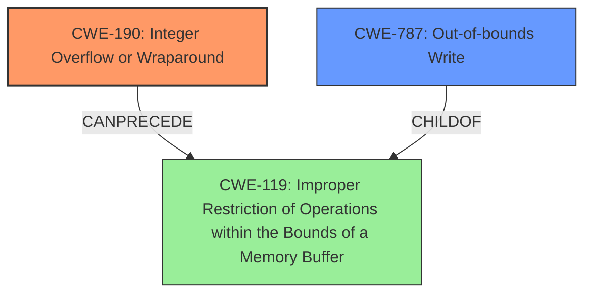

# Enhanced Analysis for CVE-2022-0608

# Summary
| CWE ID | CWE Name | Confidence | CWE Abstraction Level | CWE Vulnerability Mapping Label | CWE-Vulnerability Mapping Notes |
|---|---|---|---|---|---|
| CWE-190 | Integer Overflow or Wraparound | 1 | Base | Allowed | Primary CWE |
| CWE-787 | Out-of-bounds Write | 0.5 | Base | Allowed | Secondary Candidate |

## Evidence and Confidence

*   **Confidence Score:** 0.75
*   **Evidence Strength:** HIGH

## Relationship Analysis
The primary relationship is that **CWE-190** [Integer Overflow or Wraparound] can **CANPRECEDE** **CWE-119** [Improper Restriction of Operations within the Bounds of a Memory Buffer]. **CWE-787** [Out-of-bounds Write] is a child of **CWE-119** [Improper Restriction of Operations within the Bounds of a Memory Buffer]. This means that an integer overflow can lead to memory corruption issues like out-of-bounds writes.



## Vulnerability Chain
The vulnerability chain starts with an **integer overflow** (**CWE-190**), which leads to heap corruption. Heap corruption often manifests as an **out-of-bounds write** (**CWE-787**).

## Summary of Analysis
The vulnerability description clearly states that the **root cause** is an **integer overflow** in Mojo within Google Chrome. This aligns perfectly with **CWE-190** [Integer Overflow or Wraparound]. The **CVE Reference Links Content Summary** also confirms "Integer overflow" as the root cause of the vulnerability. The **impact** of the overflow is potential heap corruption, which could lead to an **out-of-bounds write** (**CWE-787**).

The **CWE for similar CVE Descriptions** section lists **CWE-190** [Integer Overflow or Wraparound] as the primary CWE match, further solidifying the classification.

The retriever results also show **CWE-190** [Integer Overflow or Wraparound] as the top combined result with a score of 0.800.

While **CWE-787** [Out-of-bounds Write] is a possible consequence of the overflow leading to heap corruption, the description focuses on the **integer overflow** as the root cause. Therefore, **CWE-190** [Integer Overflow or Wraparound] is the primary CWE and **CWE-787** [Out-of-bounds Write] can be considered a secondary candidate.

I am selecting **CWE-190** [Integer Overflow or Wraparound] as the primary CWE because the description explicitly identifies it as the **root cause**. I am also including **CWE-787** [Out-of-bounds Write] as a secondary candidate because the overflow leads to heap corruption which often manifests as an out-of-bounds write.

Other CWEs considered but not selected:

*   **CWE-416** [Use After Free]: While heap corruption can sometimes lead to use-after-free vulnerabilities, the description does not directly mention memory being freed and then reused.
*   **CWE-122** [Heap-based Buffer Overflow]: While heap corruption is mentioned, the root cause is the integer overflow, not directly a buffer overflow.
*   **CWE-843** [Access of Resource Using Incompatible Type ('Type Confusion')]: There is no mention of incompatible types being used to access resources.
*   **CWE-191** [Integer Underflow (Wrap or Wraparound)]: The description specifies an *overflow*, not an underflow.
*   **CWE-451** [User Interface (UI) Misrepresentation of Critical Information]: This vulnerability doesn't involve UI misrepresentation.
*   **CWE-123** [Write-what-where Condition]: While this *could* be the impact of the heap corruption, it is not explicitly stated.
*   **CWE-366** [Race Condition within a Thread]: No mention of race conditions.
*   **CWE-415** [Double Free]: No mention of double freeing memory.


## CWE Relationship Analysis

Current CWEs represent these abstraction levels: .


### Vulnerability Chain Analysis

**Chain starting from CWE-190:**
- 190 (Integer Overflow or Wraparound) - ROOT


**Chain starting from CWE-843:**
- 843 (Access of Resource Using Incompatible Type ('Type Confusion')) - ROOT


### CWE Relationship Diagram

```mermaid
graph TD
    classDef primary fill:#f96,stroke:#333,stroke-width:2px
    classDef secondary fill:#69f,stroke:#333
    classDef tertiary fill:#9e9,stroke:#333
```