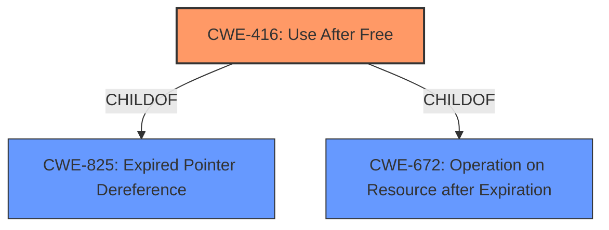

# Raw Analyzer Response for CVE-2022-0609

# Summary
| CWE ID | CWE Name | Confidence | CWE Abstraction Level | CWE Vulnerability Mapping Label | CWE-Vulnerability Mapping Notes |
|---|---|---|---|---|---|
| CWE-416 | Use After Free | 1.0 | Variant | Allowed | Primary CWE |

## Evidence and Confidence

*   **Confidence Score:** 1.0
*   **Evidence Strength:** HIGH

## Relationship Analysis
The primary relationship impacting the decision is the parent-child relationship between CWE-416 (Use After Free) and its parent CWEs like CWE-825 (Expired Pointer Dereference) and CWE-672 (Operation on Resource after Expiration). CWE-416 is the most specific variant that accurately describes the vulnerability.

## Vulnerability Chain
The vulnerability chain is:
1.  **Root Cause:** **Use After Free** (CWE-416)
2.  **Impact:** **Heap Corruption**

## Summary of Analysis
The vulnerability description clearly states "**Use after free** in Animation in Google Chrome prior to 98.0.4758.102 allowed a remote attacker to potentially exploit **heap corruption** via a crafted HTML page." The **Vulnerability Description Key Phrases** also identify "**use after free**" as the **rootcause** and "**heap corruption**" as a **weakness**. The "CVE Reference Links Content Summary" also notes the **root cause** of the vulnerability as "**Use-after-free** in Animation" and the weakness as "**Use-after-free**."

The retriever results also highly ranked CWE-416, with a good score. The "CWE for similar CVE Descriptions" section listed CWE-416 as the "Primary CWE Match".

Based on the evidence, CWE-416 is the most appropriate and specific CWE. The description of CWE-416 ("The product reuses or references memory after it has been freed.") directly matches the vulnerability description.

Other CWEs Considered:

*   CWE-366 (Race Condition within a Thread): While race conditions can lead to use-after-free vulnerabilities, there's no specific mention of concurrency or threading in the description, so it is less likely.
*   CWE-843 (Access of Resource Using Incompatible Type ('Type Confusion')): This CWE is not appropriate as the vulnerability is not related to type confusion.
*   CWE-122 (Heap-based Buffer Overflow): While **heap corruption** is mentioned, the root cause is **use-after-free**, not a buffer overflow.
*   CWE-415 (Double Free): This is similar to use-after-free but involves freeing the same memory twice, which isn't indicated in the description.
*   CWE-787 (Out-of-bounds Write): The primary issue is not related to writing outside buffer boundaries but rather using memory after it has been freed.
*   CWE-190 (Integer Overflow or Wraparound): There's no indication of integer overflow in the description.

The selection of CWE-416 is based on direct evidence from the vulnerability description and aligns with the MITRE mapping guidance. The chosen CWE is at the Variant level of abstraction, providing the most specific classification possible.