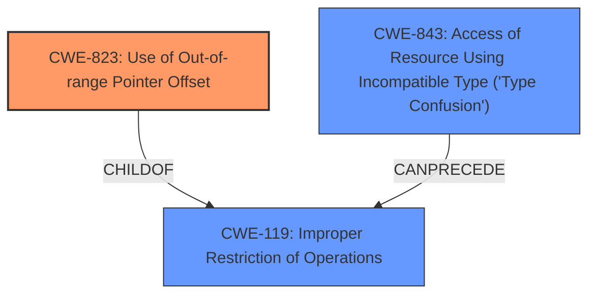

# Enhanced Analysis for CVE-2022-0614

# Summary
| CWE ID | CWE Name | Confidence | CWE Abstraction Level | CWE Vulnerability Mapping Label | CWE-Vulnerability Mapping Notes |
|---|---|---|---|---|---|
| CWE-823 | Use of **Out-of-range Pointer Offset** | 0.9 | Base | Allowed | Primary CWE |
| CWE-843 | Access of Resource Using Incompatible Type ('Type Confusion') | 0.7 | Base | Allowed | Secondary Candidate |

## Evidence and Confidence

*   **Confidence Score:** 0.8
*   **Evidence Strength:** HIGH

## Relationship Analysis
The primary CWE selected is CWE-823 (**Out-of-range Pointer Offset**), which is a base-level CWE and accurately reflects the described vulnerability. A secondary CWE considered is CWE-843 (**Type Confusion**), as the root cause involves a type mismatch that leads to the pointer offset issue. CWE-823 is a child of CWE-119 (**Improper Restriction of Operations within the Bounds of a Memory Buffer**), indicating a memory safety issue. CWE-843 can precede CWE-119, suggesting a potential chain where type confusion leads to memory access errors.



## Vulnerability Chain
The vulnerability chain starts with a **type confusion** (CWE-843) where the code incorrectly assumes a value is a hash. This leads to an **out-of-range pointer offset** (CWE-823) when the code attempts to perform hash-specific operations on a non-hash object, ultimately resulting in a crash or denial of service.

## Summary of Analysis
The primary classification of this vulnerability is CWE-823 (**Out-of-range Pointer Offset**). This is based on the vulnerability description that explicitly mentions "**Out-of-range Pointer Offset**" as the root cause. The commit message analysis further supports this by highlighting the lack of type checking before accessing a value as a hash, potentially leading to incorrect memory access. The retriever results also list CWE-823 as the top match. CWE-843 (**Type Confusion**) is considered as a contributing factor since the **type confusion** leads to the **out-of-range pointer offset**.

The choice of CWE-823 is at the optimal level of specificity because it directly addresses the core issue of using an offset that points outside the intended memory range. The relationship analysis and the evidence from the vulnerability description support this classification.

Relevant CWE Information:
- Vulnerability Description Key Phrases: **rootcause:** **Out-of-range Pointer Offset**
- CVE Reference Links Content Summary: "The root cause is the lack of proper type checking before accessing a value as a hash...Type Confusion"


## CWE Relationship Analysis

Current CWEs represent these abstraction levels: .


### Vulnerability Chain Analysis

**Chain starting from CWE-119:**
- 119 (Improper Restriction of Operations within the Bounds of a Memory Buffer) - ROOT


**Chain starting from CWE-823:**
- 823 (Use of Out-of-range Pointer Offset) - ROOT


### CWE Relationship Diagram

```mermaid
graph TD
    classDef primary fill:#f96,stroke:#333,stroke-width:2px
    classDef secondary fill:#69f,stroke:#333
    classDef tertiary fill:#9e9,stroke:#333
```