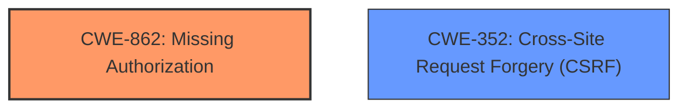

# Analysis for CVE-2022-0634

# Summary
| CWE ID | CWE Name | Confidence | CWE Abstraction Level | CWE Vulnerability Mapping Label | CWE-Vulnerability Mapping Notes |
|---|---|---|---|---|---|
| CWE-862 | Missing Authorization | 1.0 | Class | Primary | Allowed-with-Review |
| CWE-352 | Cross-Site Request Forgery (CSRF) | 1.0 | Compound | Secondary | Allowed |

## Evidence and Confidence

*   **Confidence Score:** 1.0
*   **Evidence Strength:** HIGH

## Relationship Analysis
The vulnerability description clearly indicates two distinct weaknesses: **missing authorization** and **lack of CSRF checks**. CWE-862 (Missing Authorization) represents the primary flaw where the application **does not perform an authorization check** for a critical function. CWE-352 (Cross-Site Request Forgery (CSRF)) represents the **lack of csrf checks**, which allows an attacker to trick a logged-in user into performing actions they did not intend to. These weaknesses exist independently but can be exploited in conjunction.

## Vulnerability Chain
The vulnerability chain involves two primary weaknesses that can be exploited independently or together.

1.  **Missing Authorization (CWE-862):** The `ta_insert_external_image` action lacks authorization checks.
2.  **Missing CSRF Checks (CWE-352):** There are no CSRF checks in place for the `ta_insert_external_image` action.

An attacker can exploit these weaknesses to add an image from an external URL to an affiliate link, even with low privileges or by tricking a logged-in user into performing the action.

## Summary of Analysis
Based on the vulnerability description, the ThirstyAffiliates WordPress plugin before version 3.10.5 **lacks authorization checks** in the `ta_insert_external_image` action, allowing low-privilege users to add an image from an external URL to an affiliate link. It also **lacks CSRF checks**, allowing an attacker to trick a logged-in user into performing the action.

The primary weakness is the **lack of authorization** (CWE-862), as the plugin should verify that the user has the necessary permissions to perform the action. The secondary weakness is the **lack of CSRF checks** (CWE-352), which allows an attacker to trick a logged-in user into performing the action without their consent.

The evidence from the vulnerability description includes the following:

*   "The ThirstyAffiliates WordPress plugin before 3.10.5 **lacks authorization checks** in the ta_insert_external_image action, allowing a low-privilege user (with a role as low as Subscriber) to add an image from an external URL to an affiliate link."
*   "Further the plugin **lacks csrf checks**, allowing an attacker to trick a logged in user to perform the action by crafting a special request."

These statements clearly indicate the presence of both **missing authorization** and **missing CSRF checks**.

I considered CWE-863 (Incorrect Authorization) and CWE-285 (Improper Authorization) but these were less appropriate because the vulnerability description states the plugin "**lacks authorization checks**" indicating it is **missing authorization** rather than performing authorization incorrectly.

The selected CWEs are at the optimal level of specificity because they accurately represent the weaknesses described in the vulnerability description.

Relevant CWE Information:

# Enhanced Context (25 CWEs)
The following CWEs were identified as potentially relevant to this vulnerability:

## CWE-425: Direct Request ('Forced Browsing')
**Abstraction Level**: Base
**Similarity Score**: 0.73
**Source**: dense

**Description**:
The web application does not adequately enforce appropriate authorization on all restricted URLs, scripts, or files.

**Mapping Guidance**:
- Usage: Allowed
- Rationale: This CWE entry is at the Base level of abstraction, which is a preferred level of abstraction for mapping to the root causes of vulnerabilities.

## CWE-434: Unrestricted Upload of File with Dangerous Type
**Abstraction Level**: Base
**Similarity Score**: 0.73
**Source**: dense

**Description**:
The product allows the upload or transfer of dangerous file types that are automatically processed within its environment.

**Mapping Guidance**:
- Usage: Allowed
- Rationale: This CWE entry is at the Base level of abstraction, which is a preferred level of abstraction for mapping to the root causes of vulnerabilities.

## CWE-472: External Control of Assumed-Immutable Web Parameter
**Abstraction Level**: Base
**Similarity Score**: 0.73
**Source**: dense

**Description**:
The web application does not sufficiently verify inputs that are assumed to be immutable but are actually externally controllable, such as hidden form fields.

**Mapping Guidance**:
- Usage: Allowed
- Rationale: This CWE entry is at the Base level of abstraction, which is a preferred level of abstraction for mapping to the root causes of vulnerabilities.

## CWE-352: Cross-Site Request Forgery (CSRF)
**Abstraction Level**: Compound
**Similarity Score**: 0.71
**Source**: dense

**Description**:
The web application does not, or can not, sufficiently verify whether a well-formed, valid, consistent request was intentionally provided by the user who submitted the request.

**Mapping Guidance**:
- Usage: Allowed
- Rationale: This is a well-known Composite of multiple weaknesses that must all occur simultaneously, although it is attack-oriented in nature.

## CWE-639: Authorization Bypass Through User-Controlled Key
**Abstraction Level**: Base
**Similarity Score**: 0.70
**Source**: dense

**Description**:
The system's authorization functionality does not prevent one user from gaining access to another user's data or record by modifying the key value identifying the data.

**Mapping Guidance**:
- Usage: Allowed
- Rationale: This CWE entry is at the Base level of abstraction, which is a preferred level of abstraction for mapping to the root causes of vulnerabilities.

## CWE-1390: Weak Authentication
**Abstraction Level**: Class
**Similarity Score**: 0.70
**Source**: dense

**Description**:
The product uses an authentication mechanism to restrict access to specific users or identities, but the mechanism does not sufficiently prove that the claimed identity is correct.

**Mapping Guidance**:
- Usage: Allowed-with-Review
- Rationale: This CWE entry is a Class and might have Base-level children that would be more appropriate

## CWE-807: Reliance on Untrusted Inputs in a Security Decision
**Abstraction Level**: Base
**Similarity Score**: 0.70
**Source**: dense

**Description**:
The product uses a protection mechanism that relies on the existence or values of an input, but the input can be modified by an untrusted actor in a way that bypasses the protection mechanism.

**Mapping Guidance**:
- Usage: Allowed
- Rationale: This CWE entry is at the Base level of abstraction, which is a preferred level of abstraction for mapping to the root causes of vulnerabilities.

## CWE-552: Files or Directories Accessible to External Parties
**Abstraction Level**: Base
**Similarity Score**: 0.70
**Source**: dense

**Description**:
The product makes files or directories accessible to unauthorized actors, even though they should not be.

**Mapping Guidance**:
- Usage: Allowed
- Rationale: This CWE entry is at the Base level of abstraction, which is a preferred level of abstraction for mapping to the root causes of vulnerabilities.

## CWE-74: Improper Neutralization of Special Elements in Output Used by a Downstream Component ('Injection')
**Abstraction Level**: Class
**Similarity Score**: 0.70
**Source**: dense

**Description**:
The product constructs all or part of a command, data structure, or record using externally-influenced input from an upstream component, but it does not neutralize or incorrectly neutralizes special elements that could modify how it is parsed or interpreted when it is sent to a downstream component.

**Mapping Guidance**:
- Usage: Discouraged
- Rationale: CWE-74 is high-level and often misused when lower-level weaknesses are more appropriate.

## CWE-693: Protection Mechanism Failure
**Abstraction Level**: Pillar
**Similarity Score**: 0.70
**Source**: dense

**Description**:
The product does not use or incorrectly uses a protection mechanism that provides sufficient defense against directed attacks against the product.

**Mapping Guidance**:
- Usage: Discouraged
- Rationale: This CWE entry is extremely high-level, a Pillar.

## CWE-352: Cross-Site Request Forgery (CSRF)
**Abstraction Level**: Compound
**Similarity Score**: 2994.54
**Source**: sparse

**Description**:
The web application does not, or can not, sufficiently verify whether a well-formed, valid, consistent request was intentionally provided by the user

# Enhanced Query for CVE-2022-0634

# Vulnerability Description

    The ThirstyAffiliates WordPress plugin before 3.10.5 lacks authorization checks in the ta_insert_external_image action, allowing a low-privilege user (with a role as low as Subscriber) to add an image from an external URL to an affiliate link. Further the plugin **lacks csrf checks**, allowing an attacker to trick a logged in user to perform the action by crafting a special request.

    # Keyphrase-Specific CWE Analysis
    This vulnerability contains multiple keyphrases that may map to different CWEs. 
    Please analyze each keyphrase separately and determine the most appropriate CWE(s) for each.

    ## ROOTCAUSE: 'lack of authorization checks'

Relevant CWEs for this ROOTCAUSE:

### 1. CWE-352: Cross-Site Request Forgery (CSRF) (Score: 611.74)

The web application does not, or can not, sufficiently verify whether a well-formed, valid, consistent request was intentionally provided by the user who submitted the request....

### 2. CWE-862: Missing Authorization (Score: 562.20)

The product does not perform an authorization check when an actor attempts to access a resource or perform an action....

### 3. CWE-863: Incorrect Authorization (Score: 515.53)

The product performs an authorization check when an actor attempts to access a resource or perform an action, but it does not correctly perform the check....

### 4. CWE-285: Improper Authorization (Score: 513.52)

The product does not perform or incorrectly performs an authorization check when an actor attempts to access a resource or perform an action....

### 5. CWE-434: Unrestricted Upload of File with Dangerous Type (Score: 470.71)

The product allows the upload or transfer of dangerous file types that are automatically processed within its environment....

## ROOTCAUSE: 'lacks csrf checks'

Relevant CWEs for this ROOTCAUSE:

### 1. CWE-352: Cross-Site Request Forgery (CSRF) (Score: 611.74)

The web application does not, or can not, sufficiently verify whether a well-formed, valid, consistent request was intentionally provided by the user who submitted the request....

### 2. CWE-862: Missing Authorization (Score: 562.20)

The product does not perform an authorization check when an actor attempts to access a resource or perform an action....

### 3. CWE-863: Incorrect Authorization (Score: 515.53)

The product performs an authorization check when an actor attempts to access a resource or perform an action, but it does not correctly perform the check....

### 4. CWE-285: Improper Authorization (Score: 513.52)

The product does not perform or incorrectly performs an authorization check when an actor attempts to access a resource or perform an action....

### 5. CWE-434: Unrestricted Upload of File with Dangerous Type (Score: 470.71)

The product allows the upload or transfer of dangerous file types that are automatically processed within its environment....

## IMPACT: 'add image from external URL to affiliate link'

Relevant CWEs for this IMPACT:

### 1. CWE-352: Cross-Site Request Forgery (CSRF) (Score: 611.74)

The web application does not, or can not, sufficiently verify whether a well-formed, valid, consistent request was intentionally provided by the user who submitted the request....

### 2. CWE-862: Missing Authorization (Score: 562.20)

The product does not perform an authorization check when an actor attempts to access a resource or perform an action....

### 3. CWE-863: Incorrect Authorization (Score: 515.53)

The product performs an authorization check when an actor attempts to access a resource or perform an action, but it does not correctly perform the check....

### 4. CWE-285: Improper Authorization (Score: 513.52)

The product does not perform or incorrectly performs an authorization check when an actor attempts to access a resource or perform an action....

### 5. CWE-306: Missing Authentication for Critical Function (Score: 158.43)

The product does not perform any authentication for functionality that requires a provable user identity or consumes a significant amount of resources....

## VECTOR: 'special request'

Relevant CWEs for this VECTOR:

### 1. CWE-352: Cross-Site Request Forgery (CSRF) (Score: 611.74)

The web application does not, or can not, sufficiently verify whether a well-formed, valid, consistent request was intentionally provided by the user who submitted the request....

### 2. CWE-862: Missing Authorization (Score: 562.20)

The product does not perform an authorization check when an actor attempts to access a resource or perform an action....

### 3. CWE-863: Incorrect Authorization (Score: 515.53)

The product performs an authorization check when an actor attempts to access a resource or perform an action, but it does not correctly perform the check....

### 4. CWE-285: Improper Authorization (Score: 513.52)

The product does not perform or incorrectly performs an authorization check when an actor attempts to access a resource or perform an action....

### 5. CWE-89: Improper Neutralization of Special Elements used in an SQL Command ('SQL Injection') (Score: 140.73)

The product constructs all or part of an SQL command using externally-influenced input from an upstream component, but it does not neutralize or incorrectly neutralizes special elements that could modify the intended SQL command when it is sent to a downstream component. Without sufficient removal o...

## ATTACKER: 'low-privilege user'

Relevant CWEs for this ATTACKER:

### 1. CWE-352: Cross-Site Request Forgery (CSRF) (Score: 611.74)

The web application does not, or can not, sufficiently verify whether a well-formed, valid, consistent request was intentionally provided by the user who submitted the request....

### 2. CWE-862: Missing Authorization (Score: 562.20)

The product does not perform an authorization check when an actor attempts to access a resource or perform an action....

### 3. CWE-863: Incorrect Authorization (Score: 515.53)

The product performs an authorization check when an actor attempts to access a resource or perform an action, but it does not correctly perform the check....

### 4. CWE-285: Improper Authorization (Score: 513.52)

The product does not perform or incorrectly performs an authorization check when an actor attempts to access a resource or perform an action....

### 5. CWE-434: Unrestricted Upload of File with Dangerous Type (Score: 470.71)

The product allows the upload or transfer of dangerous file types that are automatically processed within its environment....

## PRODUCT: 'ThirstyAffiliates WordPress plugin'

Relevant CWEs for this PRODUCT:

### 1. CWE-352: Cross-Site Request Forgery (CSRF) (Score: 611.74)

The web application does not, or can not, sufficiently verify whether a well-formed, valid, consistent request was intentionally provided by the user who submitted the request....

### 2. CWE-862: Missing Authorization (Score: 562.20)

The product does not perform an authorization check when an actor attempts to access a resource or perform an action....

### 3. CWE-863: Incorrect Authorization (Score: 515.53)

The product performs an authorization check when an actor attempts to access a resource or perform an action, but it does not correctly perform the check....

### 4. CWE-285: Improper Authorization (Score: 513.52)

The product does not perform or incorrectly performs an authorization check when an actor attempts to access a resource or perform an action....

### 5. CWE-434: Unrestricted Upload of File with Dangerous Type (Score: 470.71)

The product allows the upload or transfer of dangerous file types that are automatically processed within its environment....

## VERSION: 'before 3.10.5'

Relevant CWEs for this VERSION:

### 1. CWE-352: Cross-Site Request Forgery (CSRF) (Score: 611.74)

The web application does not, or can not, sufficiently verify whether a well-formed, valid, consistent request was intentionally provided by the user who submitted the request....

### 2. CWE-862: Missing Authorization (Score: 562.20)

The product does not perform an authorization check when an actor attempts to access a resource or perform an action....

### 3. CWE-863: Incorrect Authorization (Score: 515.53)

The product performs an authorization check when an actor attempts to access a resource or perform an action, but it does not correctly perform the check....

### 4. CWE-285: Improper Authorization (Score: 513.52)

The product does not perform or incorrectly performs an authorization check when an actor attempts to access a resource or perform an action....

### 5. CWE-434: Unrestricted Upload of File with Dangerous Type (Score: 470.71)

The product allows the upload or transfer of dangerous file types that are automatically processed within its environment....

## COMPONENT: 'ta_insert_external_image action'

Relevant CWEs for this COMPONENT:

### 1. CWE-352: Cross-Site Request Forgery (CSRF) (Score: 611.74)

The web application does not, or can not, sufficiently verify whether a well-formed, valid, consistent request was intentionally provided by the user who submitted the request....

### 2. CWE-862: Missing Authorization (Score: 562.20)

The product does not perform an authorization check when an actor attempts to access a resource or perform an action....

### 3. CWE-863: Incorrect Authorization (Score: 515.53)

The product performs an authorization check when an actor attempts to access a resource or perform an action, but it does not correctly perform the check....

### 4. CWE-285: Improper Authorization (Score: 513.52)

The product does not perform or incorrectly performs an authorization check when an actor attempts to access a resource or perform an action....

### 5. CWE-434: Unrestricted Upload of File with Dangerous Type (Score: 470.71)

The product allows the upload or transfer of dangerous file types that are automatically processed within its environment....

    # Analysis Instructions
    1. For each keyphrase, identify the most appropriate CWE(s) that represent the weakness.
    2. Consider how the different keyphrases might relate to each other in the vulnerability chain.
    3. Provide a final determination of primary CWE(s) and any secondary CWEs.
    4. Format your response using the standard analysis template.

    Please analyze how these different weaknesses interact and provide a comprehensive CWE classification.
    