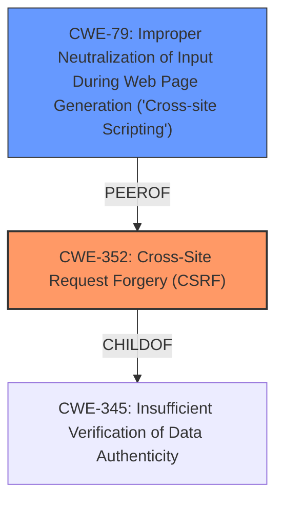

# Analysis Report for CVE-2022-0642

# Vulnerability Analysis Report: CVE-2022-0642

## Description


## Analysis (with Relationship Data)

# Summary

| CWE ID | CWE Name | Confidence | CWE Abstraction Level | CWE Vulnerability Mapping Label | CWE-Vulnerability Mapping Notes |
|---|---|---|---|---|---|
| CWE-352 | Cross-Site Request Forgery (CSRF) | 1.0 | Compound | Primary | Allowed |
| CWE-79 | Improper Neutralization of Input During Web Page Generation ('Cross-site Scripting') | 1.0 | Base | Secondary | Allowed |

## Evidence and Confidence

*   **Confidence Score:** 1.0
*   **Evidence Strength:** HIGH

## Relationship Analysis
The primary weakness is CWE-352, Cross-Site Request Forgery, because the plugin does not properly check CSRF tokens. The secondary weakness is CWE-79, Improper Neutralization of Input During Web Page Generation ('Cross-site Scripting'), because the plugin does not sanitize some parameters, leading to a stored Cross-Site Scripting vulnerability. CWE-352 is a compound weakness, which means it is comprised of multiple weaknesses. CWE-79 is a base weakness, which means it is a root cause. Both CWE-352 and CWE-79 are related, as an attacker might use CSRF in order to trick the victim into submitting requests to the server in which the requests contain an XSS payload.



## Vulnerability Chain
The chain of events is as follows:
1.  **Root Cause:** **Improper CSRF protection** (CWE-352) due to the plugin not properly checking CSRF tokens on POST requests.
2.  **Weakness:** Lack of input sanitization leading to a stored **cross-site scripting** (CWE-79) vulnerability.
3.  **Impact:** An attacker tricks a logged-in administrator into injecting arbitrary JavaScript, leading to potential account takeover or other malicious activities.

## Summary of Analysis
The analysis is based on the provided vulnerability description and CVE reference links. The primary root cause is the **improper CSRF protection**, which allows an attacker to inject arbitrary JavaScript. The secondary weakness is the **cross-site scripting vulnerability** due to the lack of input sanitization. The relationship between CWE-352 and CWE-79 is that an attacker can use CSRF to inject an XSS payload. The selected CWEs are at the optimal level of specificity because they accurately represent the weaknesses described in the vulnerability description.

Evidence for the selection of CWE-352 is in the Vulnerability Description Key Phrases: "**rootcause:** **improper CSRF protection**". Evidence for the selection of CWE-79 is in the Vulnerability Description Key Phrases: "**weakness:** **cross-site scripting**". The vulnerability description also states that the plugin "does not sanitize some parameters, leading to a stored Cross-Site Scripting vulnerability."

The retriever results also support the selection of CWE-352 and CWE-79, as they are the top two combined results.

Other CWEs considered but not used:

*   CWE-116: Improper Encoding or Escaping of Output - Considered because it relates to output sanitization, but CWE-79 is a better fit since the vulnerability is specifically a cross-site scripting vulnerability.
*   CWE-434: Unrestricted Upload of File with Dangerous Type - Not relevant because the vulnerability does not involve file uploads.
*   CWE-862: Missing Authorization - Considered because it relates to authorization, but CWE-352 is a better fit since the vulnerability is specifically a cross-site request forgery vulnerability.
*   CWE-96: Improper Neutralization of Directives in Statically Saved Code ('Static Code Injection') - Not relevant because the vulnerability does not involve static code injection.
*   CWE-73: External Control of File Name or Path - Not relevant because the vulnerability does not involve file name or path manipulation.
*   CWE-89: Improper Neutralization of Special Elements used in an SQL Command ('SQL Injection') - Not relevant because the vulnerability does not involve SQL injection.
*   CWE-285: Improper Authorization - Discouraged because CWE-352 and CWE-79 were a better fit.
*   CWE-138: Improper Neutralization of Special Elements - Discouraged because CWE-352 and CWE-79 were a better fit.

Relevant CWE Information:
* CWE-352: Cross-Site Request Forgery (CSRF)
* CWE-79: Improper Neutralization of Input During Web Page Generation ('Cross-site Scripting')


## CWE Relationship Analysis

Current CWEs represent these abstraction levels: .


### Vulnerability Chain Analysis

**Chain starting from CWE-862:**
- 862 (Missing Authorization) - ROOT


**Chain starting from CWE-89:**
- 89 (Improper Neutralization of Special Elements used in an SQL Command ('SQL Injection')) - ROOT


### CWE Relationship Diagram

```mermaid
graph TD
    classDef primary fill:#f96,stroke:#333,stroke-width:2px
    classDef secondary fill:#69f,stroke:#333
    classDef tertiary fill:#9e9,stroke:#333
```


*Report generated on 2025-03-30 17:19:09*
