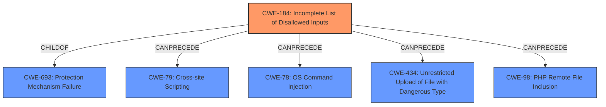

# Enhanced Analysis for CVE-2022-0675

# Summary
| CWE ID | CWE Name | Confidence | CWE Abstraction Level | CWE Vulnerability Mapping Label | CWE-Vulnerability Mapping Notes |
|---|---|---|---|---|---|
| CWE-184 | Incomplete List of Disallowed Inputs | 0.8 | Base | Allowed | Primary CWE |

## Evidence and Confidence

*   **Confidence Score:** 0.8
*   **Evidence Strength:** MEDIUM

## Relationship Analysis
The primary relationship impacting the decision is the ChildOf relationship of CWE-184 to CWE-693: Protection Mechanism Failure, indicating a failure in a broader category of security mechanisms. The CanPrecede relationships (CWE-79, CWE-78, CWE-434, CWE-98) suggest that this incomplete list could lead to various injection vulnerabilities or unrestricted file uploads. The Base abstraction level is appropriate as it directly describes the **root cause**.



## Vulnerability Chain
The vulnerability chain starts with the **weakness** of an **unmanaged rule** existing with the same comment as a rule specified in the manifest, leading to the presence of such rules on the target system, and ultimately resulting in an unsafe state. This chain highlights the importance of proper management and validation of rules to maintain system security. The root cause is that there is an Incomplete List of Disallowed inputs or lack of validation to prevent the existence of **unmanaged rule**s.

## Summary of Analysis
The initial analysis focused on the **weakness** of an **unmanaged rule** leading to an unsafe state. The provided evidence supports the selection of CWE-184, Incomplete List of Disallowed Inputs. This is because the scenario described involves the potential for **unmanaged rules** (inputs) to exist on the target system due to a failure in properly managing or validating these rules against a defined policy or manifest. The vulnerability description states, "In certain situations it is possible for an **unmanaged rule** to exist on the target system that has the same comment as the rule specified in the manifest." This indicates that the system's protection mechanism, which should prevent such **unmanaged rules**, is either incomplete or bypassed.

The retriever results also listed several potentially relevant CWEs, including CWE-1289 (Improper Validation of Unsafe Equivalence in Input) and CWE-863 (Incorrect Authorization). However, CWE-184 is the most accurate because it directly addresses the **root cause** of the vulnerability: the failure to adequately prevent **unmanaged rules** from existing on the system.

The decision to use CWE-184 is based on the vulnerability description highlighting a failure to prevent certain inputs (i.e., **unmanaged rules**) from existing on the system, leading to an unsafe state. The abstraction level is Base, which is the preferred level.


## CWE Relationship Analysis

Current CWEs represent these abstraction levels: .


### Vulnerability Chain Analysis

**Chain starting from CWE-693:**
- 693 (Protection Mechanism Failure) - ROOT


**Chain starting from CWE-434:**
- 434 (Unrestricted Upload of File with Dangerous Type) - ROOT


### CWE Relationship Diagram

```mermaid
graph TD
    classDef primary fill:#f96,stroke:#333,stroke-width:2px
    classDef secondary fill:#69f,stroke:#333
    classDef tertiary fill:#9e9,stroke:#333
```