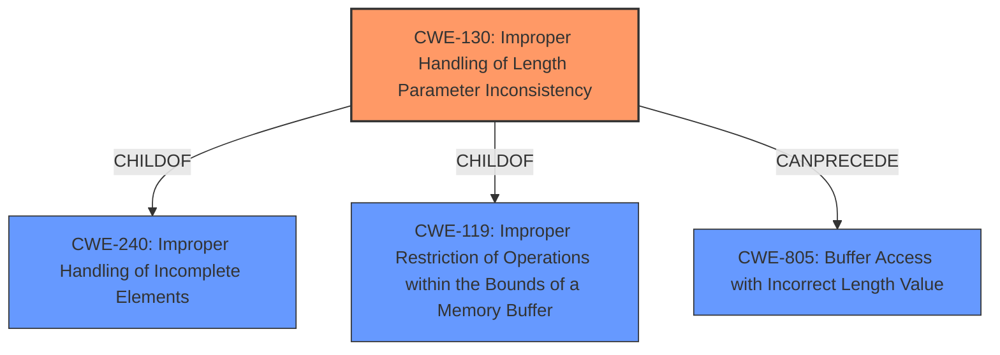

# Raw Analyzer Response for CVE-2022-0677

# Summary
| CWE ID | CWE Name | Confidence | CWE Abstraction Level | CWE Vulnerability Mapping Label | CWE-Vulnerability Mapping Notes |
|---|---|---|---|---|---|
| CWE-130 | Improper Handling of Length Parameter Inconsistency | 1.0 | Base | Allowed | Primary CWE |

## Evidence and Confidence

*   **Confidence Score:** 1.0
*   **Evidence Strength:** HIGH

## Relationship Analysis
The primary CWE is CWE-130, a base-level weakness. It has ChildOf relationships to CWE-240 and CWE-119, indicating it is a specific type of data structure handling issue and a type of improper restriction of operations within memory buffers. It has a CanPrecede relationship to CWE-805, suggesting that an incorrect length parameter can lead to buffer access issues.

## Vulnerability Chain
The vulnerability chain starts with the **improper handling of a length parameter inconsistency** (CWE-130). This **root cause** can lead to a denial-of-service (DoS), which is the impact.

## Summary of Analysis
The analysis is based on the provided evidence, specifically the "Vulnerability Description Key Phrases" and "CVE Reference Links Content Summary," which both explicitly mention "**Improper Handling of Length Parameter Inconsistency**" as the root cause of the vulnerability. The provided text says "**Improper Handling of Length Parameter Inconsistency** vulnerability in the Update Server component...allows an attacker to cause a Denial-of-Service."

The graph relationships reinforce the understanding that CWE-130 is a specific type of weakness related to buffer handling and can lead to buffer access issues (CWE-805).

The selection of CWE-130 is at the optimal level of specificity because it directly describes the **root cause** of the vulnerability, which is the **improper handling of a length parameter inconsistency**. The retriever results also list CWE-130 as the top candidate.

Relevant CWE Information:

# Enhanced Context (25 CWEs)
The following CWEs were identified as potentially relevant to this vulnerability:

## CWE-130: Improper Handling of Length Parameter Inconsistency
**Abstraction:** Base
**Status:** Incomplete

### Description
The product parses a formatted message or structure, but it does not handle or incorrectly handles a length field that is inconsistent with the actual length of the associated data.

### Extended Description
If an attacker can manipulate the length parameter associated with an input such that it is inconsistent with the actual length of the input, this can be leveraged to cause the target application to behave in unexpected, and possibly, malicious ways. One of the possible motives for doing so is to pass in arbitrarily large input to the application. Another possible motivation is the modification of application state by including invalid data for subsequent properties of the application. Such weaknesses commonly lead to attacks such as buffer overflows and execution of arbitrary code.

### Alternative Terms
length manipulation
length tampering

### Relationships
ChildOf -> CWE-240
ChildOf -> CWE-119
ChildOf -> CWE-119
CanPrecede -> CWE-805

### Mapping Guidance
**Usage:** Allowed
**Rationale:** This CWE entry is at the Base level of abstraction, which is a preferred level of abstraction for mapping to the root causes of vulnerabilities.
**Comments:** Carefully read both the name and description to ensure that this mapping is an appropriate fit. Do not try to 'force' a mapping to a lower-level Base/Variant simply to comply with this preferred level of abstraction.
**Reasons:**
- Acceptable-Use

### Additional Notes
**[Relationship]** This probably overlaps other categories including zero-length issues.

### Observed Examples
- **CVE-2014-0160:** Chain: "Heartbleed" bug receives an inconsistent length parameter (CWE-130) enabling an out-of-bounds read (CWE-126), returning memory that could include private cryptographic keys and other sensitive data.
- **CVE-2009-2299:** Web application firewall consumes excessive memory when an HTTP request contains a large Content-Length value but no POST data.
- **CVE-2001-0825:** Buffer overflow in internal string handling routine allows remote attackers to execute arbitrary commands via a length argument of zero or less, which disables the length check.

I considered CWE-805 (Buffer Access with Incorrect Length Value), but it represents a later stage where the incorrect length has already led to a buffer access issue. The vulnerability description focuses on the **improper handling** itself, making CWE-130 more appropriate as the **root cause**.