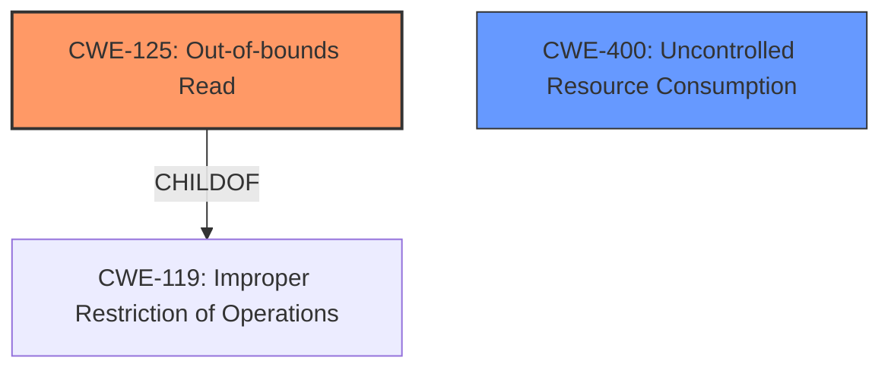

# Enhanced Analysis for CVE-2022-0695

# Summary
| CWE ID | CWE Name | Confidence | CWE Abstraction Level | CWE Vulnerability Mapping Label | CWE-Vulnerability Mapping Notes |
|---|---|---|---|---|---|
| CWE-125 | Out-of-bounds Read | 0.9 | Base | Allowed | Primary CWE |
| CWE-400 | Uncontrolled Resource Consumption | 0.5 | Class | Discouraged | Secondary Candidate |

## Evidence and Confidence

*   **Confidence Score:** 0.9
*   **Evidence Strength:** HIGH

## Relationship Analysis
The primary relationship that influenced the selection was the hierarchical relationship between `CWE-125` (Out-of-bounds Read) and its parent, `CWE-119` (Improper Restriction of Operations Within the Bounds of a Memory Buffer). While `CWE-119` is a broader category, the vulnerability description specifically points to an out-of-bounds read, making `CWE-125` a more precise and suitable classification. `CWE-400` (Uncontrolled Resource Consumption) was considered due to the denial-of-service impact, but the root cause is the out-of-bounds read, making `CWE-125` the more direct cause.



## Vulnerability Chain
The vulnerability chain starts with **insufficient checks** when reading data from a buffer. This leads to an **out-of-bounds read**, which then results in a **denial of service**. The root cause is the lack of proper input validation and boundary checks, and the impact is the application crash.

## Summary of Analysis
The initial analysis considered `CWE-400` due to the stated "Denial of Service" impact. However, after reviewing the CVE Reference Links Content Summary, the root cause is clearly an **out-of-bounds read** due to **insufficient checks** when reading data from a buffer in multiple file parsers. This is supported by the statement: "The vulnerability is caused by insufficient checks when reading data from a buffer in multiple file parsers (PE/QNX/DYLDCACHE/PSX) of radare2." The weaknesses listed further clarify this: "The code attempts to read a specific number of bytes from a buffer using `r_buf_fread_at` or `r_buf_read_at`. However, it only checks if the number of bytes read is greater than or less than 0/1 instead of verifying if the exact expected number of bytes was read," "The size of the read buffer is hardcoded, and not checked against the size of input data which could lead to out-of-bounds read," and "The code uses `sizeof` operator to determine buffer size in some cases and then attempts to read using a hardcoded length or format string, which could lead to out-of-bounds access if the buffer size is smaller than expected read size." The description directly supports `CWE-125` (Out-of-bounds Read).

The selection of `CWE-125` is at the optimal level of specificity because it accurately describes the root cause of the vulnerability, which is reading beyond the allocated buffer. While `CWE-400` describes the impact (Denial of Service), `CWE-125` pinpoints the specific programming error that leads to this impact.

Relevant CWE Information:

# Enhanced Context (25 CWEs)
The following CWEs were identified as potentially relevant to this vulnerability:

## CWE-404: Improper Resource Shutdown or Release
**Abstraction Level**: Class
**Similarity Score**: 0.78
**Source**: dense

**Description**:
The product does not release or incorrectly releases a resource before it is made available for re-use.

**Mapping Guidance**:
- Usage: Allowed-with-Review
- Rationale: This CWE entry is a Class and might have Base-level children that would be more appropriate

**Rationale for Not Selecting**: This CWE doesn't apply because the vulnerability is related to reading beyond buffer boundaries, not resource management.

## CWE-405: Asymmetric Resource Consumption (Amplification)
**Abstraction Level**: Class
**Similarity Score**: 0.78
**Source**: dense

**Description**:
The product does not properly control situations in which an adversary can cause the product to consume or produce excessive resources without requiring the adversary to invest equivalent work or otherwise prove authorization, i.e., the adversary's influence is "asymmetric."

**Mapping Guidance**:
- Usage: Allowed-with-Review
- Rationale: This CWE entry is a Class and might have Base-level children that would be more appropriate

**Rationale for Not Selecting**: The vulnerability is not directly related to asymmetric resource consumption, but rather to reading beyond the bounds of a buffer.

## CWE-226: Sensitive Information in Resource Not Removed Before Reuse
**Abstraction Level**: Base
**Similarity Score**: 0.77
**Source**: dense

**Description**:
The product releases a resource such as memory or a file so that it can be made available for reuse, but it does not clear or "zeroize" the information contained in the resource before the product performs a critical state transition or makes the resource available for reuse by other entities.

**Mapping Guidance**:
- Usage: Allowed
- Rationale: This CWE entry is at the Base level of abstraction, which is a preferred level of abstraction for mapping to the root causes of vulnerabilities.

**Rationale for Not Selecting**: The vulnerability is not related to the exposure of sensitive information through resource reuse, but rather to out-of-bounds reads.

## CWE-664: Improper Control of a Resource Through its Lifetime
**Abstraction Level**: Pillar
**Similarity Score**: 0.77
**Source**: dense

**Description**:
The product does not maintain or incorrectly maintains control over a resource throughout its lifetime of creation, use, and release.

**Mapping Guidance**:
- Usage: Discouraged
- Rationale: This CWE entry is high-level when lower-level children are available.

**Rationale for Not Selecting**: This is a high-level CWE, and the vulnerability is more specifically related to out-of-bounds reads.

## CWE-274: Improper Handling of Insufficient Privileges
**Abstraction Level**: Base
**Similarity Score**: 0.77
**Source**: dense

**Description**:
The product does not handle or incorrectly handles when it has insufficient privileges to perform an operation, leading to resultant weaknesses.

**Mapping Guidance**:
- Usage: Discouraged
- Rationale: This CWE entry could be deprecated in a future version of CWE.

**Rationale for Not Selecting**: The vulnerability is not related to privilege handling, but to out-of-bounds reads.

## CWE-280: Improper Handling of Insufficient Permissions or Privileges 
**Abstraction Level**: Base
**Similarity Score**: 0.77
**Source**: dense

**Description**:
The product does not handle or incorrectly handles when it has insufficient privileges to access resources or functionality as specified by their permissions. This may cause it to follow unexpected code paths that may leave the product in an invalid state.

**Mapping Guidance**:
- Usage: Allowed
- Rationale: This CWE entry is at the Base level of abstraction, which is a preferred level of abstraction for mapping to the root causes of vulnerabilities.

**Rationale for Not Selecting**: The vulnerability is not related to permission handling, but to out-of-bounds reads.

## CWE-799: Improper Control of Interaction Frequency
**Abstraction Level**: Class
**Similarity Score**: 0.76
**Source**: dense

**Description**:
The product does not properly limit the number or frequency of interactions that it has with an actor, such as the number of incoming requests.

**Mapping Guidance**:
- Usage: Allowed-with-Review
- Rationale: This CWE entry is a Class and might have Base-level children that would be more appropriate

**Rationale for Not Selecting**: The vulnerability is not related to interaction frequency, but to out-of-bounds reads.

## CWE-130: Improper Handling of Length Parameter Inconsistency
**Abstraction Level**: Base
**Similarity Score**: 0.76
**Source**: dense

**Description**:
The product parses a formatted message or structure, but it does not handle or incorrectly handles a length field that is inconsistent with the actual length of the associated data.

**Mapping Guidance**:
- Usage: Allowed
- Rationale: This CWE entry is at the Base level of abstraction, which is a preferred level of abstraction for mapping to the root causes of vulnerabilities.

**Rationale for Not Selecting**: While there is mention of size and length checks that are **insufficient**, the issue is the read occurring out of bounds not the length parameter itself being inconsistent.

## CWE-668: Exposure of Resource to Wrong Sphere
**Abstraction Level**: Class
**Similarity Score**: 0


## CWE Relationship Analysis

Current CWEs represent these abstraction levels: .


### Vulnerability Chain Analysis

**Chain starting from CWE-130:**
- 130 (Improper Handling of Length Parameter Inconsistency) - ROOT


**Chain starting from CWE-400:**
- 400 (Uncontrolled Resource Consumption) - ROOT


### CWE Relationship Diagram

```mermaid
graph TD
    classDef primary fill:#f96,stroke:#333,stroke-width:2px
    classDef secondary fill:#69f,stroke:#333
    classDef tertiary fill:#9e9,stroke:#333
```