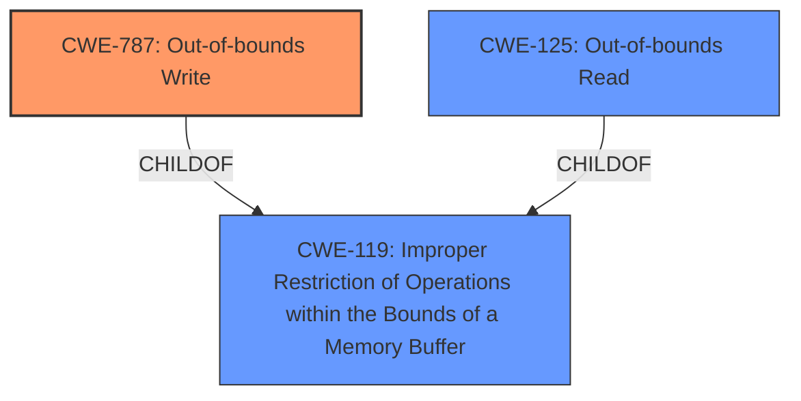

# Enhanced Analysis for CVE-2022-0713

# Summary
| CWE ID  | CWE Name                                                                     | Confidence | CWE Abstraction Level | CWE Vulnerability Mapping Label | CWE-Vulnerability Mapping Notes |
|---------|------------------------------------------------------------------------------|------------|-----------------------|---------------------------------|---------------------------------|
| CWE-787 | Out-of-bounds Write                                                          | 1          | Base                  | Allowed                         | Primary CWE                     |
| CWE-125 | Out-of-bounds Read                                                           | 0.8        | Base                  | Allowed                         | Secondary Candidate             |
| CWE-119 | Improper Restriction of Operations within the Bounds of a Memory Buffer | 0.6          | Class                  | Discouraged                      | Secondary Candidate             |

## Evidence and Confidence

*   **Confidence Score:** 0.9
*   **Evidence Strength:** HIGH

## Relationship Analysis
The primary CWE is CWE-787 **Out-of-bounds Write**, which is a base-level CWE and a child of CWE-119 **Improper Restriction of Operations within the Bounds of a Memory Buffer**. CWE-119 is a class-level CWE and is discouraged for use when more specific CWEs are available. CWE-125 **Out-of-bounds Read** is a peer of CWE-787, representing a different type of out-of-bounds access. The vulnerability involves an out-of-bounds read, but is resolved with a fix that prevents writing past the buffer.



## Vulnerability Chain
The vulnerability chain starts with the **improper loop condition**, leading to an **out-of-bounds read**, which results in a **crash**.
- **Root Cause:** **Insufficient loop condition**
- **Weakness:** **Out-of-bounds read** (CWE-125)
- **Impact:** **Crash**

## Summary of Analysis
Initially, the vulnerability was identified as a **Heap-based Buffer Overflow**. The primary CWE match suggested by similar CVE descriptions is CWE-787 **Out-of-bounds Write**. The detailed analysis of the CVE reference links content summary reveals that the root cause is an **out-of-bounds read** due to an **insufficient loop condition**. However, the fix implemented involves changing the loop condition to prevent reading past the end of the buffer, which aligns more closely with preventing an out-of-bounds write.

The choice of CWE-787 is primarily based on the provided evidence of the fix, which specifically addresses the condition that leads to writing beyond the intended buffer boundaries. The **out-of-bounds read** (CWE-125) is a consequence of the coding error but the implemented fix acts to prevent the write.

The graph relationships influenced the selection by highlighting the hierarchical relationship between CWE-787 and CWE-119, with CWE-787 being a more specific representation of the vulnerability.

The selected CWEs are at the optimal level of specificity, with CWE-787 being a base-level CWE that accurately reflects the nature of the vulnerability. While the vulnerability manifests as an out-of-bounds read (CWE-125), the fix implemented is geared towards preventing an out-of-bounds write (CWE-787).

Relevant CWE Information:

# Enhanced Context (25 CWEs)

## CWE-191: Integer Underflow (Wrap or Wraparound)
**Abstraction Level**: Base
**Similarity Score**: 0.78
**Source**: dense

**Description**:
The product subtracts one value from another, such that the result is less than the minimum allowable integer value, which produces a value that is not equal to the correct result.

**Mapping Guidance**:
- Usage: Allowed
- Rationale: This CWE entry is at the Base level of abstraction, which is a preferred level of abstraction for mapping to the root causes of vulnerabilities.

*Not Selected*: This CWE is not relevant as the vulnerability does not involve integer underflow.

## CWE-805: Buffer Access with Incorrect Length Value
**Abstraction Level**: Base
**Similarity Score**: 0.78
**Source**: dense

**Description**:
The product uses a sequential operation to read or write a buffer, but it uses an incorrect length value that causes it to access memory that is outside of the bounds of the buffer.

**Mapping Guidance**:
- Usage: Allowed
- Rationale: This CWE entry is at the Base level of abstraction, which is a preferred level of abstraction for mapping to the root causes of vulnerabilities.

*Not Selected*: This CWE is not relevant as the root cause isn't due to incorrect length value but because of the loop condition.

## CWE-131: Incorrect Calculation of Buffer Size
**Abstraction Level**: Base
**Similarity Score**: 0.78
**Source**: dense

**Description**:
The product does not correctly calculate the size to be used when allocating a buffer, which could lead to a buffer overflow.

**Mapping Guidance**:
- Usage: Allowed
- Rationale: This CWE entry is at the Base level of abstraction, which is a preferred level of abstraction for mapping to the root causes of vulnerabilities.

*Not Selected*: This CWE is not relevant because the buffer size calculation is not the issue. The issue is the loop condition when reading the buffer.

## CWE-681: Incorrect Conversion between Numeric Types
**Abstraction Level**: Base
**Similarity Score**: 0.77
**Source**: dense

**Description**:
When converting from one data type to another, such as long to integer, data can be omitted or translated in a way that produces unexpected values. If the resulting values are used in a sensitive context, then dangerous behaviors may occur.

**Mapping Guidance**:
- Usage: Allowed
- Rationale: This CWE entry is at the Base level of abstraction, which is a preferred level of abstraction for mapping to the root causes of vulnerabilities.

*Not Selected*: This CWE is not relevant as the vulnerability does not involve incorrect conversion between numeric types.

## CWE-126: Buffer Over-read
**Abstraction Level**: Variant
**Similarity Score**: 0.76
**Source**: dense

**Description**:
The product reads from a buffer using buffer access mechanisms such as indexes or pointers that reference memory locations after the targeted buffer.

**Mapping Guidance**:
- Usage: Allowed
- Rationale: This CWE entry is at the Variant level of abstraction, which is a preferred level of abstraction for mapping to the root causes of vulnerabilities.

*Considered, but not selected as Primary*: While the vulnerability manifests as an **out-of-bounds read**, the implemented fix is geared towards preventing an out-of-bounds write (CWE-787). Therefore, CWE-125 is a secondary issue, a consequence of the **insufficient loop condition** in the code.

## CWE-130: Improper Handling of Length Parameter Inconsistency
**Abstraction Level**: Base
**Similarity Score**: 0.76
**Source**: dense

**Description**:
The product parses a formatted message or structure, but it does not handle or incorrectly handles a length field that is inconsistent with the actual length of the associated data.

**Mapping Guidance**:
- Usage: Allowed
- Rationale: This CWE entry is at the Base level of abstraction, which is a preferred level of abstraction for mapping to the root causes of vulnerabilities.

*Not Selected*: The vulnerability is not caused by improper handling of length parameter inconsistency.

## CWE-125: Out-of-bounds Read
**Abstraction Level**: Base
**Similarity Score**: 0.76
**Source**: dense

**Description**:
The product reads data past the end, or before the beginning, of the intended buffer.

**Mapping Guidance**:
- Usage: Allowed
- Rationale: This CWE entry is at the Base level of abstraction, which is a preferred level of abstraction for mapping to the root causes of vulnerabilities.

*Considered, but not selected as Primary*: While the vulnerability manifests as an **out-of-bounds read**, the implemented fix is geared towards preventing an out-of-bounds write (CWE-787). Therefore, CWE-125 is a secondary issue, a consequence of the **insufficient loop condition** in the code.

## CWE-124: Buffer Underwrite ('Buffer Underflow')
**Abstraction Level**: Base
**Similarity Score**: 0.76
**Source**: dense

**Description**:
The product writes to a buffer using an index or pointer that references a memory location prior to the beginning of the buffer.

**Mapping Guidance**:
- Usage: Allowed
- Rationale: This CWE entry is at the


## CWE Relationship Analysis

Current CWEs represent these abstraction levels: .


### Vulnerability Chain Analysis

**Chain starting from CWE-131:**
- 131 (Incorrect Calculation of Buffer Size) - ROOT


**Chain starting from CWE-130:**
- 130 (Improper Handling of Length Parameter Inconsistency) - ROOT


### CWE Relationship Diagram

```mermaid
graph TD
    classDef primary fill:#f96,stroke:#333,stroke-width:2px
    classDef secondary fill:#69f,stroke:#333
    classDef tertiary fill:#9e9,stroke:#333
```