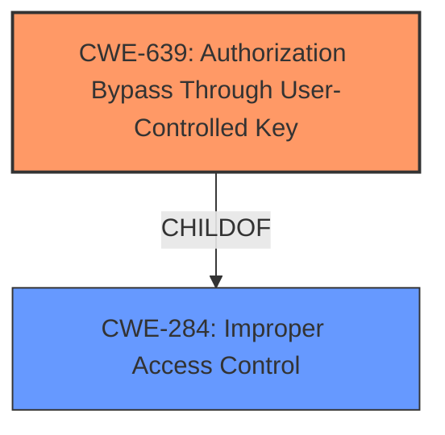

# Enhanced Analysis for CVE-2022-0731

# Summary
| CWE ID  | CWE Name   | Confidence | CWE Abstraction Level | CWE Vulnerability Mapping Label | CWE-Vulnerability Mapping Notes |
| ------- | ---------- | ---------- | --------------------- | ------------------------------- | ------------------------------- |
| CWE-639 | Authorization Bypass Through User-Controlled Key | 0.9 | Base  | Allowed    | Primary CWE |
| CWE-284 | Improper Access Control  | 0.5 | Pillar | Discouraged | Secondary Candidate |

## Evidence and Confidence

*   **Confidence Score:** 0.9
*   **Evidence Strength:** HIGH

## Relationship Analysis
The primary relationship influencing the CWE selection is the ChildOf relationship between CWE-639 and CWE-284. While CWE-284 is a high-level Pillar, CWE-639 is a more specific Base that accurately captures the vulnerability's root cause: authorization bypass via user-controlled key. The vulnerability involves **improper access control** due to the ability of a user to potentially modify a key value (the user ID) to access another user's photo. Therefore, selecting the more specific CWE-639 is the better option.



## Vulnerability Chain
The vulnerability chain starts with the **improper handling of user photo paths**, which leads to a potential **authorization bypass**, ultimately resulting in **unauthorized access to user photos and information disclosure.**

## Summary of Analysis
The initial assessment focused on identifying the **root cause** of the vulnerability. The description clearly states that the vulnerability is due to **Improper Access Control (IDOR)**. The analysis of the commit and file changes confirms that the **inconsistent handling of user photo paths** allows for potential **authorization bypass**.

The selection of CWE-639 is based on the following evidence:

*   **Vulnerability Description:** The vulnerability is explicitly described as an **Improper Access Control (IDOR)** issue.
*   **CVE Reference Links Content Summary:** The analysis highlights that the vulnerability stems from the ability to access user photos by manipulating the path, effectively bypassing authorization checks.  The key phrase is "potential insecure access to user photos if the application did not correctly reference the right path, or allowed someone to access a photo by referencing the old directory structure."
*   **Retriever Results:** CWE-639 has the highest similarity score and is at the Base level of abstraction, which is preferred.

CWE-284 was considered but ultimately deemed too general. While **improper access control** is a valid high-level characterization, CWE-639 provides a more precise description of the vulnerability's root cause.

Therefore, the final decision is to map the vulnerability to CWE-639 as the primary weakness, with a confidence score of 0.9. This decision is based on the evidence from the vulnerability description, the analysis of the commit changes, and the mapping guidance provided by MITRE.

Relevant CWE Information:

# Enhanced Context (25 CWEs)
The following CWEs were identified as potentially relevant to this vulnerability:

## CWE-639: Authorization Bypass Through User-Controlled Key
**Abstraction Level**: Base
**Similarity Score**: 0.76
**Source**: dense

**Description**:
The system's authorization functionality does not prevent one user from gaining access to another user's data or record by modifying the key value identifying the data.

**Mapping Guidance**:
- Usage: Allowed
- Rationale: This CWE entry is at the Base level of abstraction, which is a preferred level of abstraction for mapping to the root causes of vulnerabilities.

## CWE-284: Improper Access Control
**Abstraction Level**: Pillar
**Similarity Score**: 6347.95
**Source**: sparse

**Description**:
The product does not perform or incorrectly performs an authorization check when an actor attempts to access a resource or perform an action.

**Mapping Guidance**:
- Usage: Discouraged
- Rationale: CWE-285 is high-level and lower-level CWEs can frequently be used instead. It is a level-1 Class (i.e., a child of a Pillar).
#


## CWE Relationship Analysis

Current CWEs represent these abstraction levels: .


### Vulnerability Chain Analysis

**Chain starting from CWE-285:**
- 285 (Improper Authorization) - ROOT


**Chain starting from CWE-639:**
- 639 (Authorization Bypass Through User-Controlled Key) - ROOT


### CWE Relationship Diagram

```mermaid
graph TD
    classDef primary fill:#f96,stroke:#333,stroke-width:2px
    classDef secondary fill:#69f,stroke:#333
    classDef tertiary fill:#9e9,stroke:#333
```