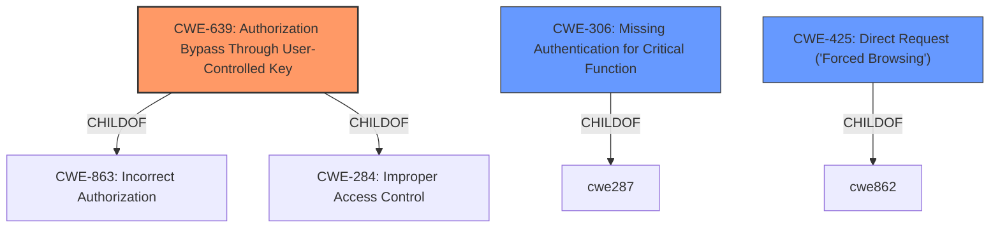

# Enhanced Analysis for CVE-2022-0732

# Summary
| CWE ID  | CWE Name                                                                    | Confidence | CWE Abstraction Level | CWE Vulnerability Mapping Label | CWE-Vulnerability Mapping Notes |
| ------- | --------------------------------------------------------------------------- | ---------- | --------------------- | ------------------------------- | ------------------------------- |
| CWE-639 | Authorization Bypass Through User-Controlled Key                           | 0.9        | Base                  | Primary                         | Allowed                       |
| CWE-306 | Missing Authentication for Critical Function                              | 0.7        | Base                  | Secondary                       | Allowed                       |
| CWE-425 | Direct Request ('Forced Browsing')                                        | 0.6        | Base                  | Secondary                       | Allowed                       |

## Evidence and Confidence

*   **Confidence Score:** 0.8
*   **Evidence Strength:** HIGH

## Relationship Analysis
The primary CWE is CWE-639, which is a Base level CWE and a child of CWE-863 (Incorrect Authorization) and CWE-284 (Improper Access Control). The vulnerability description indicates a failure in authorization, aligning with CWE-639's focus on user-controlled keys bypassing authorization. CWE-306 (Missing Authentication for Critical Function) is considered as a secondary CWE because the description also notes inadequate authentication. CWE-425 (Direct Request) is a peer of CWE-862 which is a Parent of CWE-639 which is another secondary candidate.



## Vulnerability Chain
The vulnerability chain starts with the **inadequate authentication or authorization** on the backend infrastructure. This leads to an **IDOR** vulnerability, where an attacker can access resources by manipulating the key value. The final impact is **unauthorized access to personal information**.

## Summary of Analysis
The analysis is based on the vulnerability description and the CVE reference links. The **root cause** is the **lack of proper authentication and authorization**, which allows attackers to exploit an **IDOR** vulnerability.

The primary CWE selected is CWE-639 (Authorization Bypass Through User-Controlled Key) because it directly addresses the **IDOR** vulnerability described, where an attacker can modify a key value to access another user's data. The evidence supporting this is from the "Vulnerability Description Key Phrases" which states: "**rootcause:** **does not adequately authenticate or authorize API requests**" and "**weakness:** **IDOR (Insecure Direct Object Reference)**". Also the "CVE Reference Links Content Summary" section states "**Insufficient Authentication/Authorization:** The primary weakness is the lack of adequate authentication and authorization controls on the backend servers. This allows unauthenticated users to access data they should not have access to." This aligns perfectly with the description of CWE-639.

CWE-306 (Missing Authentication for Critical Function) is considered as a secondary CWE because the description also notes **inadequate authentication**. This is supported by the "Vulnerability Description Key Phrases" which states "**does not adequately authenticate or authorize API requests**". However, the primary issue is related to authorization after a user might be authenticated, making CWE-639 more relevant.

CWE-425 (Direct Request ('Forced Browsing')) is considered as a secondary CWE because the description also notes improper enforcement of authorization.

Other CWEs considered but not used:

*   CWE-99: Improper Control of Resource Identifiers ('Resource Injection') - While related to resource access, it's a broader category and CWE-639 provides a more specific description of the vulnerability.
*   CWE-1390: Weak Authentication - While authentication is mentioned, the core issue is with authorization, making CWE-639 a better fit.
*   CWE-863: Incorrect Authorization - This is a class-level CWE, and CWE-639 is a more specific base-level CWE that better describes the vulnerability.

The selected CWEs are at the optimal level of specificity because they accurately represent the weakness while being at the base level of abstraction, which is preferred for mapping to root causes.

Relevant CWE Information:

# Enhanced Context (25 CWEs)
The following CWEs were identified as potentially relevant to this vulnerability:

## CWE-639: Authorization Bypass Through User-Controlled Key
**Abstraction Level**: Base
**Similarity Score**: 0.78
**Source**: dense

**Description**:
The system's authorization functionality does not prevent one user from gaining access to another user's data or record by modifying the key value identifying the data.

**Mapping Guidance**:
- Usage: Allowed
- Rationale: This CWE entry is at the Base level of abstraction, which is a preferred level of abstraction for mapping to the root causes of vulnerabilities.


## CWE-41: Improper Resolution of Path Equivalence
**Abstraction Level**: Base
**Similarity Score**: 0.78
**Source**: dense

**Description**:
The product is vulnerable to file system contents disclosure through path equivalence. Path equivalence involves the use of special characters in file and directory names. The associated manipulations are intended to generate multiple names for the same object.

**Mapping Guidance**:
- Usage: Allowed
- Rationale: This CWE entry is at the Base level of abstraction, which is a preferred level of abstraction for mapping to the root causes of vulnerabilities.


## CWE-425: Direct Request ('Forced Browsing')
**Abstraction Level**: Base
**Similarity Score**: 0.77
**Source**: dense

**Description**:
The web application does not adequately enforce appropriate authorization on all restricted URLs, scripts, or files.

**Mapping Guidance**:
- Usage: Allowed
- Rationale: This CWE entry is at the Base level of abstraction, which is a preferred level of abstraction for mapping to the root causes of vulnerabilities.


## CWE-472: External Control of Assumed-Immutable Web Parameter
**Abstraction Level**: Base
**Similarity Score**: 0.77
**Source**: dense

**Description**:
The web application does not sufficiently verify inputs that are assumed to be immutable but are actually externally controllable, such as hidden form fields.

**Mapping Guidance**:
- Usage: Allowed
- Rationale: This CWE entry is at the Base level of abstraction, which is a preferred level of abstraction for mapping to the root causes of vulnerabilities.


## CWE-451: User Interface (UI) Misrepresentation of Critical Information
**Abstraction Level**: Class
**Similarity Score**: 0.77
**Source**: dense

**Description**:
The user interface (UI) does not properly represent critical information to the user, allowing the information - or its source - to be obscured or spoofed. This is often a component in phishing attacks.

**Mapping Guidance**:
- Usage: Allowed-with-Review
- Rationale: This CWE entry is a Class and might have Base-level children that would be more appropriate


## CWE-668: Exposure of Resource to Wrong Sphere
**Abstraction Level**: Class
**Similarity Score**: 0.77
**Source**: dense

**Description**:
The product exposes a resource to the wrong control sphere, providing unintended actors with inappropriate access to the resource.

**Mapping Guidance**:
- Usage: Discouraged
- Rationale: CWE-668 is high-level and is often misused as a catch-all when lower-level CWE IDs might be applicable. It is sometimes used for low-information vulnerability reports [REF-1287]. It is a level-1 Class (i.e., a child of a Pillar). It is not useful for trend analysis.


## CWE-799: Improper Control of Interaction Frequency
**Abstraction Level**: Class
**Similarity Score**: 0.76
**Source**: dense

**Description**:
The product does not properly limit the number or frequency of interactions that it has with an actor, such as the number of incoming requests.

**Mapping Guidance**:
- Usage: Allowed-with-Review
- Rationale: This CWE entry is a Class and might have Base-level children that would be more appropriate


## CWE-610: Externally Controlled Reference to a Resource in Another Sphere
**Abstraction Level**: Class
**Similarity Score**: 0.76
**Source**: dense

**Description**:
The product uses an externally controlled name or reference that resolves to a resource that is outside of the intended control sphere.

**Mapping Guidance**:


## CWE Relationship Analysis

Current CWEs represent these abstraction levels: .


### Vulnerability Chain Analysis

**Chain starting from CWE-862:**
- 862 (Missing Authorization) - ROOT


**Chain starting from CWE-425:**
- 425 (Direct Request ('Forced Browsing')) - ROOT


### CWE Relationship Diagram

```mermaid
graph TD
    classDef primary fill:#f96,stroke:#333,stroke-width:2px
    classDef secondary fill:#69f,stroke:#333
    classDef tertiary fill:#9e9,stroke:#333
```