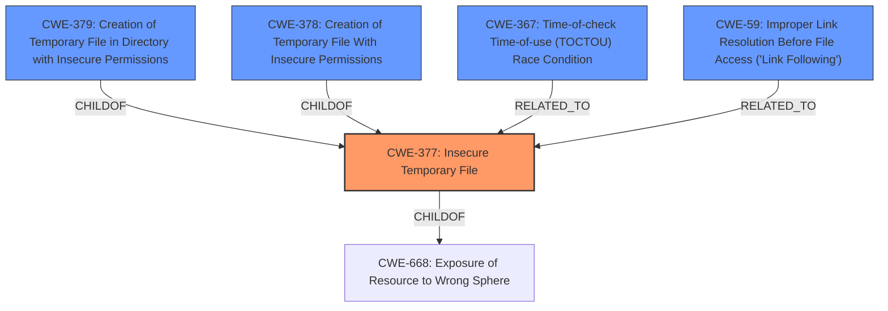

# Raw Analyzer Response for CVE-2022-0736

# Summary
| CWE ID | CWE Name | Confidence | CWE Abstraction Level | CWE Vulnerability Mapping Label | CWE-Vulnerability Mapping Notes |
|---|---|---|---|---|---|
| **CWE-377** | **Insecure Temporary File** | 0.9 | Class | Primary | Allowed-with-Review |
| CWE-379 | Creation of Temporary File in Directory with Insecure Permissions | 0.7 | Base | Secondary Candidate | Allowed |
| CWE-378 | Creation of Temporary File With Insecure Permissions | 0.7 | Base | Secondary Candidate | Allowed |
| CWE-367 | Time-of-check Time-of-use (TOCTOU) Race Condition | 0.6 | Base | Secondary Candidate | Allowed |
| CWE-59 | Improper Link Resolution Before File Access ('Link Following') | 0.5 | Base | Secondary Candidate | Allowed |

## Evidence and Confidence

*   **Confidence Score:** 0.8
*   **Evidence Strength:** HIGH

## Relationship Analysis
The primary CWE is CWE-377 (Insecure Temporary File), which is a Class-level CWE. Child CWEs like CWE-378 (Creation of Temporary File With Insecure Permissions) and CWE-379 (Creation of Temporary File in Directory with Insecure Permissions) are more specific Base-level CWEs and represent potential refinements of the classification. CWE-367 (Time-of-check Time-of-use (TOCTOU) Race Condition) represents a potential vulnerability chain element related to insecure temporary file handling. CWE-59 (Improper Link Resolution Before File Access ('Link Following')) is a related weakness that could arise from insecure temporary files.

## Vulnerability Chain
The vulnerability chain starts with the **insecure temporary file handling** (**ROOTCAUSE**). This can lead to a Time-of-Check Time-of-Use (TOCTOU) race condition (CWE-367) if the file creation is not atomic. This race condition can enable an attacker to replace the temporary file with a symbolic link, leading to CWE-59 (Improper Link Resolution Before File Access). Depending on the permissions of the temporary file's directory (CWE-379) or the temporary file itself (CWE-378), an attacker might gain unauthorized access or modify the file.

## Summary of Analysis
My initial analysis focused on the **insecure temporary file handling** as the primary issue. The "Vulnerability Description Key Phrases" section clearly identifies this as the **rootcause**. The "CVE Reference Links Content Summary" elaborates on the original use of `tempfile.mktemp()`, a function known for creating insecure temporary files. The evidence suggests that the core problem stems from the **lack of secure creation and management of temporary files**. The switch to `tempfile.mkstemp()` was an attempt to mitigate a TOCTOU race condition (CWE-367), but the comment from @sr-mpamera indicates that the fix might be incomplete.

CWE-377 (Insecure Temporary File) is a Class-level CWE that encapsulates the general problem. While more specific Base-level CWEs exist, such as CWE-378 (Creation of Temporary File With Insecure Permissions) and CWE-379 (Creation of Temporary File in Directory with Insecure Permissions), the evidence doesn't strongly point to either of these as the sole issue. The problem seems more general, relating to the overall insecure handling of temporary files, making CWE-377 the most appropriate primary classification.

I also considered CWE-59 (Improper Link Resolution Before File Access ('Link Following')), as this is a common consequence of insecure temporary file handling. An attacker might exploit a race condition to replace a temporary file with a symbolic link, leading to the application accessing an unintended file. However, without more specific evidence of a successful link following attack, I've classified CWE-59 as a secondary candidate.

I am classifying CWE-377 as the primary CWE because it best represents the general vulnerability, while acknowledging that more specific CWEs could apply depending on the exact exploitation scenario.

Relevant CWE Information:
- **CWE-377 (Insecure Temporary File)**: "Creating and using insecure temporary files can leave application and system data vulnerable to attack." This aligns directly with the vulnerability description and the identified **rootcause**.
- **CWE-379 (Creation of Temporary File in Directory with Insecure Permissions)**: "The product creates a temporary file in a directory whose permissions allow unintended actors to determine the file's existence or otherwise access that file." This is a more specific case of CWE-377 and could be relevant if the temporary files are created in a directory with overly permissive permissions.
- **CWE-378 (Creation of Temporary File With Insecure Permissions)**: "Opening temporary files without appropriate measures or controls can leave the file, its contents and any function that it impacts vulnerable to attack." This is another specific case of CWE-377 and is related to the file permissions set during creation.
- **CWE-367 (Time-of-check Time-of-use (TOCTOU) Race Condition)**: "The product checks the state of a resource before using that resource, but the resource's state can change between the check and the use in a way that invalidates the results of the check." This is relevant due to the use of `tempfile.mktemp()` which is susceptible to TOCTOU issues.
- **CWE-59 (Improper Link Resolution Before File Access ('Link Following'))**: "The product attempts to access a file based on the filename, but it does not properly prevent that filename from identifying a link or shortcut that resolves to an unintended resource." This could occur if an attacker replaces a temporary file with a symbolic link.